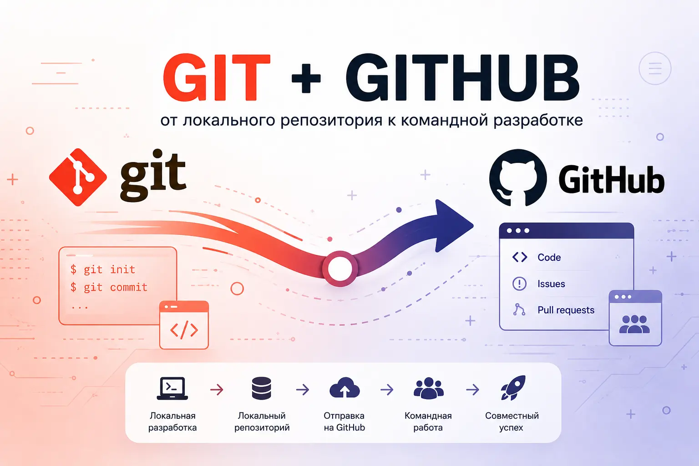

# От Git до Github

## О модуле

Модуль знакомит школьников с системой контроля версий **Git** и платформой **GitHub**.
Ученики проходят путь от первого локального репозитория на своём компьютере до
совместной работы над проектом в интернете и публикации результата как сайта на
GitHub Pages. Опыт работы с Git не требуется — модуль рассчитан на новичков.

Эти навыки — основа повседневной работы любого программиста: они позволяют не терять
свои наработки, безопасно экспериментировать и работать над проектом в команде.

## Параметры

| Параметр              | Значение            |
| --------------------- | ------------------- |
| Возраст учащихся      | 12–14 лет           |
| Количество уроков     | 8                   |
| Длительность урока    | 120 мин (2 часа)    |
| Общая длительность    | 16 часов            |
