# Урок 7 — Командная работа: Pull Request, Issues, обзор кода

## Общая информация

| Параметр | Значение |
|----------|----------|
| Курс | От Git до Github |
| Модуль | От Git до Github |
| Номер урока | 7 |
| Возраст учащихся | 12–14 лет |
| Продолжительность | 120 мин |

---

## Цель урока

К концу урока ученики смогут открыть Pull Request из своего форка в оригинальный репозиторий на GitHub, создать в своём репозитории Issue с понятным описанием задачи и оставить комментарий при обзоре кода (code review) в Pull Request.

---

## План урока

| Этап | Время |
|------|-------|
| 1. Организационный момент | 5 мин |
| 2. Теоретическая часть | 10 мин |
| 3. Практическая работа | 60 мин |
| 4. Самостоятельная работа | 35 мин |
| 5. Подведение итогов | 10 мин |
| **Итого** | **120 мин** |

---

## Ход занятия

### 1. Организационный момент (5 мин)

**Действия преподавателя:**

Поприветствовать группу, проверить, что у каждого ученика включён компьютер, установлены Git и VS Code (с урока 1), есть вход в аккаунт на GitHub (с урока 5). Проверить главное для сегодняшнего урока: с прошлого занятия на аккаунте каждого ученика должен остаться форк проекта `first-contributions`, а в нём — файл со своим именем, который ученик уже отправил командой `push`. Если у кого-то форка нет (пропустил урок 6), помочь ученику сделать форк `first-contributions` и отправить файл со своим именем в начале практики — чтобы у него тоже было что предложить в Pull Request. Кратко напомнить прошлую тему: «На прошлом уроке мы сделали форк чужого проекта, скачали его, добавили в свою копию файл со своим именем и отправили его в свой форк». Назвать тему и цель урока простыми словами: «До сих пор мы меняли только свою копию. Сегодня сделаем следующий шаг настоящей командной работы: научимся предлагать свои изменения автору чужого проекта — это называется Pull Request, ставить задачи и обсуждать их — это Issues, и разбирать чужой код». Объяснить, зачем это нужно: «Так работают все программисты в командах и над открытыми проектами по всему миру: никто не вливает свой код в общий проект молча — сначала предлагают, обсуждают и проверяют». Заранее записать на доске адрес учебного проекта (понадобится в практике): `https://github.com/firstcontributions/first-contributions`.

---

### 2. Теоретическая часть (10 мин)

> Режим Б: здесь даём только короткое введение — три главные идеи урока. Сами действия (открыть PR, создать Issue, оставить комментарий ревью) ученики освоят руками в практике по схеме «мини-теория — задание».

**Действия преподавателя:**

Объяснить на доске или на экране три понятия и как они связаны в работе команды: Pull Request, Issue и обзор кода. Опираться на понятный пример из жизни. Подробности разберём по ходу практики.

#### Pull Request — предложение влить твои изменения в чужой проект

Pull Request (по-русски часто говорят «пул-реквест» или «запрос на слияние») — это вежливая просьба к автору проекта: «Посмотри, пожалуйста, мои изменения и, если они тебе нравятся, добавь их в свой проект». Ты не можешь сам менять чужой оригинал, но можешь предложить изменение из своего форка, а автор решит — принять его (этот шаг называется merge, слияние) или отклонить. Это как принести готовое домашнее задание на проверку: учитель смотрит и либо ставит зачёт и забирает работу, либо просит доделать.

#### Issue — задача или сообщение в проекте

Issue (по-английски «вопрос, проблема») — это запись внутри проекта о том, что нужно сделать или что сломалось. Через Issues ставят задачи, сообщают об ошибках и обсуждают идеи. Например: «Калькулятор не умеет находить меньшее из двух чисел — надо добавить» или «Нашёл ошибку: при делении на ноль программа падает». У каждой Issue есть свой номер (#1, #2, …), по которому на неё удобно ссылаться.

#### Обзор кода (code review) — проверка чужих изменений

Прежде чем влить чей-то Pull Request, его читают и проверяют — это и есть обзор кода. Можно оставить комментарий: похвалить, задать вопрос или предложить поправить. Цель обзора — вместе сделать код лучше.

#### Записи в блокнот

**Pull Request (PR)** — предложение влить свои изменения из форка (или ветки) в оригинальный проект; автор решает, принять или нет.

**Merge (слияние)** — действие автора: принять Pull Request и добавить предложенные изменения в проект.

**Issue** — запись о задаче, ошибке или идее внутри проекта; у каждой свой номер (#1, #2, …).

**Обзор кода (code review)** — чтение и проверка чужих изменений с комментариями перед слиянием.

---

### 3. Практическая работа (60 мин)

**Действия преподавателя:**

Работаем по принципу «Я показываю — делаем вместе — делаешь сам». Каждый новый шаг сначала показать на проекторе, затем ученики повторяют у себя и проверяют результат. Все три части практики проходим вместе шаг в шаг. Большая часть работы сегодня — на сайте GitHub в браузере, а не в терминале: PR, Issues и обзор кода живут именно на GitHub. Поэтому держим открытым браузер; терминал и VS Code понадобятся только в самостоятельной работе. Самое трудное сегодня — не команды, а ориентация на страницах GitHub: ученики путают свой форк с оригиналом и не сразу находят нужные кнопки. Поэтому на каждом шаге проговаривать вслух, чья страница сейчас открыта (смотрим на имя вверху: своё имя — это форк, `firstcontributions` — это оригинал).

#### Предлагаем свой файл автору проекта — открываем Pull Request

**Мини-теория:** на прошлом уроке мы добавили в свой форк `first-contributions` файл со своим именем и отправили его командой `push`. Но автор оригинального проекта об этом ничего не знает — файл лежит только в нашей копии. Чтобы предложить его автору, открывают Pull Request: GitHub сравнивает наш форк с оригиналом, видит наш новый файл и оформляет предложение «добавь это к себе». Проект `first-contributions` специально создан для тренировки: туда можно безопасно отправлять такие предложения.

**Задание:**

1. В браузере откройте страницу своего форка `first-contributions` (вверху должно стоять ваше имя пользователя, а ниже — `forked from firstcontributions/first-contributions`). Если открыта главная страница GitHub — нажмите на свой аватар справа вверху, выберите **Your repositories** и в списке откройте `first-contributions`.
2. На странице форка над списком файлов найдите кнопку **Contribute** (по-английски «внести вклад»; рядом с надписью о том, что ваша ветка опережает оригинал на 1 коммит). Нажмите её, в выпавшем окошке нажмите **Open pull request**.

   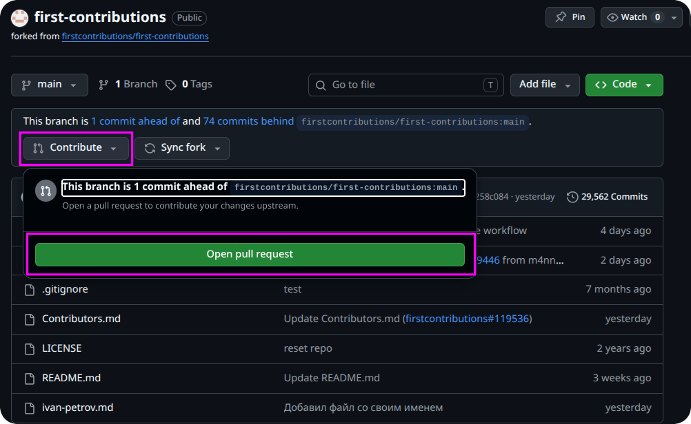
3. Откроется страница сравнения. Вверху проверьте стрелку слияния: слева — оригинал `firstcontributions/first-contributions` (туда предлагаем), справа — ваш форк (откуда берём изменение). Ниже зелёная галочка `Able to merge` означает, что изменения не конфликтуют. В списке внизу должен быть виден ваш файл со своим именем.

   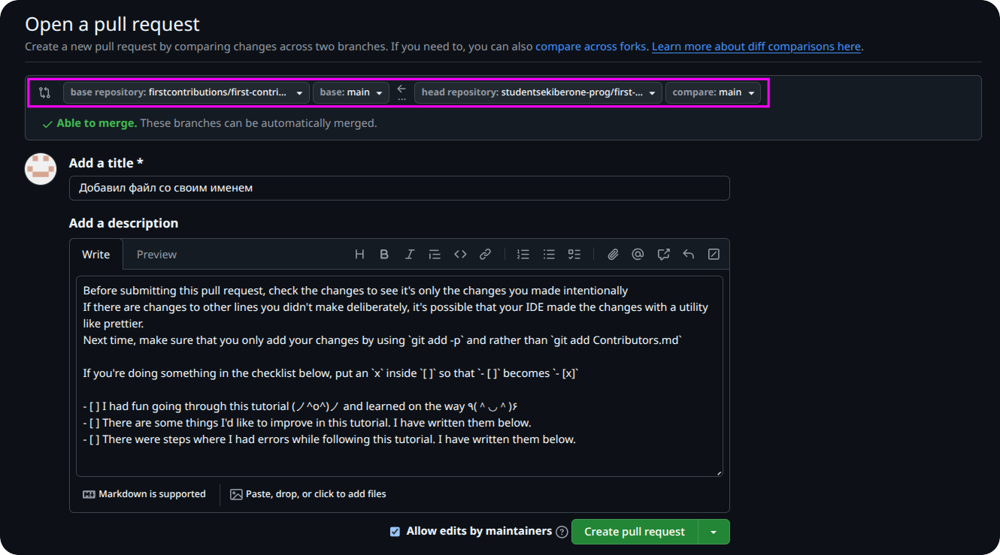
4. Нажмите зелёную кнопку **Create pull request**.
5. Откроется форма с заголовком и описанием. В поле заголовка коротко напишите, что вы предлагаете, например: `Добавил файл со своим именем`. В поле описания одной строкой поясните: `Это мой учебный вклад в проект.` Не трогайте остальные настройки.
6. Нажмите зелёную кнопку **Create pull request** ещё раз — теперь уже окончательно.

   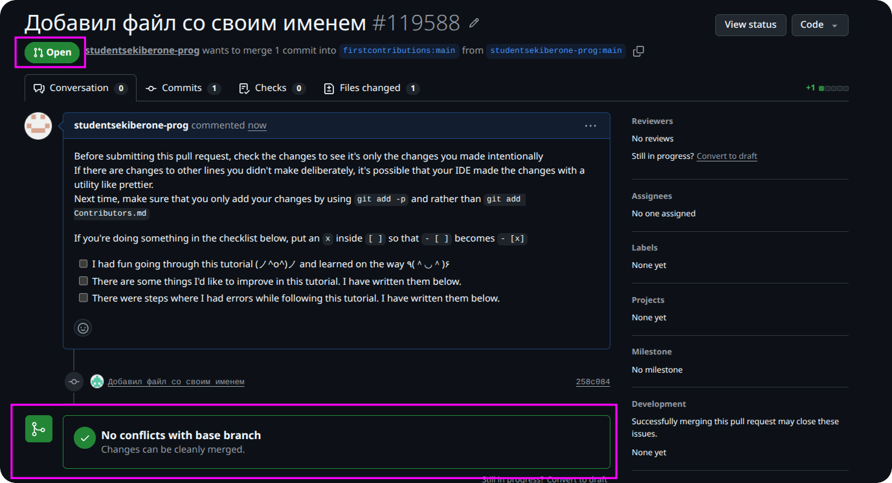
7. Откроется страница вашего Pull Request на сайте оригинального проекта. Обратите внимание: вверху теперь стоит имя оригинала `firstcontributions / first-contributions`, а у запроса есть свой номер (например, `#5821`) и статус **Open** (открыт, ждёт решения автора).

**Ожидаемый результат:** ученик открыл Pull Request из своего форка в оригинальный проект `first-contributions`; запрос виден на странице оригинала со статусом **Open**; ученик понимает, что предложил изменение, но пока ничего в чужом проекте не изменил — решение за автором.

> Заметка: в этом учебном проекте Pull Request обычно принимают автоматически или вручную через некоторое время, иногда не сразу. Ждатпохвала и, при желании,ь слияния на уроке не нужно — наша цель в том, чтобы ученик правильно оформил и отправил предложение. Проговорить: пока запрос не приняли (merge), оригинальный проект не изменился.

#### Ставим задачу — создаём Issue в своём проекте

**Мини-теория:** Issue — это запись о том, что нужно сделать в проекте. Потренируемся в своём репозитории `my-first-app` (он у нас на GitHub с урока 5). Наш калькулятор `calc.py` уже многое умеет: складывать, вычитать, умножать, делить, возводить в степень, находить большее из двух чисел. А вот находить меньшее из двух чисел он пока не умеет. Заведём задачу-напоминание: «добавить поиск меньшего из двух чисел (минимум)». Позже, в самостоятельной работе, мы по этой задаче сделаем изменение.

**Задание:**

1. В браузере откройте свой репозиторий `my-first-app` на GitHub (через аватар — **Your repositories** — `my-first-app`).
2. В верхнем меню репозитория, рядом с **Code**, нажмите вкладку **Issues**.
3. Нажмите зелёную кнопку **New issue**.

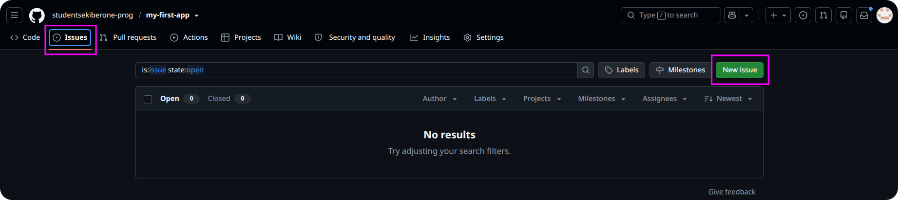

4. В поле заголовка (**Title**) напишите задачу коротко и понятно: `Добавить поиск минимума в калькулятор`.
5. В поле описания (**Leave a comment**) распишите чуть подробнее, что нужно: `Калькулятор умеет находить большее из двух чисел, но не умеет находить меньшее. Нужно добавить поиск меньшего из двух чисел (минимум).`
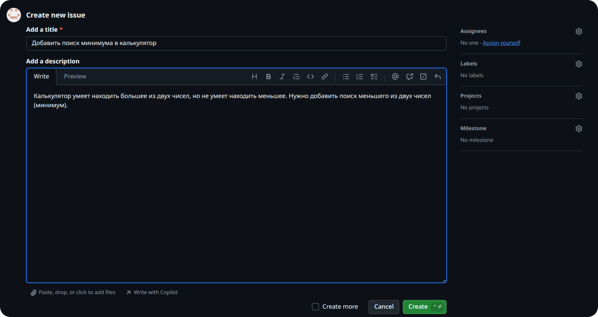
6. Нажмите зелёную кнопку **Create** (или **Submit new issue**).

   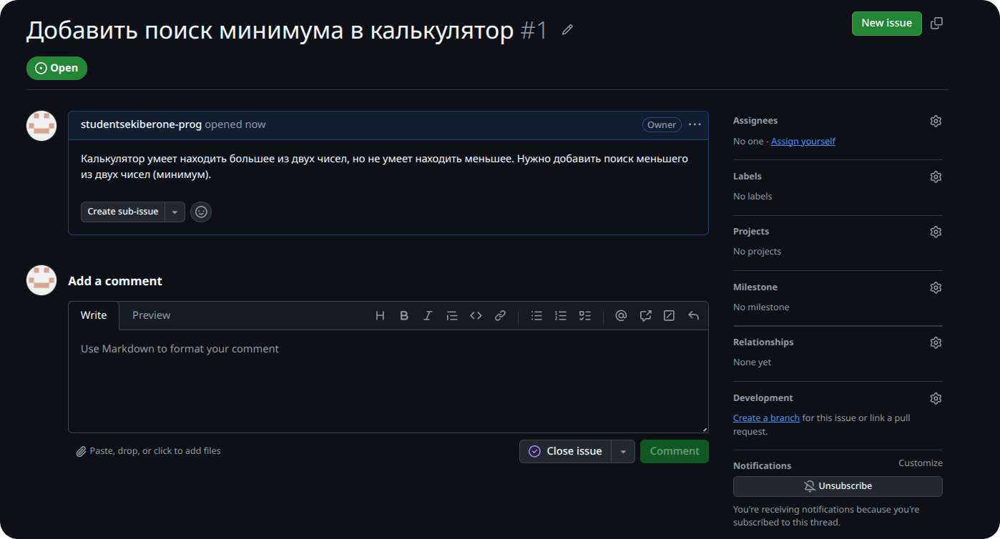
7. Issue создана. Запомните её номер вверху (скорее всего **#1**) — он понадобится в самостоятельной работе, чтобы связать с этой задачей наше будущее изменение.

**Мини-теория:** Issue — это не просто запись, а ещё и место для обсуждения. Под задачей все участники проекта могут оставлять ответы-комментарии: уточнять, спорить, договариваться, кто и когда её сделает. Внизу страницы каждой Issue есть поле **Add a comment** («добавить комментарий») с двумя кнопками: зелёная **Comment** — отправить свой ответ в обсуждение; **Close issue** — закрыть задачу, когда она выполнена или больше не нужна (закрытую задачу при необходимости можно открыть снова кнопкой **Reopen**).

Если рядом с кнопкой **Close issue** нажать маленькую стрелочку, GitHub предложит выбрать, **почему** задачу закрывают:

- **Close as completed** («закрыть как выполненную») — задачу сделали: исправили, добавили, решили. Это самый частый случай.
- **Close as not planned** («закрыть как невыполняемую») — задачу решили не делать: не будем чинить, не получилось повторить ошибку, идея устарела.
- **Close as duplicate** («закрыть как дубликат») — такая задача уже есть, эта её повторяет.

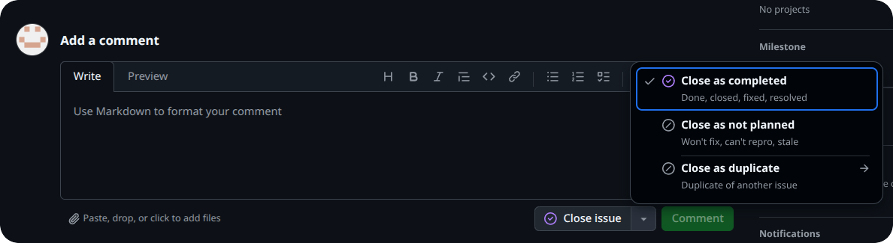

Эти пометки нужны, чтобы потом по списку закрытых задач было понятно, что реально сделали, а что отложили. Потренируемся ответить на свою же задачу.

**Задание:**

8. Прокрутите страницу своей Issue вниз — там есть поле **Add a comment**. Напишите в нём короткий ответ-план, например: `Сделаю минимум в отдельной ветке и предложу через Pull Request.`
9. Нажмите зелёную кнопку **Comment** — ваш комментарий появится в обсуждении под задачей.

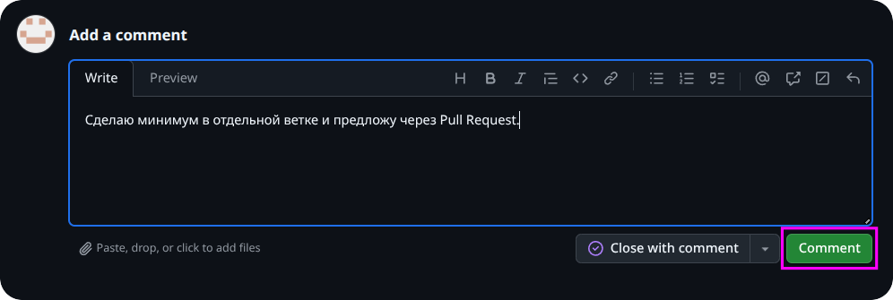

10. Кнопку **Close issue** сейчас **не** нажимайте — задача ещё не сделана. Мы закроем её позже, в самостоятельной работе, и не вручную, а автоматически — через Pull Request.

**Ожидаемый результат:** в репозитории `my-first-app` появилась открытая Issue `Добавить поиск минимума в калькулятор` с номером (#1); под ней есть ответ-комментарий ученика; ученик понимает, что Issue — это поставленная задача с обсуждением, а не само изменение кода, и что задачу можно закрыть кнопкой **Close issue**.

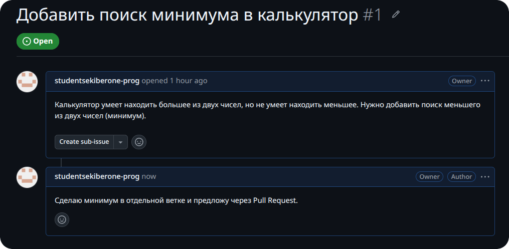

#### Обзор кода — комментируем общий Pull Request

**Мини-теория:** перед тем как принять чей-то Pull Request, его читают и оставляют комментарии — это обзор кода. Преподаватель заранее подготовил один общий Pull Request с небольшим изменением кода — все вместе его разберём и каждый оставит свой комментарий. Адрес этого Pull Request преподаватель написал на доске; он у всех один и тот же.

**Действия преподавателя:** до урока создать один учебный Pull Request, который класс будет разбирать (например, в отдельном тренировочном репозитории своим аккаунтом): добавить в код небольшое изменение, в котором есть к чему оставить комментарий — понятная строка, которую можно похвалить, и одно место, о котором уместно задать вопрос или предложить улучшение. Адрес этого Pull Request записать на доске. На уроке открыть его на проекторе, показать вкладку **Files changed** и как оставить комментарий к конкретной строке. Проговорить, что комментарий пишут по делу. Все ученики комментируют этот один и тот же Pull Request — искать ничего не нужно, адрес у всех общий.

**Готовый пример для подготовки (можно взять как есть):**

1. Создайте на своём аккаунте новый репозиторий, например `text-review`, с галочкой **Add a README file** (чтобы сразу была основная ветка).
2. Через сайт GitHub добавьте в него файл `text_utils.py` с одной функцией (кнопка **Add file — Create new file**):

   ```python
   # Работа с текстом
   def shout(text):
       return text.upper()
   ```

3. Создайте ветку `add-longest` (на странице репозитория слева переключатель веток — введите имя новой ветки и создайте её) и в этой ветке отредактируйте `text_utils.py`, дописав функцию поиска более длинного слова:

   ```python
   # Работа с текстом
   def shout(text):
       return text.upper()

   def longest_word(a, b):
       # возвращаем слово, которое длиннее
       if len(a) > len(b):
           return a
       return b
   ```
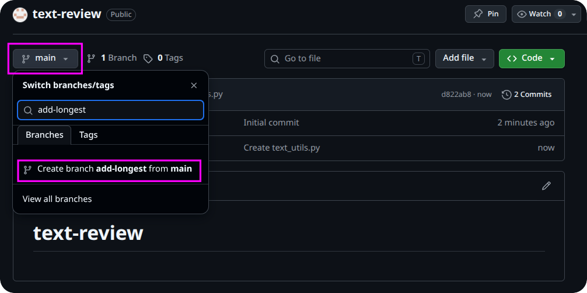
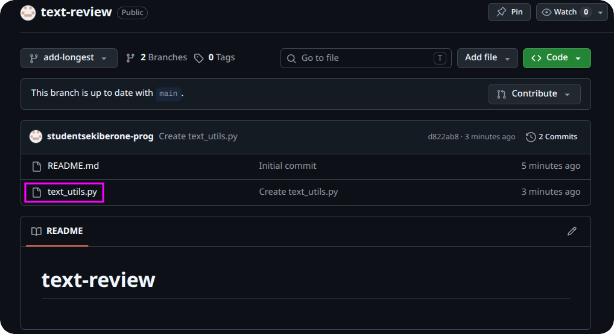
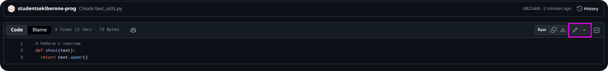
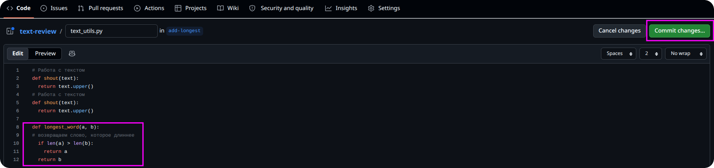

4. Откройте Pull Request из ветки `add-longest` в основную ветку (`main`): на странице репозитория вкладка **Pull requests — New pull request**, в строке сравнения выберите **base: main** и **compare: add-longest** (должна появиться зелёная отметка **Able to merge**). Заголовок GitHub подставит сам (`Update text_utils.py`) — замените его на понятный, например `Добавил функцию longest_word`, чтобы на проекторе сразу было видно, о чём этот PR. Нажмите **Create pull request**. Адрес получившегося Pull Request запишите на доске.

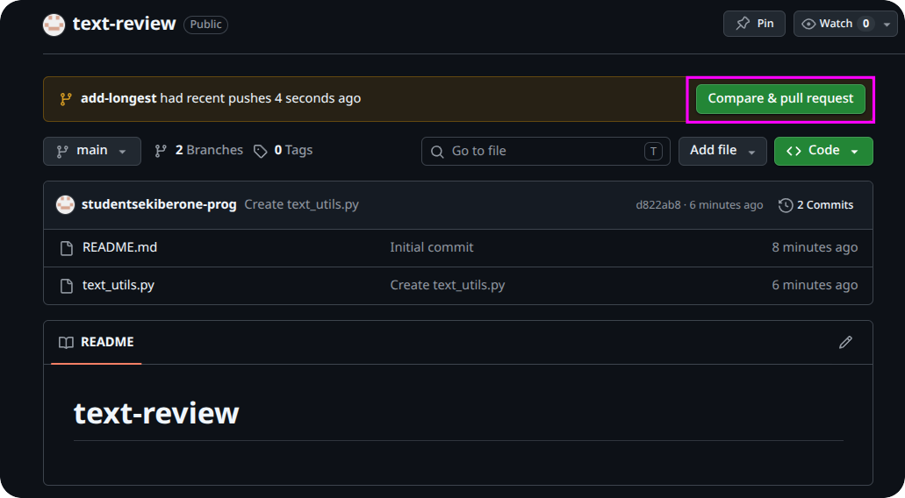
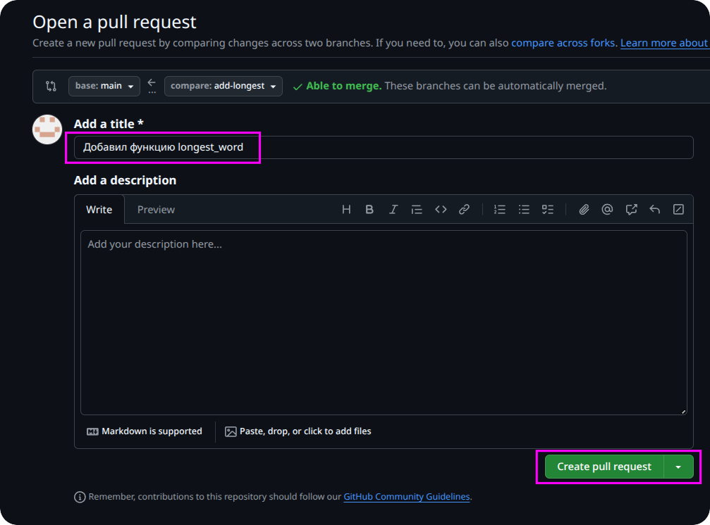
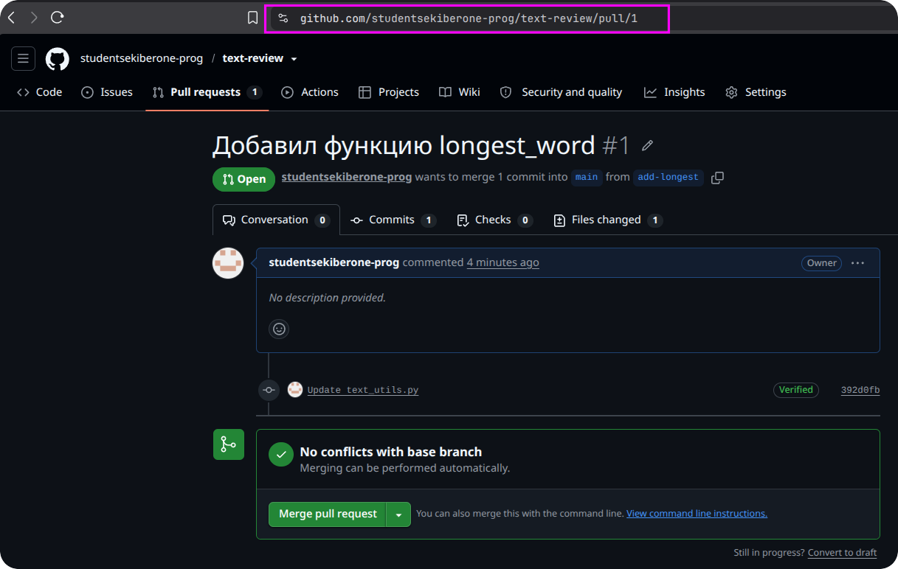

В этом изменении заранее заложены два повода для комментария:

- **что можно похвалить:** понятное имя `longest_word` и строка-комментарий `# возвращаем слово, которое длиннее` — сразу ясно, что делает функция.
- **о чём спросить или что предложить:** не учтён случай, когда слова одинаковой длины — тогда функция вернёт `b`, и это не очевидно из кода. Это и есть место для вопроса ученика.

Образцы комментариев, которые могут оставить ученики (показать один на проекторе как пример):

- к строке с комментарием: `Удобно, что есть пояснение — сразу понятно, что делает функция.`
- к строке `return b`: `А что вернётся, если оба слова одинаковой длины? Из кода это не сразу понятно.`

**Задание:**

1. Откройте в браузере адрес общего учебного Pull Request, записанный на доске.
2. Перейдите на вкладку **Files changed** («изменённые файлы») вверху страницы PR — здесь видно, какой файл и какие строки изменены. Зелёным подсвечены добавленные строки.

   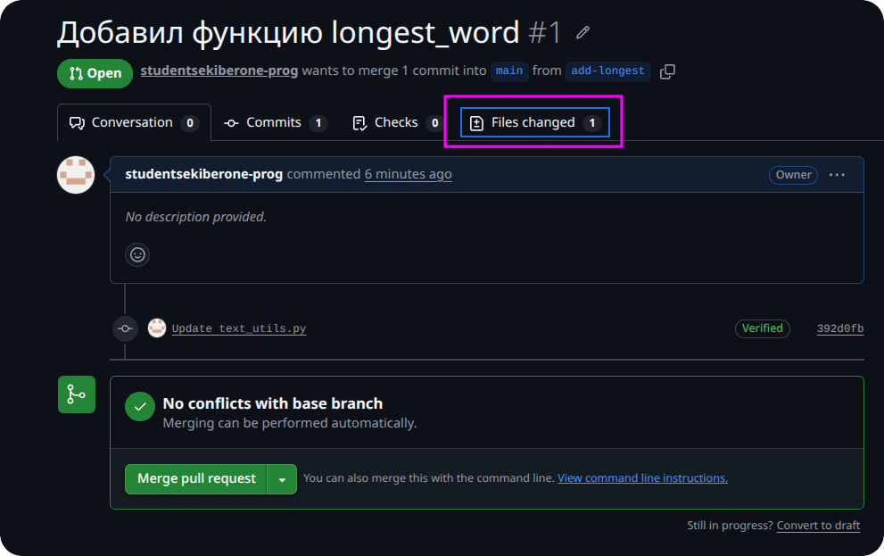
   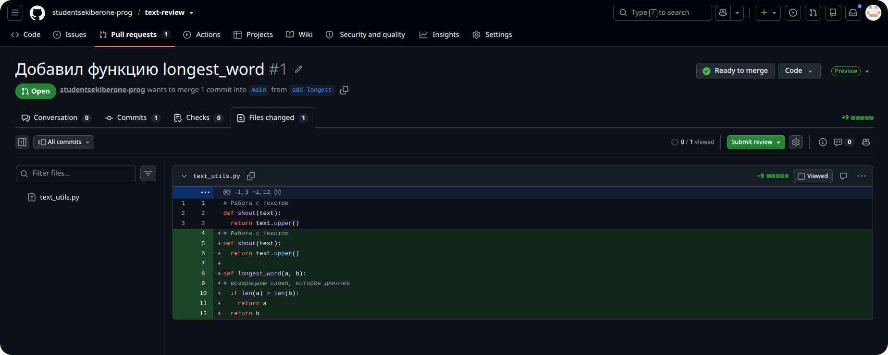
3. Прочитайте изменённый код. Наведите курсор на нужную строку — слева появится синий значок **+**. Нажмите его, чтобы оставить комментарий именно к этой строке.
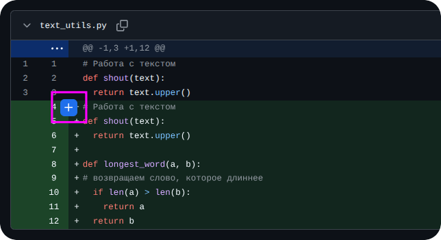
4. Напишите комментарий по делу, например: `Тут всё понятно и аккуратно.` или `А что вернётся, если оба слова одинаковой длины?` Нажмите **Start a review** («начать обзор»). Комментарий пока сохранится как черновик с жёлтой пометкой **Pending** («ожидает») — важно: его видите только вы, остальным он ещё не показан.

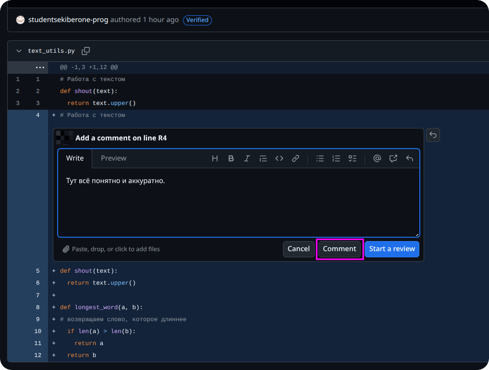
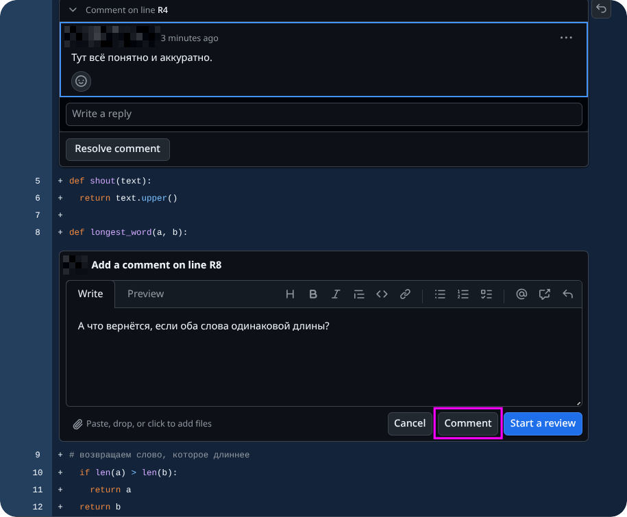

5. **Обязательный шаг — опубликовать обзор.** Когда комментарий написан, вверху справа нажмите синюю кнопку **Submit review** («отправить обзор»). Откроется окно **Finish your review** («завершить обзор»). Можно дописать общий комментарий ко всему обзору (необязательно); ниже уже выбран вариант **Comment** — оставьте его как есть. Нажмите зелёную кнопку **Submit review** внизу окна. Только после этого ваши комментарии перестанут быть черновиком и станут видны всем, в том числе автору Pull Request. Если пропустить этот шаг, комментарий так и останется **Pending** и никто его не увидит.

   В окне есть три варианта отправки обзора — для урока оставляем первый:
   - **Comment** — просто оставить отзыв, без решения принимать изменения или нет (наш случай).
   - **Approve** («одобрить») — отзыв с одобрением: изменения можно вливать.
   - **Request changes** («запросить правки») — отзыв с просьбой сначала что-то исправить.

   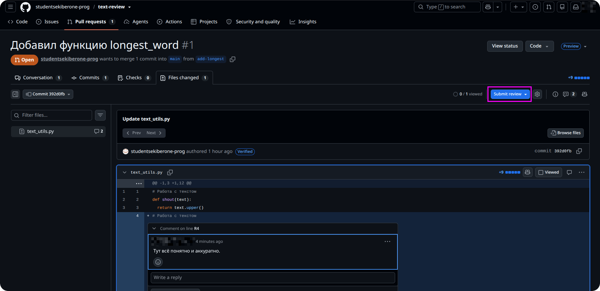
   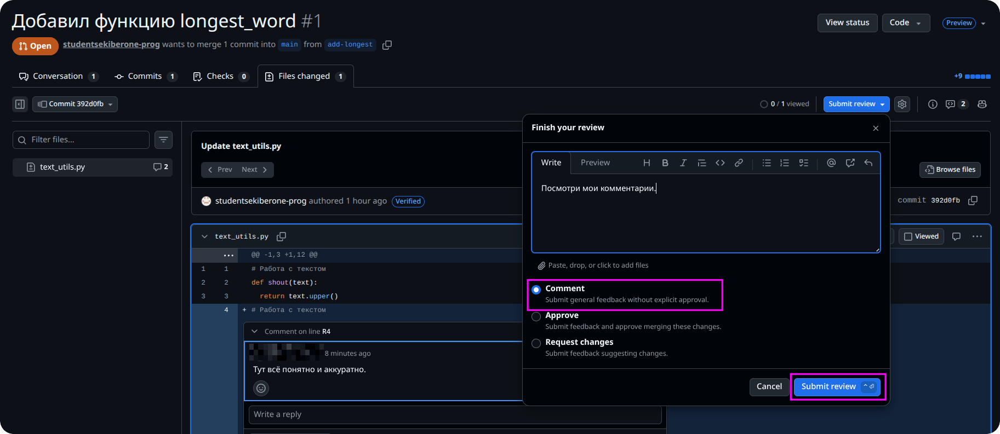
6. Переключитесь на вкладку **Conversation** («обсуждение») и прочитайте комментарии, которые оставили к этому же коду одноклассники, — получился общий разбор одного Pull Request.

> Заметка: у каждого комментария есть две похожие кнопки. **Comment** публикует один комментарий сразу. **Start a review** копит комментарии в черновик, и их обязательно нужно отправить: кнопка **Submit review** вверху справа, затем в окне **Finish your review** ещё раз зелёная **Submit review**. Если выбрали Start a review, но забыли отправить обзор, комментарии остаются видны только автору обзора (статус **Pending**) — это самая частая причина «комментарии пропали».

**Ожидаемый результат:** ученик оставил комментарий к коду в общем Pull Request на вкладке **Files changed**, опубликовал обзор кнопкой **Submit review** (комментарий больше не в статусе **Pending**) и увидел в обсуждении комментарии одноклассников к тому же коду; ученик понимает, что обзор кода — это обсуждение изменений до их принятия.

> Важно проговорить вслух: обзор кода нужен, чтобы вместе сделать проект лучше. Если хочется что-то поправить — предлагаем по делу и объясняем, зачем.

---

### 4. Самостоятельная работа (35 мин)

**Действия преподавателя:**

Сначала дать ученикам пройти короткий квиз для самопроверки (5 минут) — он закрепляет теорию урока. Разобрать на классе вопросы, где ошиблись многие. Затем раздать основное задание: ученики самостоятельно проходят полный командный цикл уже в своём проекте `my-first-app` — от задачи (Issue, созданной на практике) до её решения через Pull Request. Здесь соединяются навыки прошлых уроков: ветки (урок 4), push (урок 5) и сегодняшние Pull Request и обзор кода. Наблюдать, в какой момент ученики теряются, сразу не подсказывать — навести вопросом (см. «Способы помощи»). Главное, на что смотреть: создают ли отдельную ветку для изменения, ссылаются ли в Pull Request на свою Issue и понимают ли, что merge — это и есть момент, когда изменение попадает в основной проект.

#### Квиз для самопроверки

Заметка для вёрстки (mkdocs-programmer): оформить как интерактивный квиз с одним правильным ответом в каждом вопросе. Правильный вариант помечен «(верно)», после каждого вопроса дана строка обратной связи для пояснения после ответа.

**Вопрос 1. Что такое Pull Request?**

- А) Команда, которая скачивает чужой проект на компьютер
- Б) Предложение автору проекта влить твои изменения в его проект (верно)
- В) Кнопка, которая удаляет чужой репозиторий
- Г) Сообщение об ошибке в коде

Обратная связь: Pull Request — это вежливая просьба принять твои изменения; решение (merge или отказ) остаётся за автором проекта.

**Вопрос 2. Для чего нужны Issues?**

- А) Чтобы хранить пароли проекта
- Б) Чтобы ставить задачи, сообщать об ошибках и обсуждать идеи проекта (верно)
- В) Чтобы скачивать проект на компьютер
- Г) Чтобы удалять чужие комментарии

Обратная связь: Issue — это запись о задаче, ошибке или идее; у каждой свой номер, по которому на неё удобно ссылаться.

**Вопрос 3. Ты открыл Pull Request в чужой проект. Изменился ли при этом сразу оригинальный проект?**

- А) Да, изменения попадают в проект сразу
- Б) Нет, пока автор не примет запрос (merge), оригинал не меняется (верно)
- В) Оригинал удаляется
- Г) Изменится только если перезагрузить страницу

Обратная связь: Pull Request — это только предложение. Изменения попадут в проект, лишь когда автор сделает merge (слияние).

**Вопрос 4. Что такое обзор кода (code review)?**

- А) Удаление чужого кода без спроса
- Б) Чтение и проверка чужих изменений с комментариями перед слиянием (верно)
- В) Команда для скачивания проекта
- Г) Список всех файлов проекта

Обратная связь: обзор кода — это обсуждение изменений до их принятия.

**Вопрос 5. Как правильно оставить комментарий при обзоре кода?**

- А) Грубо раскритиковать автора
- Б) Написать по делу: похвалить и, при желании, предложить улучшение (верно)
- В) Молча отклонить Pull Request
- Г) Удалить чужой файл

Обратная связь: цель обзора — вместе сделать код лучше; комментарии пишут по делу и про код.

#### Задание

Пройди полный командный цикл в своём проекте `my-first-app` — от задачи до её решения. Задачу мы уже поставили на практике (Issue «Добавить поиск минимума в калькулятор», #1).

1. Открой свой проект `my-first-app` в VS Code (папка с прошлых уроков) и убедись, что он у тебя свежий. На всякий случай в терминале (меню **Terminal — New Terminal**) выполни `git pull`, чтобы забрать последнюю версию с GitHub.
2. Создай новую ветку под задачу и переключись в неё (как на уроке 4):

   ```
   git switch -c add-minimum
   ```
3. Открой файл `calc.py` и добавь в него поиск меньшего из двух чисел (функцию `minimum` — по образцу того, как сделана функция `maximum` с урока 4, только наоборот). Сохрани файл (Ctrl+S).
4. Закоммить изменение: в терминале `git add .`, затем `git commit -m "Добавил поиск минимума в калькулятор"`.
5. Отправь ветку на GitHub: `git push -u origin add-minimum`.
6. Открой в браузере свой репозиторий `my-first-app`. GitHub покажет жёлтую плашку с кнопкой **Compare & pull request** — нажми её.
7. В описании Pull Request напиши, что он решает твою задачу, и сошлись на Issue словами `Closes #1` (это автоматически закроет Issue #1, когда запрос вольют). Нажми **Create pull request**.

   [СКРИНШОТ: Pull Request в my-first-app с текстом Closes #1 в описании]
8. Сам себе сделай короткий обзор: открой вкладку **Files changed**, перечитай своё изменение — нет ли опечаток. Если всё хорошо, вернись на вкладку **Conversation** и нажми зелёную кнопку **Merge pull request**, затем **Confirm merge**.
9. Проверь результат: зайди на вкладку **Code** — твой поиск минимума теперь в основной версии проекта; открой вкладку **Issues** — задача #1 закрылась автоматически.
10. Покажи преподавателю: влитый (Merged) Pull Request и закрытую Issue #1.

#### Критерии оценки

| Результат | Оценка |
|-----------|--------|
| Прошёл весь цикл самостоятельно: создал ветку, добавил поиск минимума, отправил ветку, открыл Pull Request со ссылкой `Closes #1`, сделал merge; Issue #1 закрылась автоматически | Отлично |
| Выполнил всё, но с одной-двумя мелкими ошибками или с одной подсказкой (например, забыл `Closes #1` или создал PR не из ветки) | Хорошо |
| Сделал изменение и открыл Pull Request, но ветку, ссылку на Issue или merge выполнил только с помощью преподавателя | Удовлетворительно |
| Не смог самостоятельно открыть Pull Request даже с помощью | Требует доработки |

---

### 5. Подведение итогов (10 мин)

**Действия преподавателя:**

Кратко повторить путь командной работы: Issue — поставили задачу; ветка и изменение — решили её; Pull Request — предложили изменение; обзор кода — проверили; merge — приняли. Спросить нескольких учеников: чем Pull Request отличается от обычного `push` в свой форк (push кладёт изменение в свою копию, а PR предлагает его автору оригинала), и изменится ли чужой проект сразу после открытия Pull Request (нет, только после merge). Похвалить за то, что научились работать в команде так, как это делают настоящие программисты: предлагать, обсуждать и проверять, а не менять общий проект молча. Сделать связку со следующим уроком: «На последнем уроке модуля соберём всё вместе: сделаем свой проект и опубликуем его как настоящий сайт на GitHub Pages».

**Вопросы для рефлексии:**

- Что нового узнали сегодня?
- Что было самым сложным?
- Где это можно применить в жизни?

---

## Домашнее задание

Повторение. Дома закрепи командный цикл и письменно ответь на вопросы.

1. Зайди на GitHub в свой проект `my-first-app`, открой вкладку **Issues** и создай новую Issue с любой полезной идеей для калькулятора, например: `Добавить куб числа` или `Выводить результат с пояснением`. Запиши её номер.
2. Письменно ответь одной-двумя строками на вопросы (можно в обычном текстовом файле):
   - Чем Pull Request отличается от обычного `push` в свой форк?
   - Что должно произойти, чтобы предложенное в Pull Request изменение попало в проект?
   - Каким должен быть хороший комментарий при обзоре кода?

---

## Методические заметки преподавателя

### Возможные сложности

- Путают свой форк с оригиналом. На страницах GitHub ученики не сразу понимают, чья страница открыта, и пытаются открыть Pull Request не с той стороны. Приучать смотреть на имя вверху: своё имя пользователя — это форк, `firstcontributions` — оригинал. На странице сравнения проговаривать направление стрелки слияния: слева оригинал (куда), справа форк (откуда).
- Нет форка с прошлого урока (пропустил урок 6) — тогда нечего предлагать в Pull Request. Заранее проверить на оргмоменте; такому ученику помочь быстро сделать форк и push файла, прежде чем открывать PR.
- Не находят кнопку **Contribute** / **Compare & pull request**. Эти кнопки появляются, только если в форке (или ветке) есть коммиты, которых нет в оригинале. Если кнопки нет — значит, изменение не отправлено (`push`) или взята не та страница. Показать кнопки явно на проекторе.
- Путают Issue и Pull Request. Issue — это задача (текст, что нужно сделать), Pull Request — это уже готовое изменение кода, которое предлагают влить. Проговорить разницу на примере практики и самостоятельной работы.
- В самостоятельной работе делают изменение прямо в основной ветке, без `git switch -c`. Тогда не из чего открыть Pull Request внутри своего репозитория. Напоминать: сначала новая ветка под задачу, потом изменение.
- Забывают `git push` ветки перед открытием PR, и GitHub не показывает плашку с кнопкой. Напоминать порядок: коммит — push ветки — затем PR на сайте.
- Не понимают, что `Closes #1` в описании сам закроет Issue. Показать после merge, что задача #1 перешла в Closed автоматически.
- При `push` ветки или merge Git/GitHub может снова запросить вход через браузер (как на уроке 5) — окно входа прячется за окном VS Code; напомнить искать его на панели задач Windows.
- Неудачные комментарии при обзоре кода (не по делу). Заранее показать образец хорошего комментария по делу.
- Комментарий обзора «пропал» — самая частая техническая загвоздка. Если ученик нажал **Start a review**, комментарий уходит в черновик со статусом **Pending** и виден только ему; пока не нажать **Submit review** (вверху справа), а затем в окне **Finish your review** ещё раз **Submit review**, остальные его не увидят. Обязательно проговорить и показать этот финальный шаг на проекторе. Кому проще — пусть пользуются кнопкой **Comment** (публикует сразу).

### Способы помощи

Подсказки давать по нарастанию, не выдавая ответ сразу:

- При путанице форк/оригинал: «Посмотри на имя вверху страницы. Если стоит твоё имя — это твой форк. Pull Request открывают со страницы своего форка кнопкой Contribute».
- Если нет кнопки для PR: «Кнопка появляется, только когда есть отправленное изменение, которого нет в оригинале. Ты сделал `push`? Открой страницу именно своего форка, а не оригинала».
- При путанице Issue и PR: «Issue — это где ты словами описываешь задачу. Pull Request — это где ты предлагаешь уже сделанный код. Сегодня ты делаешь и то, и другое».
- Если в самостоятельной работе нет кнопки PR внутри своего репозитория: «Из какой ветки ты предлагаешь изменение? Сначала нужно создать ветку командой `git switch -c add-minimum`, внести изменение и отправить ветку командой `git push -u origin add-minimum`».
- При ошибке доступа на push: «Проверь, что ты отправляешь ветку в свой репозиторий (`origin`), а не в чужой. Сравни имя пользователя в адресе со своим».
- При вопросе «как закрыть Issue автоматически»: «В описании Pull Request напиши `Closes #` и номер своей задачи. После merge она закроется сама».
- При неконкретном комментарии в обзоре: «Перечитай свой комментарий. Понятно ли из него, что именно стоит поправить? Похвали то, что хорошо, и предложи улучшение по делу».
- Если ученик говорит, что его комментарий не виден другим: «Посмотри, нет ли у комментария жёлтой пометки Pending. Если есть — нажми вверху справа Submit review, потом в окне Finish your review ещё раз Submit review. Черновик обзора виден только тебе, пока ты его не отправишь».

### Дополнительные задания для тех, кто справился раньше

- Открой свой влитый Pull Request в `my-first-app` и найди в истории проекта, как изменение из ветки попало в основную версию (вкладка **Code**, затем **commits**). Объясни соседу, что сделал merge.
- В своём репозитории `my-first-app` создай ещё одну Issue с пометкой (label), например `enhancement` (улучшение): на странице Issue справа есть раздел **Labels**. Узнай, зачем нужны метки.
- Найди на GitHub любой настоящий открытый проект и посмотри его вкладку **Issues** и **Pull requests**: сколько там открытых задач и предложений, как люди обсуждают изменения. Расскажи классу один интересный пример.
- Помоги однокласснику, у которого не получается открыть Pull Request, — проведи для него короткий обзор кода и оставь комментарий по делу.
