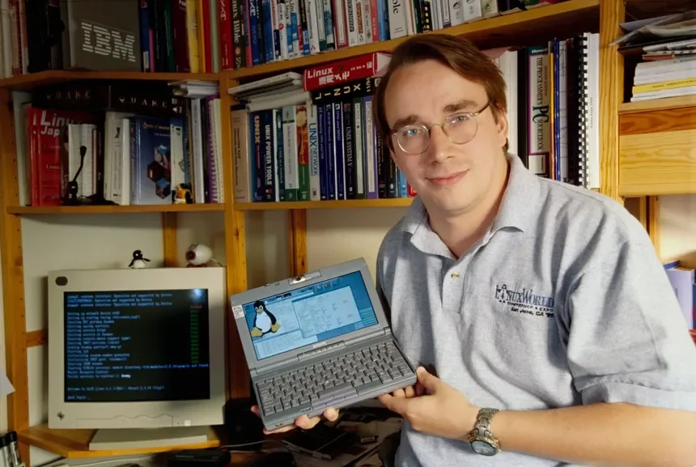
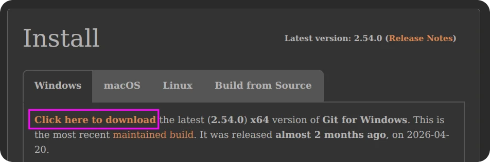
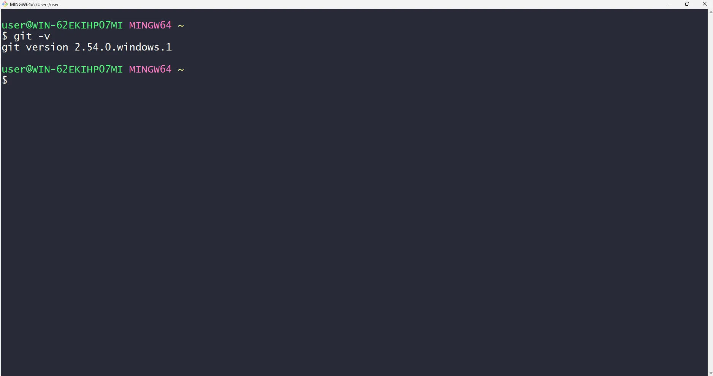
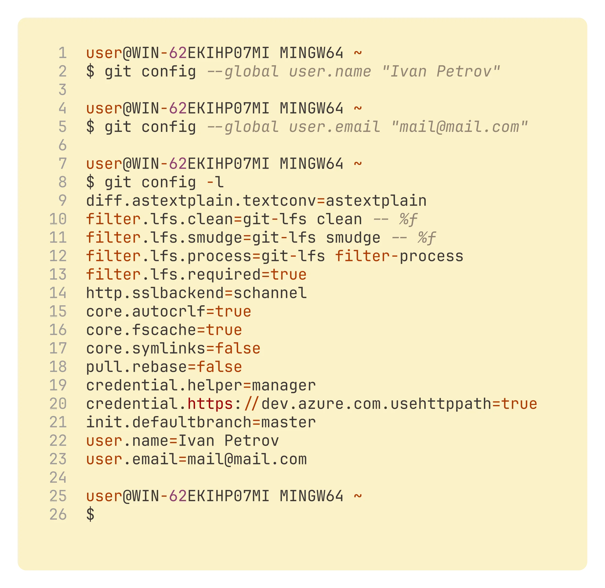

# Урок 1 — Что такое контроль версий. Установка Git и первая настройка

## Общая информация

| Параметр          | Значение                                                   |
| ----------------- | ---------------------------------------------------------- |
| Курс              | От Git до Github                                            |
| Модуль            | От Git до Github                                            |
| Тема урока        | Что такое контроль версий. Установка Git и первая настройка |
| Возраст учащихся  | 12–14 лет                                                  |
| Продолжительность | 120 мин                                                    |

---

## Цель урока

!!! slide "Цель урока"
    К концу урока ученики смогут объяснить своими словами, зачем нужна система контроля версий, самостоятельно установить Git и редактор VS Code на компьютер под Windows и выполнить первую настройку Git (имя и e-mail), проверив результат командами в терминале.

---

## План урока

| Этап                      | Время   |
| ------------------------- | ------- |
| 1. Организационный момент | 5 мин   |
| 2. Теоретическая часть    | 10 мин  |
| 3. Практическая работа    | 60 мин  |
| 4. Самостоятельная работа | 35 мин  |
| 5. Подведение итогов      | 10 мин  |
| Итого                     | 120 мин |

---

## Ход занятия

### 1. Организационный момент

**Время:** 5 мин

#### Действия преподавателя

- Поприветствовать группу, проверить, что у каждого ученика включён компьютер, есть доступ в интернет и открыт браузер.
- Назвать тему урока простыми словами: «Сегодня узнаем, как программисты не теряют свои файлы и хранят все версии проекта, и установим главный инструмент для этого — Git».
- Предупредить, что урок практический: мы будем ставить программы и набирать команды.

---

### 2. Теоретическая часть

**Время:** 10 мин

#### Действия преподавателя

- Объяснить тему на доске или на экране, задавая вопросы классу. Лучше всего начать с понятной всем проблемы — потерянных и перепутанных версий файлов.

!!! slide "Зачем нужен контроль версий: два примера"
    **Пример 1.** Ты пишешь игру, и всё работает. Добавляешь новую фишку — и игра перестаёт запускаться. Что именно ты сломал? Без контроля версий придётся вспоминать и искать ошибку вручную, перебирая весь код. С Git можно сравнить «было и стало» и за секунду вернуться к рабочей версии.

    **Пример 2.** Во многих играх есть контрольные точки — checkpoint. Прошёл сложное место — игра сохранилась, и если дальше погибнешь, начнёшь не с начала, а с последней точки. Git делает то же самое для проекта: каждое сохранение (коммит) это контрольная точка, к которой всегда можно вернуться.

!!! slide "Что такое Git"
    Git — это программа, которая следит за изменениями в папке с проектом. Она запоминает каждое сохранение (его называют «коммит»), позволяет вернуться к любой прошлой версии и показывает, что именно поменялось. Git работает через команды, которые мы набираем в специальном окне — терминале. Это как машина времени для ваших файлов.

!!! slide "Краткая история: откуда взялся Git"
    Git придумал в 2005 году Линус Торвальдс — тот же человек, который создал операционную систему Linux. Его большой команде нужен был инструмент, чтобы сотни программистов могли работать над одним проектом и не мешать друг другу. Существующие инструменты их не устроили, и Линус за пару недель написал свой. Сегодня Git — самый популярный в мире инструмент контроля версий, им пользуются почти все программисты.

    Откуда же взялось само название «git»? Линус Торвальдс придумал его в шутку. В британском английском словом «git» в разговоре называют вредного, упрямого человека — примерно как у нас сказали бы «ворчун» или «зануда». Линус пошутил, что называет свои программы в свою честь: сначала была Linux, а теперь git. Есть и более «серьёзное» объяснение: эти три буквы можно расшифровать как Global Information Tracker — «глобальный отслеживатель информации». Какое объяснение выбрать, каждый решает сам, но короткое слово из трёх букв запомнить точно легко.

    

!!! slide "Записи в блокнот"
    - **Система контроля версий (Version Control System, VCS)** — программа, которая хранит все версии проекта и помнит, кто и что в нём менял.
    - **Git** — самая популярная система контроля версий; работает через команды в терминале.
    - **Репозиторий** — папка проекта, за которой следит Git (познакомимся с ней на следующем уроке).
    - **Терминал (командная строка)** — окно, в котором мы вводим команды текстом, а не мышкой.
    - **Git Bash** — терминал, который устанавливается вместе с Git и понимает его команды.
    - **git config** — команда, которой мы настраиваем Git — например, задаём своё имя и e-mail.

---

### 3. Практическая работа

**Время:** 60 мин

#### Действия преподавателя

- Работаем по принципу «Я показываю — делаем вместе — делаешь сам». Каждый шаг сначала показывается на проекторе, затем ученики повторяют на своих компьютерах.
- Перед каждым этапом — короткая мини-теория (1–3 предложения), затем задание. Двигаться маленькими шагами и дожидаться, пока повторят все, прежде чем идти дальше.
- Если Git уже установлен тьютором, пропустить скачивание и установку и начать с проверки версии.

!!! slide "Скачиваем установщик Git"
    **Мини-теория:** программы для Windows скачивают в виде файла-установщика. Git берут только с официального сайта git-scm.com — так мы не поймаем вирус с поддельного сайта.

    1. Откройте браузер и в адресной строке введите: `git-scm.com`
    2. На главной странице нажмите кнопку «Download for Windows».
    3. Выберите «64-bit Git for Windows Setup» — начнётся скачивание файла.
    4. Внизу окна браузера или в папке «Загрузки» найдите скачанный файл (его имя начинается со слова Git и заканчивается на .exe).

    

!!! slide "Устанавливаем Git"
    **Мини-теория:** установщик задаёт много вопросов, но новичку менять ничего не нужно — стандартные настройки подходят. Нам важно просто несколько раз нажать «Next» и затем «Install».

    1. Дважды щёлкните по скачанному файлу установщика Git.
    2. Если Windows спросит «Разрешить этому приложению вносить изменения?» (окно UAC) — нажмите «Да».
    3. Во всех окнах установщика нажимайте кнопку «Next», не меняя настройки.
    4. На последнем шаге нажмите «Install» и дождитесь окончания установки.
    5. Нажмите «Finish». Если стоит галочка про заметки о версии — её можно снять.

!!! note "Где чаще всего теряются"
    Ученики пугаются окна UAC и большого числа экранов установщика. Заранее предупредите, что окон много и нужно просто нажимать «Next» — это нормально.

!!! slide "Открываем Git Bash и проверяем установку"
    **Мини-теория:** вместе с Git устанавливается терминал Git Bash. Команда `git -v` показывает номер установленной версии — это самый простой способ проверить, что Git работает.

    1. Нажмите кнопку «Пуск» и начните печатать: Git Bash.
    2. В списке найдите приложение «Git Bash» и откройте его — появится чёрное окно терминала.
    3. Наберите команду: `git -v` и нажмите Enter.
    4. Прочитайте ответ — в строке должно появиться слово git и номер версии (например, `git version 2.45.0`).

    

    

!!! warning "Важно"
    В терминале команды печатают руками точь-в-точь, включая дефис перед флагом `v`. Вставить текст в Git Bash можно правой кнопкой мыши, а не сочетанием Ctrl+V.

!!! slide "Первая настройка Git: имя и e-mail"
    **Мини-теория:** Git подписывает каждое сохранение именем автора, поэтому ему нужно один раз сообщить, кто вы. Эти данные настраиваются командой `git config` и потом используются во всех проектах.

    1. В Git Bash наберите команду (вместо Ivan Petrov впишите своё имя латиницей в кавычках) и нажмите Enter:

        ```bash
        git config --global user.name "Ivan Petrov"
        ```

    2. Следующей командой задайте e-mail (впишите свой e-mail) и нажмите Enter:

        ```bash
        git config --global user.email "ivan@example.com"
        ```

    3. Проверьте настройки командой:

        ```bash
        git config -l
        ```

    4. Найдите в списке строки user.name и user.email — в них должны быть ваши данные.

    

!!! note "Ожидаемый результат"
    Git установлен, открывается Git Bash, команда `git -v` показывает версию, а в настройках записаны имя и e-mail ученика.

!!! slide "Устанавливаем редактор кода VS Code"
    **Мини-теория:** файлы проекта удобно открывать и редактировать в специальном редакторе. Весь модуль мы будем работать в VS Code — это бесплатный редактор от Microsoft.

    1. Откройте браузер и перейдите на сайт: `code.visualstudio.com`
    2. Нажмите большую кнопку «Download for Windows».
    3. Запустите скачанный установщик, в окне UAC нажмите «Да».
    4. Примите условия лицензии, затем нажимайте «Next», а в конце — «Install».
    5. После установки нажмите «Finish» — VS Code откроется. Закройте вкладку приветствия.

---

### 4. Самостоятельная работа

**Время:** 35 мин

#### Действия преподавателя

- Вывести на проектор задание, которое указано ниже. Ходить по классу и наблюдать.
- Вмешиваться не сразу: сначала дать ученику попробовать самому, затем подсказать наводящим вопросом, и только потом показывать.
- Особое внимание — тем, у кого на практике не получилось открыть Git Bash или набрать команду.

#### Задание

!!! slide "Самостоятельная работа"
    Проверь себя: пройди весь путь настройки заново и убедись, что всё работает.

    1. Открой Git Bash через кнопку «Пуск».
    2. Выполни команду `git -v` и запиши номер своей версии Git.
    3. Выполни команду `git config -l` и проверь, что user.name и user.email указаны верно.
    4. Если в имени или e-mail ошибка — исправь её той же командой `git config --global`, что и на практике.

#### Критерии оценки

| Критерий | Оценка |
| -------- | ------ |
| Все пункты выполнены полностью самостоятельно: Git и VS Code установлены, версия проверена, имя и e-mail настроены верно | Отлично |
| Всё выполнено, но с небольшими ошибками или после одной подсказки (например, перепутал команду или формат кавычек) | Хорошо |
| Выполнена часть пунктов, потребовалась помощь преподавателя на нескольких шагах | Удовлетворительно |
| Не удалось установить Git или выполнить настройку, задание не завершено | Требует доработки |

---

### 5. Подведение итогов

**Время:** 10 мин

#### Действия преподавателя

- Кратко повторить, что сделали: поняли, зачем нужен контроль версий, и установили Git и VS Code.
- Спросить нескольких учеников, какую версию Git показала команда `git -v`.
- Сказать, что на следующем уроке создадим свой первый репозиторий и сделаем первое сохранение-коммит. Выдать домашнее задание.

#### Вопросы для рефлексии

!!! slide "Подведём итоги"
    - Зачем программисту система контроля версий? Приведи пример из жизни.
    - Что было самым сложным при установке?
    - Какой командой проверить, что Git установлен?

---

## Домашнее задание

!!! slide "Домашнее задание"
    Задание на повторение (письменно в тетради или в файле):

    1. Своими словами объясни, что такое система контроля версий и какую проблему она решает (2–3 предложения).
    2. Напиши, в каком году и кто создал Git.
    3. Выпиши три команды, которые мы использовали на уроке, и подпиши, что делает каждая (`git -v`, `git config --global user.name`, `git config -l`).
    4. Если дома есть компьютер — установи на нём Git и редактор VS Code, затем выполни первую настройку Git (имя и e-mail) самостоятельно.

---

## Методические заметки преподавателя

### Возможные сложности

- Окно UAC «Разрешить вносить изменения?» пугает учеников — заранее объяснить, что нужно нажать «Да».
- Большое число экранов в установщике Git — ученики теряются и начинают менять настройки. Предупредить: просто «Next».
- Ввод команд в терминал: опечатки, пропущенные дефисы, неправильные кавычки. Самая частая ошибка на этом уроке.
- Вставка в Git Bash: Ctrl+V не работает, нужна правая кнопка мыши.
- На школьных компьютерах может не быть прав администратора — тогда Git и VS Code должен установить тьютор заранее.

### Способы помощи учащимся

Помогать каскадом подсказок, не давая сразу готовый ответ:

- **Подсказка 1 (общая):** «Перечитай шаг в инструкции вслух. Какое именно слово или символ ты набрал по-другому?»
- **Подсказка 2 (конкретнее):** «Сравни свою команду с командой на экране по буквам — обрати внимание на два дефиса и кавычки».
- **Подсказка 3 (процедурная):** показать на проекторе правильный ввод этой же команды и попросить повторить.
- Если ученик застрял на открытии Git Bash — показать поиск через «Пуск» и набор слова Git Bash.

### Дополнительные задания (для тех, кто справился раньше)

- Выполнить команду `git -h` и посмотреть, сколько у Git команд. Назвать две незнакомые.
- Поиграйте с терминалом Git Bash: введите команду `cal` — появится календарь текущего месяца, а команда `date` покажет точные дату и время. Найдите в календаре день своего рождения.
- Сделайте сообщения Git цветными: выполните команду `git config --global color.ui auto`, затем проверьте настройки командой `git config -l` и найдите новую строку `color.ui` — теперь подсказки Git будут раскрашиваться.

---
