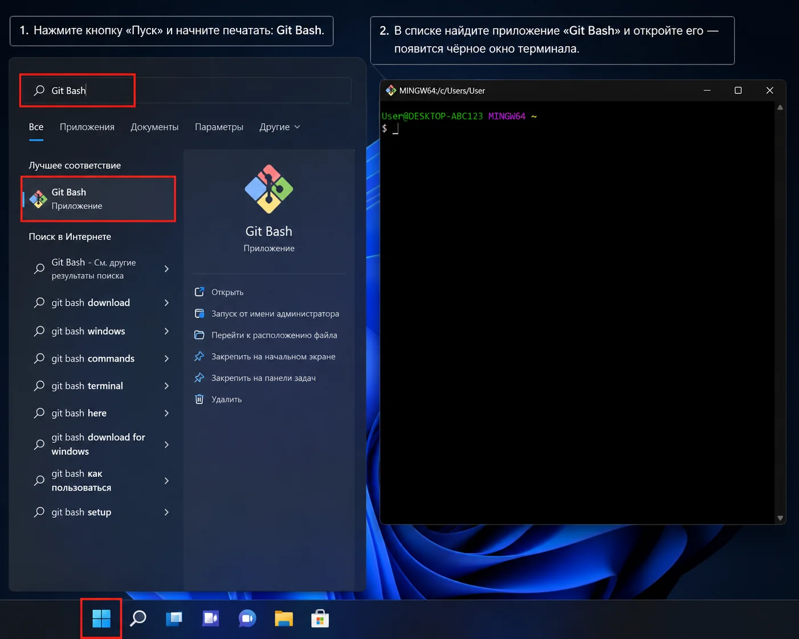
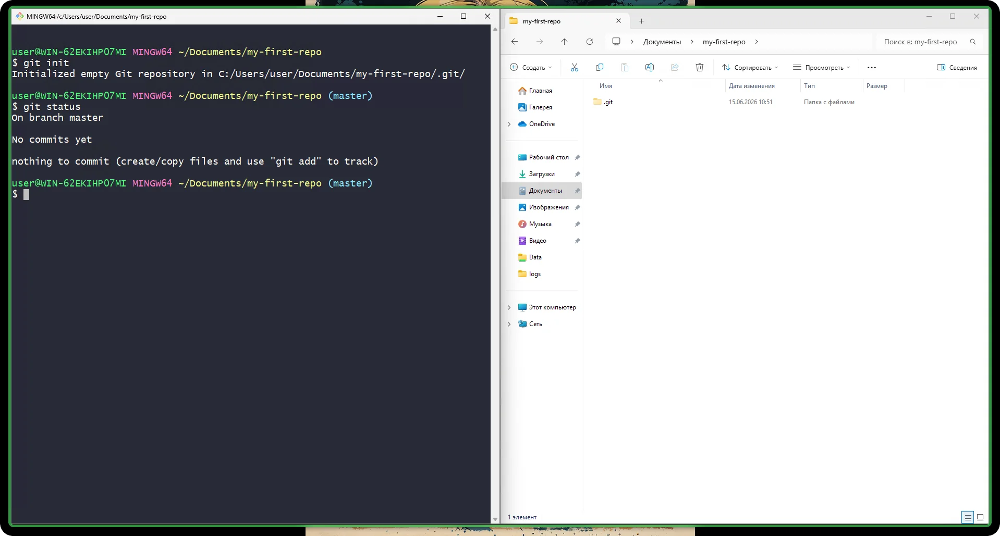
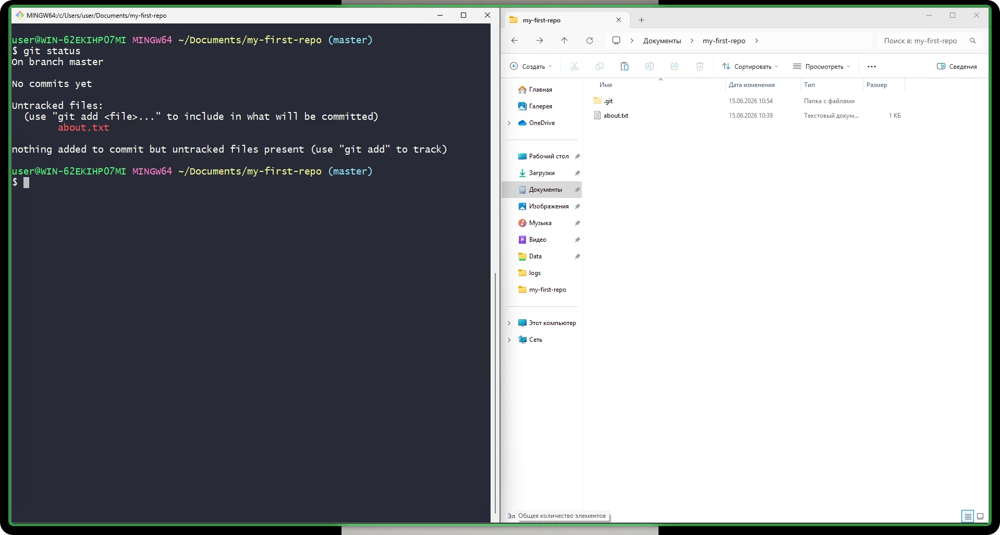
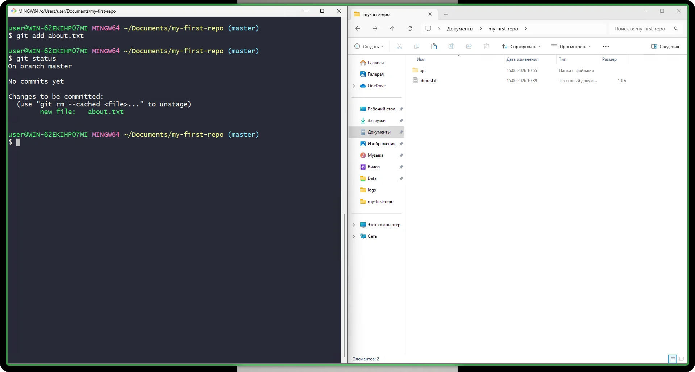
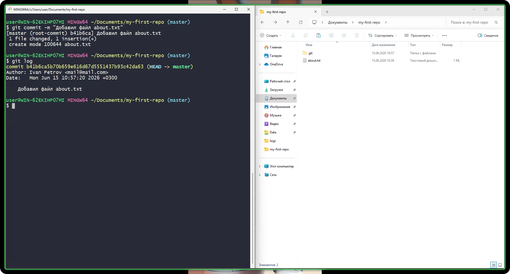
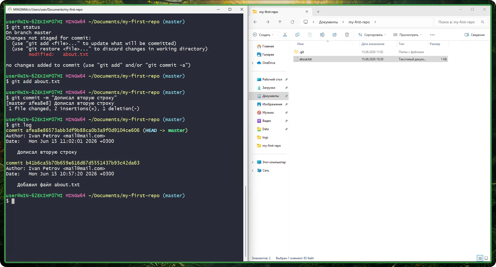
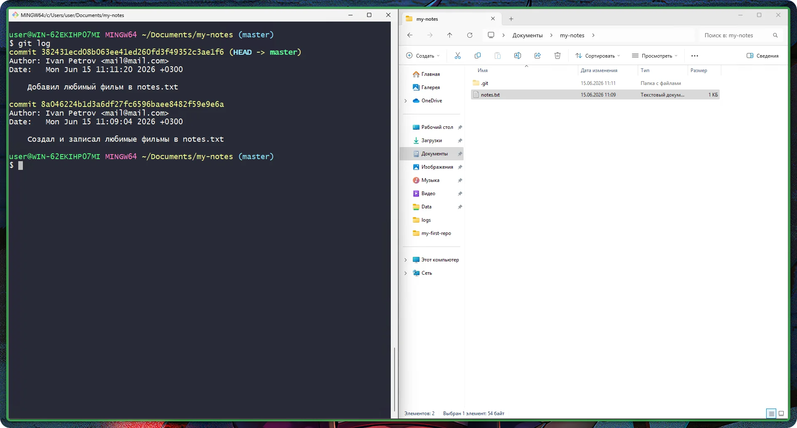

# Урок 2 — Первый репозиторий: init, add, commit, status, log

## Общая информация

| Параметр          | Значение                                          |
| ----------------- | ------------------------------------------------- |
| Курс              | От Git до Github                                   |
| Модуль            | От Git до Github                                   |
| Тема урока        | Первый репозиторий: init, add, commit, status, log |
| Возраст учащихся  | 12–14 лет                                         |
| Продолжительность | 120 мин                                           |

---

## Цель урока

!!! slide "Цель урока"
    К концу урока ученики смогут создать локальный репозиторий командой `git init` и самостоятельно сделать в нём первый коммит, последовательно применив команды `git status`, `git add` и `git commit`, а затем посмотреть историю изменений командой `git log`.

---

## План урока

| Этап                      | Время   |
| ------------------------- | ------- |
| 1. Организационный момент | 5 мин   |
| 2. Теоретическая часть    | 10 мин  |
| 3. Практическая работа    | 60 мин  |
| 4. Самостоятельная работа | 35 мин  |
| 5. Подведение итогов      | 10 мин  |
| Итого                     | 120 мин |

---

## Ход занятия

### 1. Организационный момент

**Время:** 5 мин

#### Действия преподавателя

- Поприветствовать группу, проверить, что у каждого ученика включён компьютер и установлен Git (с прошлого урока).
- Кратко напомнить прошлую тему: «На прошлом уроке мы установили Git и настроили своё имя и e-mail».
- Назвать тему и цель сегодняшнего урока простыми словами: «Сегодня мы создадим свой первый репозиторий и научимся сохранять в нём изменения — делать коммиты. Коммит — это как сохранение в игре, к которой всегда можно вернуться».

---

### 2. Теоретическая часть

**Время:** 10 мин

#### Действия преподавателя

- Объяснить на доске или на экране три коротких понятия. Не вводить много теории сразу: основные команды ученики освоят руками в практической части по схеме «мини-теория — задание».
- Задавать классу вопросы, опираться на примеры из игр и жизни.

!!! slide "Что такое репозиторий"
    Репозиторий — это папка проекта, за которой следит Git. Снаружи это обычная папка с файлами, но внутри неё Git создаёт скрытую папку `.git`, где хранит всю историю изменений.

!!! slide "Три состояния файла: рабочая папка, индекс, коммит"
    Чтобы сохранить изменения, файл проходит три ступени. Сначала ты меняешь файлы в **рабочей папке**. Потом командой `git add` складываешь нужные файлы в **индекс** — это как коробка, в которую ты собираешь вещи перед отправкой. Затем командой `git commit` заклеиваешь и подписываешь коробку — Git делает снимок и сохраняет его навсегда.

    Пример из жизни: собираешь посылку (`add`) → заклеиваешь и подписываешь её (`commit`).

!!! slide "Что такое коммит"
    Коммит — это сохранённый снимок проекта с коротким описанием, что именно изменилось. У каждого коммита есть автор, время и подпись.

    Пример из жизни: это контрольная точка (checkpoint) в игре — в любой момент можно посмотреть, что было сохранено, и вернуться назад.

!!! slide "Записи в блокнот"
    - **Репозиторий** — папка проекта, за которой следит Git; внутри хранится скрытая папка `.git` с историей.
    - **git init** — команда, которая превращает обычную папку в репозиторий Git.
    - **git status** — команда, которая показывает, что изменилось внутри папки (репозитория) и что готово к сохранению.
    - **git add** — команда, которая добавляет файл в индекс (готовит его к коммиту).
    - **git commit** — команда, которая сохраняет снимок изменений с подписью.
    - **git log** — команда, которая показывает список всех коммитов — историю проекта.

---

### 3. Практическая работа

**Время:** 60 мин

#### Действия преподавателя

- Работаем по принципу «Я показываю — делаем вместе — делаешь сам». Каждую новую команду сначала показать на проекторе и объяснить, что она делает, затем ученики повторяют у себя и проверяют результат.
- Блоки идут по нарастанию: первые команды выполняем все вместе шаг в шаг (блоки 1–5), последний блок ученики проходят почти самостоятельно (блок 6). Команды вводим в Git Bash.
- Напомнить: вставка в Git Bash — правой кнопкой мыши, а не Ctrl+V.

!!! slide "Блок 1. Создаём папку проекта и открываем в ней Git Bash"
    **Мини-теория:** Git работает внутри папки проекта. Сначала создадим обычную папку там, где вы храните свои проекты, а затем откроем в ней терминал Git Bash — для этого у Git есть пункт в меню по правой кнопке мыши.

    1. Откройте Проводник Windows: нажмите Win+E (или щёлкните по значку жёлтой папки на Панели задач).
    2. Перейдите в папку, где вы храните свои проекты, — например, «Документы», папку Google Drive или другую, которую укажет тьютор.
    3. Щёлкните правой кнопкой мыши по пустому месту, выберите «Создать», затем «Папку».
    4. Дайте папке имя `my-first-repo` (английскими буквами, без пробелов) и нажмите Enter.
    5. Откройте папку двойным щелчком — внутри она пустая.
    6. Щёлкните правой кнопкой мыши по пустому месту внутри папки. В Windows 11 сначала нажмите «Показать дополнительные параметры».
    7. В меню выберите пункт «Open Git Bash here» — откроется чёрное окно терминала.

    

!!! note "Ожидаемый результат"
    Открыт Git Bash, и в его строке виден путь, заканчивающийся на `/my-first-repo`.

!!! slide "Блок 2. Превращаем папку в репозиторий (git init)"
    **Мини-теория:** команда `git init` создаёт внутри папки скрытую папку `.git` — с этого момента Git начинает следить за проектом. Делать это нужно только один раз для каждого проекта.

    1. В окне Git Bash наберите команду `git init` и нажмите Enter.
    2. Прочитайте сообщение: Git напишет, что создан пустой репозиторий (`Initialized empty Git repository`).
    3. Наберите команду `git status` и нажмите Enter, чтобы проверить состояние нового репозитория.

    

!!! note "Ожидаемый результат"
    Git сообщил, что репозиторий создан, а `git status` показывает, что коммитов пока нет (`No commits yet`).

!!! slide "Блок 3. Создаём файл и смотрим состояние (git status)"
    **Мини-теория:** команда `git status` — главный помощник новичка. Она показывает, какие файлы Git ещё не отслеживает. Новый файл Git считает неотслеживаемым (untracked) и подсвечивает красным.

    1. Не закрывая Git Bash, вернитесь в папку `my-first-repo` в Проводнике.
    2. Создайте в ней текстовый файл: правая кнопка мыши, «Создать», «Текстовый документ».
    3. Назовите файл `about.txt`. Важно: имя должно заканчиваться на `.txt`, а не `.txt.txt`.
    4. Откройте файл двойным щелчком, напишите внутри одну строку о себе, например: `Меня зовут Аня, мне 13 лет`. Сохраните файл (Ctrl+S) и закройте.
    5. Вернитесь в Git Bash, наберите команду `git status` и нажмите Enter.
    6. Найдите в выводе имя файла `about.txt` в разделе Untracked files — это значит, что Git увидел новый файл, но пока его не сохраняет.

    

!!! note "Ожидаемый результат"
    `git status` показывает `about.txt` как неотслеживаемый файл (Untracked files).

!!! slide "Блок 4. Добавляем файл в индекс (git add)"
    **Мини-теория:** команда `git add` складывает файл в индекс — готовит его к сохранению. Это как положить вещь в коробку для посылки. После `add` файл в `git status` станет зелёным (Changes to be committed).

    1. В Git Bash наберите команду `git add about.txt` и нажмите Enter.
    2. Наберите команду `git status` и нажмите Enter ещё раз.
    3. Сравните вывод с прошлым разом: теперь файл `about.txt` находится в разделе Changes to be committed — он готов к коммиту.

    

!!! note "Ожидаемый результат"
    Файл `about.txt` перешёл в раздел Changes to be committed — он в индексе и готов к сохранению.

!!! tip "Как добавить сразу всё"
    Когда файлов в проекте много, добавлять их по одному долго. Команда `git add .` (слово `add`, пробел и точка) кладёт в индекс сразу все изменённые и новые файлы из папки. Точку легко не заметить — это самая частая ошибка. Проверить, что попало в индекс, всегда можно командой `git status`.

!!! slide "Блок 5. Делаем первый коммит и смотрим историю (git commit, git log)"
    **Мини-теория:** команда `git commit` сохраняет снимок проекта. После `-m` в кавычках пишут короткое описание, что изменилось. Команда `git log` показывает список всех коммитов — историю проекта.

    1. В Git Bash наберите команду одной строкой `git commit -m "Добавил файл about.txt"` и нажмите Enter.
    2. Прочитайте сообщение: Git напишет, что создан 1 коммит и изменён 1 файл.
    3. Наберите команду `git status` — теперь Git сообщает, что сохранять нечего (`nothing to commit, working tree clean`).
    4. Наберите команду `git log` и нажмите Enter — вы увидите свой первый коммит: его подпись, ваше имя, дату и описание.

    

!!! note "Ожидаемый результат"
    Сделан первый коммит; `git log` показывает его с именем автора, датой и описанием.

!!! warning "Важно"
    Коммит сохраняет только то, что лежит в индексе. Если изменить файл, но забыть сделать `git add`, то `git commit` зафиксирует не новые правки, а ту версию, которую вы добавили в индекс раньше; свежие изменения останутся несохранёнными. Поэтому порядок всегда такой: сначала `git add`, потом `git commit`. Если коммитить нечего (всё уже сохранено), Git так и напишет: `nothing to commit`.

!!! slide "Блок 6. Второй коммит своими руками (делаешь сам)"
    **Мини-теория:** каждое новое сохранение проходит тот же путь: изменил файл → `git add` → `git commit`. Теперь пройдите его сами, подглядывая в свои записи в блокноте, а не в проектор.

    1. Откройте файл `about.txt` и допишите вторую строку, например: `Я учусь работать с Git`. Сохраните и закройте файл.
    2. В Git Bash командой `git status` проверьте, что Git увидел изменение (файл станет modified).
    3. Командой `git add about.txt` добавьте файл в индекс.
    4. Командой `git commit -m "Дописал вторую строку"` сделайте второй коммит.
    5. Командой `git log` посмотрите историю — теперь в ней должно быть два коммита.

    

!!! note "Ожидаемый результат"
    В репозитории два коммита; ученик прошёл цикл `add` → `commit` самостоятельно.

---

### 4. Самостоятельная работа

**Время:** 35 мин

#### Интерактивный тренажёр: путь файла

Прежде чем перейти к практическим задачам, закрепите модель «рабочая папка → индекс → репозиторий» на тренажёре. Создайте репозиторий, добавляйте и изменяйте файлы, складывайте их в индекс командой `git add` и делайте коммит — следите, как файлы меняют цвет (красный = не в индексе → зелёный = в индексе) и переходят между зонами.

!!! note "Что сказать ученикам (для тьютора)"
    Объясните классу коротко, перед тем как открыть тренажёр:

    - **Это симуляция Git, а не настоящий терминал.** Тренажёр наглядно показывает, что происходит «под капотом» при работе с Git на компьютере. Команды по-настоящему не выполняются — мы их повторим в Git Bash на самостоятельной работе.
    - **Кнопки загораются по очереди не случайно.** Действие доступно, только когда оно имеет смысл: нельзя сделать `git add`, пока нет изменений, или `git commit`, пока ничего не лежит в индексе. Так тренажёр не даёт нарушить порядок шагов и заодно показывает логику Git.
    - **Имена авторов, e-mail и тексты коммитов подставляются автоматически** — случайным образом, просто для удобства и наглядности. В реальном проекте вы впишете своё имя и e-mail (как в уроке 1) и сами придумаете описание коммита.

    Дайте каждому ученику пройти полный цикл: создать репозиторий → создать файл → `git add` → `git commit`, и обратить внимание, как файл проходит три зоны.

<iframe src="../../interactives/trainer-1.html" title="Тренажёр 1: жизненный цикл файла в Git" loading="lazy"></iframe>
[Открыть тренажёр на весь экран ↗](../../interactives/trainer-1.html){ target="_blank" }

#### Действия преподавателя

- Вывести задание на проектор. Ходить по классу и наблюдать, не вмешиваться сразу: дать ученику возможность найти подсказку в своих записях и в выводе `git status`.
- Помогать каскадом подсказок (см. методические заметки), не называя готовую команду первой же фразой.
- Засекать тех, кто справился раньше, и давать им дополнительные задания.

#### Задание

!!! slide "Самостоятельная работа"
    Создай с нуля новый репозиторий и сделай в нём два коммита — без подсказок на проекторе. Опирайся на свои записи в блокноте.

    1. Создай новую папку с именем `my-notes` и открой в ней Git Bash.
    2. Преврати папку в репозиторий нужной командой.
    3. Создай в папке файл `notes.txt` и напиши в нём список из трёх своих любимых игр или фильмов.
    4. Проверь состояние репозитория, добавь файл в индекс и сделай первый коммит с понятным описанием.
    5. Допиши в файл ещё одну строку, затем сделай второй коммит.
    6. Посмотри историю и убедись, что в ней два коммита.

    

#### Критерии оценки

| Результат | Оценка |
| --------- | ------ |
| Создал репозиторий и оба коммита полностью самостоятельно, история показывает два коммита | Отлично |
| Справился с небольшими ошибками или одной подсказкой (например, перепутал порядок add и commit) | Хорошо |
| Выполнил частично, потребовалась помощь на нескольких шагах | Удовлетворительно |
| Не удалось создать репозиторий или сделать коммит | Требует доработки |

---

### 5. Подведение итогов

**Время:** 10 мин

#### Действия преподавателя

- Кратко повторить путь файла: рабочая папка → `git add` → `git commit`.
- Спросить класс, какая команда что делает, опираясь на записи в блокноте. Подчеркнуть, что `git status` — главный помощник, когда непонятно, что происходит.
- Сказать, что на следующем уроке научимся смотреть и отменять изменения в истории.

#### Вопросы для рефлексии

!!! slide "Подведём итоги"
    - Какой командой превратить обычную папку в репозиторий?
    - Чем `git add` отличается от `git commit`? Объясни на примере посылки.
    - Где в жизни пригодилось бы сохранять историю изменений?

---

## Домашнее задание

!!! slide "Домашнее задание"
    Задание на повторение (письменно в тетради или в файле):

    1. Выпиши по порядку пять команд урока (`git init`, `git status`, `git add`, `git commit`, `git log`) и подпиши, что делает каждая.
    2. Своими словами объясни, что такое индекс и зачем нужен `git add` перед коммитом (2–3 предложения).
    3. Нарисуй или опиши путь файла из трёх ступеней: рабочая папка, индекс, коммит.
    4. Если дома есть компьютер с Git — создай репозиторий `my-home-repo`, добавь в него один файл и сделай первый коммит.

---

## Методические заметки преподавателя

### Возможные сложности

- Расширения файлов в Windows по умолчанию скрыты — ученик создаёт `about.txt.txt` и не понимает, почему Git видит не тот файл. Заранее показать, как включить отображение расширений (вкладка «Вид» в Проводнике).
- Ученик выполняет `git init` не в той папке (например, на Рабочем столе) и засоряет её репозиторием. Проверять, что в строке Git Bash виден путь, заканчивающийся на имя нужной папки.
- Путаница порядка: ученики делают `commit` до `add` и получают «nothing to commit». Напомнить цепочку `add` → `commit`.
- `git commit` без `-m` открывает редактор Vim — чёрный экран, из которого ученик не может выйти. Всегда писать `-m` с сообщением; если редактор открылся, выйти клавишами Esc, затем `:q` и Enter.
- Из `git log` не получается выйти — экран «завис». Это режим просмотра; выход — клавиша `q`.
- Вставка в Git Bash: Ctrl+V не работает, нужна правая кнопка мыши.
- В Windows 11 пункт «Open Git Bash here» спрятан под «Показать дополнительные параметры» — ученики его не находят.

### Способы помощи учащимся

Помогать каскадом подсказок, не давая сразу готовый ответ:

- **Подсказка 1 (общая):** «Запусти `git status` и прочитай вслух, что Git тебе советует. Git почти всегда подсказывает следующий шаг».
- **Подсказка 2 (направляющая):** «Вспомни путь файла из трёх ступеней. На какой ступени сейчас твой файл и какой командой двинуть его дальше?»
- **Подсказка 3 (конкретнее):** «Тебе нужна команда из записей в блокноте, которая кладёт файл в индекс. Найди её и набери, подставив имя своего файла».
- **Подсказка 4 (процедурная):** показать на проекторе правильный ввод этой команды и попросить повторить у себя по буквам.
- Если ученик застрял на открытии Git Bash в папке — показать правый клик внутри папки и пункт «Open Git Bash here» (в Windows 11 — через «Показать дополнительные параметры»).

### Дополнительные задания (для тех, кто справился раньше)

- Сделать `git log` короче и нагляднее: выполнить `git log --oneline` — каждый коммит на одной строке. Сравнить с обычным `git log`.
- Добавить в репозиторий второй файл, сделать `git add` сразу двух файлов одной командой и зафиксировать их одним коммитом.
- Выполнить `git log` и найти в выводе подпись коммита (длинный набор букв и цифр — хеш). Объяснить соседу, что это уникальный «номер» сохранения.
- Выполнить `git show` и сравнить с `git log`. Объяснить разницу: `git log` показывает список коммитов (только их подписи, авторов и сообщения — что и когда сохраняли), а `git show` открывает один коммит подробно и показывает, какие именно строки в файлах изменились. Вывод: `log` применяют, когда нужен общий список истории, а `show` — когда нужно разглядеть, что конкретно поменялось в коммите. Для выхода из просмотра нажать `q`.

---
