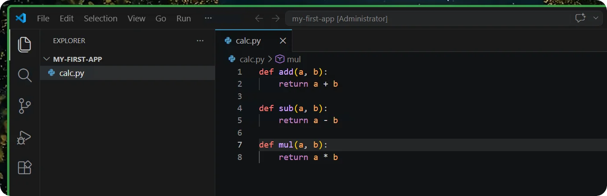
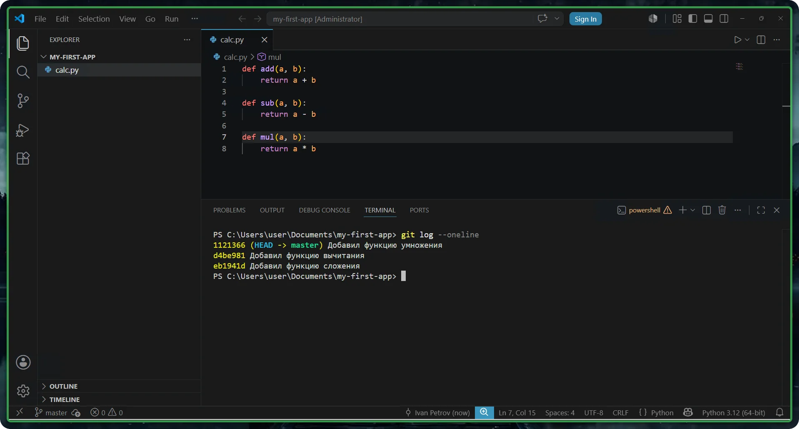
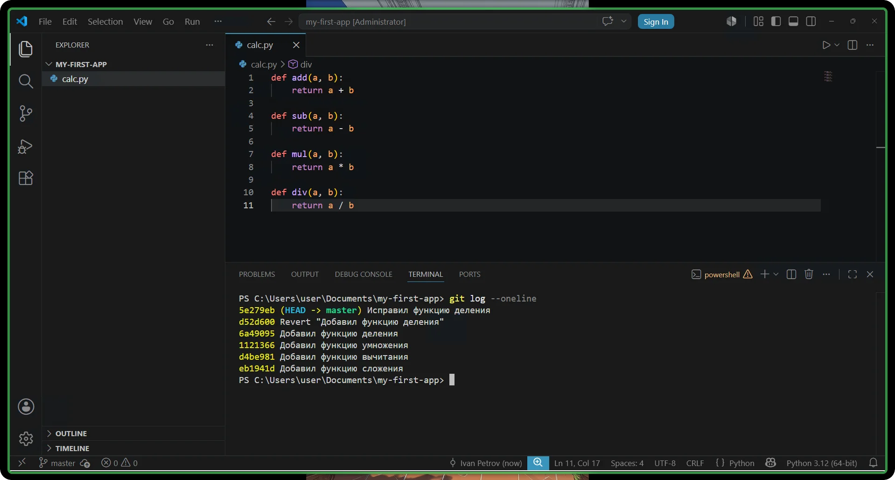
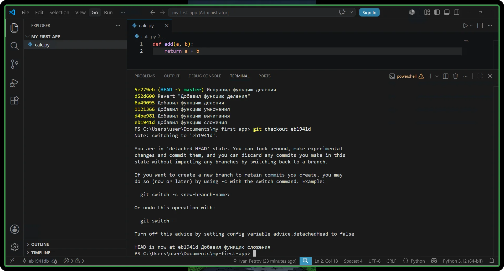

# Урок 3 — История изменений: просмотр, отмена, возврат к версии

## Общая информация

| Параметр          | Значение                                          |
| ----------------- | ------------------------------------------------- |
| Курс              | От Git до Github                                   |
| Модуль            | От Git до Github                                   |
| Тема урока        | История изменений: просмотр, отмена, возврат к версии |
| Возраст учащихся  | 12–14 лет                                         |
| Продолжительность | 120 мин                                           |

---

## Цель урока

!!! slide "Цель урока"
    К концу урока ученики смогут просмотреть историю коммитов своего Python-проекта командами `git log` и `git show`, отменить несохранённую ошибку в коде командой `git restore`, безопасно отменить уже закоммиченную ошибку командой `git revert` и самостоятельно вернуться к состоянию проекта из старого коммита командой `git checkout`, а затем снова вернуться в настоящее.

---

## План урока

| Этап                      | Время   |
| ------------------------- | ------- |
| 1. Организационный момент | 5 мин   |
| 2. Теоретическая часть    | 10 мин  |
| 3. Практическая работа    | 60 мин  |
| 4. Самостоятельная работа | 35 мин  |
| 5. Подведение итогов      | 10 мин  |
| Итого                     | 120 мин |

---

## Ход занятия

### 1. Организационный момент

**Время:** 5 мин

#### Действия преподавателя

- Поприветствовать группу, проверить, что у каждого ученика включён компьютер, установлен Git и VS Code (с урока 1).
- Кратко напомнить прошлую тему: «На прошлом уроке мы создали репозиторий и научились сохранять изменения — делать коммиты по цепочке `git add` и `git commit`».
- Назвать тему и цель урока простыми словами: «Сегодня мы поведём в Git настоящий проект — консольный калькулятор на Python. Будем добавлять по одной операции отдельными коммитами, а заодно научимся находить и отменять ошибки в коде. Если изменение окажется неудачным, Git позволит вернуть проект к прежнему состоянию — это часть повседневной работы программиста».
- Сообщить, что весь урок работаем в одном окне VS Code: и код пишем, и команды Git вводим там же.

---

### 2. Теоретическая часть

**Время:** 10 мин

#### Действия преподавателя

- Дать только короткое введение: две главные идеи урока. Все команды ученики освоят руками в практике по схеме «мини-теория — задание».
- Объяснять на доске или на экране, опираться на примеры из реальной работы программиста.

!!! slide "История проекта — это лента сохранений"
    Каждый коммит — это сохранённый снимок проекта. Все коммиты выстраиваются в ленту: от самой первой версии программы до самой свежей. Эту ленту можно листать и открывать любой снимок, чтобы посмотреть, что и когда менялось в коде.

    Пример из жизни: это история версий программы — видно, как она росла функция за функцией.

!!! slide "Отменить можно по-разному — и это три разные команды"
    Слово «отменить» в Git означает три разных действия:

    - отменить ошибку, которая ещё **не сохранена** в коммит, — вернуть файл как был (`git restore`);
    - отменить **целый коммит**, в который ошибка уже попала, — но безопасно, не стирая историю (`git revert`);
    - просто **заглянуть в прошлое** — открыть старую версию проекта и потом вернуться обратно (`git checkout`).

    Так и работает программист: исправил ошибку до сохранения, откатил ошибочный коммит, заглянул в раннюю рабочую версию кода.

!!! slide "Записи в блокнот"
    - **HEAD** — указатель Git на текущий коммит, место в истории, где ты сейчас находишься.
    - **Хеш** — уникальный «номер» коммита из букв и цифр, который Git генерирует сам; по нему Git находит нужное сохранение. Обычно используют короткий хеш — первые 7 символов.
    - **git diff** — показывает построчно, что изменилось в файлах, но ещё не добавлено в индекс.
    - **git show** — показывает один коммит подробно: какие именно строки в нём поменялись.
    - **git restore &lt;файл&gt;** — возвращает файл к виду из последнего коммита (отменяет несохранённые правки).
    - **git revert &lt;хеш&gt;** — безопасно отменяет коммит: создаёт новый коммит, который возвращает изменения назад.
    - **git checkout &lt;хеш&gt;** — переносит рабочую папку в состояние выбранного коммита (временный переход в прошлое).

---

### 3. Практическая работа

**Время:** 60 мин

#### Действия преподавателя

- Работаем по принципу «Я показываю — делаем вместе — делаешь сам». Каждую новую команду сначала показать на проекторе и объяснить, что она делает, затем ученики повторяют у себя и проверяют результат.
- Первые шаги проходим вместе шаг в шаг, последний шаг ученики выполняют почти самостоятельно.
- Весь урок работаем в одном окне VS Code: код пишем в редакторе, команды Git вводим во встроенном терминале (меню Terminal → New Terminal).
- Программу не запускаем — Git следит за файлом независимо от запуска, нам важна именно история изменений и отмена ошибок.
- Тело функции (строка с `return`) пишется с отступом; VS Code обычно делает отступ сам после строки с двоеточием.

!!! slide "Создаём калькулятор: три операции — три коммита"
    **Мини-теория:** чтобы было что смотреть и отменять, нужна история из нескольких коммитов. Начнём собирать консольный калькулятор и будем добавлять операции по одной, сохраняя каждую отдельным коммитом — так же, как делают программисты.

    1. Открой Проводник Windows (Win+E), перейди в папку для проектов и создай новую папку с именем `my-first-app` (английскими буквами, без пробелов).
    2. Открой VS Code. Выбери в меню File → Open Folder и открой свою папку `my-first-app` — слева появится её содержимое.
    3. Открой встроенный терминал: в меню Terminal выбери New Terminal (или нажми Ctrl+Ё). Внизу появится строка терминала — она уже находится внутри папки проекта.
    4. В терминале набери команду `git init` и нажми Enter.
    5. Создай файл: щёлкни по значку «новый файл» рядом с именем папки слева и назови его `calc.py`.
    6. Напиши первую операцию — сложение — и сохрани файл (Ctrl+S):

        ```python
        def add(a, b):
            return a + b
        ```

    7. В терминале сделай первый коммит: `git add calc.py`, затем `git commit -m "Добавил функцию сложения"`.
    8. Допиши вторую операцию — вычитание — и сохрани файл:

        ```python
        def sub(a, b):
            return a - b
        ```

    9. В терминале сделай второй коммит: `git add calc.py`, затем `git commit -m "Добавил функцию вычитания"`.
    10. Допиши третью операцию — умножение — и сохрани файл:

        ```python
        def mul(a, b):
            return a * b
        ```

    11. В терминале сделай третий коммит: `git add calc.py`, затем `git commit -m "Добавил функцию умножения"`.

    

!!! note "Ожидаемый результат"
    В репозитории три коммита (сложение, вычитание, умножение), в `calc.py` три рабочие функции.

!!! slide "Смотрим историю: git log и git show"
    **Мини-теория:** команда `git log` показывает всю ленту коммитов. С флагом `--oneline` она выводит каждый коммит одной короткой строкой — так историю удобнее листать. В начале каждой строки стоит короткий хеш — это «номер» коммита, он нам пригодится дальше. Команда `git show` открывает один коммит подробно и показывает, какие строки кода в нём изменились.

    1. В терминале набери команду `git log --oneline` и нажми Enter. Ты увидишь три строки — три операции калькулятора, у каждого коммита свой короткий хеш в начале.
    2. Посмотри свой самый свежий коммит подробно: набери `git show` и нажми Enter. Зелёным показана добавленная функция умножения.

    

!!! note "Что такое хеш"
    Хеш — это уникальный номер коммита, который Git генерирует сам. У каждого коммита он свой: двух одинаковых не бывает. По этому номеру Git точно находит нужное сохранение среди всех; нам обычно хватает первых 7 символов — короткого хеша. Частый вопрос ученика: «почему у всех хеши разные, если файл одинаковый?» — потому что в хеш входят ещё и время, и автор коммита.

!!! note "Ожидаемый результат"
    Ученик видит ленту из трёх коммитов калькулятора и умеет открыть один коммит подробно.

!!! slide "Нашли ошибку до коммита: git diff"
    **Мини-теория:** пока изменения не добавлены в индекс командой `git add`, их можно увидеть командой `git diff` — она показывает построчно, что именно поменялось по сравнению с последним коммитом. Программисты так проверяют себя перед сохранением: видно ровно то, что собираешься закоммитить, и можно вовремя заметить ошибку.

    1. Начни добавлять четвёртую операцию — деление, но с ошибкой: в `return` стоит плюс вместо деления. Сохрани файл, но **НЕ** делай `git add`:

        ```python
        def div(a, b):
            return a + b
        ```

    2. В терминале набери команду `git diff` и нажми Enter.
    3. Найди свой новый код — добавленные строки помечены зелёным и знаком плюс в начале. Видно, что в делении по ошибке стоит `+`, а не `/`.

!!! warning "Заметка про git diff"
    Иногда предыдущая последняя строка показана сразу удалённой и добавленной, хотя её не меняли. Так бывает, если в конце файла нет пустой строки: дописав новую строку, ты добавил к предыдущей невидимый перевод строки, и Git отметил её как изменённую. Это не ошибка — обращай внимание только на по-настоящему добавленные строки кода.

!!! note "Ожидаемый результат"
    `git diff` показывает добавленную функцию деления с ошибкой (`+` вместо `/`), пока не закоммиченную.

!!! slide "Отменяем несохранённую ошибку: git restore"
    **Мини-теория:** ошибку мы заметили вовремя — она ещё не закоммичена. Команда `git restore` вернёт файл к виду из последнего коммита, и неудачная функция исчезнет. Внимание: несохранённые изменения при этом пропадут безвозвратно — `restore` их стирает, отменить это нельзя. Поэтому сначала всегда смотрим `git diff`, а потом решаем.

    1. Убедись, что ошибочную функцию деления ты только дописал и не делали `git add`.
    2. В терминале набери команду `git restore calc.py` и нажми Enter.
    3. Посмотри `calc.py` в редакторе — ошибочной функции деления больше нет, остались три рабочие функции.
    4. Проверь состояние командой `git status` — Git сообщит, что менять нечего (`working tree clean`).

!!! tip "Если файл уже попал в индекс"
    Командой `git add` файл кладут в индекс. Чтобы вынуть его обратно из индекса (но оставить сами правки в файле), есть команда `git restore --staged calc.py`. Сначала вынимаем из индекса, и только потом, если нужно, отменяем сами правки.

!!! note "Ожидаемый результат"
    Несохранённая ошибка убрана, файл вернулся к виду из последнего коммита.

!!! slide "Ошибка уже в коммите: git revert"
    **Мини-теория:** иногда ошибку замечают не сразу, и она успевает попасть в коммит. Стереть такой коммит из истории нельзя и не нужно — есть `git revert`. Он не удаляет ошибочный коммит, а создаёт новый коммит, который отменяет его изменения. История остаётся честной и полной: видно и где ошиблись, и как исправили. Это самый безопасный способ отмены, его используют в командной работе.

    1. Снова напиши деление — и снова с ошибкой (на этот раз умножение вместо деления), но теперь сохрани её. Сохрани файл:

        ```python
        def div(a, b):
            return a * b
        ```

    2. В терминале сделай коммит: `git add calc.py`, затем `git commit -m "Добавил функцию деления"`.
    3. Посмотри историю: `git log --oneline`. Скопируй короткий хеш самого верхнего коммита «Добавил функцию деления» (выделить мышью, скопировать — Ctrl+C).
    4. Заметили ошибку: в делении стоит `*` вместо `/`. Коммит уже сделан, поэтому отменяем безопасно: `git revert <хеш> --no-edit` — вместо `<хеш>` вставь скопированный хеш (Ctrl+V).
    5. Посмотри `calc.py`: ошибочная функция деления исчезла — её убрал коммит-отмена.
    6. Посмотри `git log --oneline`: в истории теперь и «Добавил функцию деления», и коммит-отмена `Revert`. История сохранилась полностью.
    7. Теперь напиши деление правильно и сохрани файл:

        ```python
        def div(a, b):
            return a / b
        ```

    8. В терминале сделай коммит: `git add calc.py`, затем `git commit -m "Исправил функцию деления"`.

    

!!! warning "Зачем --no-edit"
    Флаг `--no-edit` говорит Git взять готовое сообщение отмены и не открывать текстовый редактор. Без него может открыться редактор Vim — чёрный экран, из которого трудно выйти (выход: клавиша Esc, затем `:q` и Enter).

!!! note "Ожидаемый результат"
    Ошибочный коммит деления отменён новым коммитом `Revert` (история цела), затем деление добавлено правильно.

!!! slide "Временный переход в прошлое: git checkout (делаешь сам)"
    **Мини-теория:** чтобы заглянуть в раннюю версию калькулятора, есть команда `git checkout <хеш>`. Она переносит рабочую папку в состояние выбранного коммита — код становится таким, каким был тогда. Это безопасный просмотр: ничего не теряется. Чтобы вернуться в настоящее, есть короткая команда `git checkout -` (минус) — она возвращает на ту ветку, где ты был. Пройди блок сам, подглядывая в записи в блокноте, а не в проектор.

    1. Посмотри историю командой `git log --oneline` и скопируй короткий хеш самого первого коммита «Добавил функцию сложения» (он в самом низу списка).
    2. Перенесись в прошлое: набери `git checkout <хеш>` со скопированным хешем и нажми Enter. Git напишет предупреждение про `detached HEAD` — это нормально, так и должно быть.
    3. Посмотри `calc.py` в редакторе: в нём снова только одна функция — сложение. Ты в самой первой версии калькулятора.
    4. Вернись в настоящее короткой командой: `git checkout -` (минус) и нажми Enter.
    5. Посмотри `calc.py` ещё раз — вернулись все функции, калькулятор снова в актуальном виде.

    

!!! note "Ожидаемый результат"
    Ученик самостоятельно открыл первую версию калькулятора и вернулся к свежей; понимает, что просмотр прошлого ничего не ломает.

---

### 4. Самостоятельная работа

**Время:** 35 мин

#### Действия преподавателя

- Вывести задание на проектор. Ходить по классу, наблюдать, не вмешиваться сразу: дать ученику найти подсказку в записях и в выводе `git status` и `git log`.
- Помогать каскадом подсказок (см. методические заметки), не называя готовую команду первой же фразой.
- Особое внимание — моменту `detached HEAD`: успокоить, что это просмотр, и напомнить про `git checkout -` для возврата.
- Тем, кто справился раньше, дать дополнительные задания.

#### Квиз для разминки

!!! note "Что сделать тьютору"
    Перед основным заданием откройте этот квиз на компьютере каждого ученика. Это короткая проверка теории урока: что такое HEAD и хеш, команды `git log`, `git show`, `git diff`, а также три разных «отменить» — `git restore`, `git revert` и `git checkout`. Ученик отвечает на все вопросы, при ошибке под вопросом появляется правильный ответ, а справа выставляется итоговая оценка за квиз.

<div class="interactive-embed" markdown>
<iframe src="../../interactives/quiz-3.html" title="Квиз 3: история изменений и возврат к версии" loading="lazy"></iframe>
[Открыть квиз на весь экран ↗](../interactives/quiz-3.html){ target="_blank" }
</div>

#### Задание

!!! slide "Самостоятельная работа"
    Собери свой проект из функций, как калькулятор, и потренируйся находить и отменять ошибки самостоятельно — без подсказок на проекторе. Работай в VS Code, опирайся на свои записи в блокноте.

    1. Создай папку `my-figures`, открой её в VS Code (File → Open Folder), открой встроенный терминал и преврати папку в репозиторий.
    2. Создай файл `figures.py`, напиши функцию периметра прямоугольника, сохрани файл и сделай коммит «Периметр»:

        ```python
        def perimeter(a, b):
            return (a + b) * 2
        ```

    3. Допиши функцию площади прямоугольника, сохрани файл и сделай коммит «Площадь»:

        ```python
        def area(a, b):
            return a * b
        ```

    4. Посмотри ленту коммитов компактной командой и открой подробно последний коммит.
    5. Начни писать третью функцию с ошибкой, но НЕ коммить её: посмотри изменения командой `git diff`, найди ошибку и убери несохранённую ошибку через `git restore`.
    6. Теперь допусти ошибку и закоммить её, затем найди ошибку и безопасно отмени этот коммит через `git revert`.
    7. Сделай временный переход в прошлое — в самый первый коммит, убедись, что в файле осталась одна функция, и вернись в настоящее.

#### Критерии оценки

| Результат | Оценка |
| --------- | ------ |
| Выполнил всё полностью самостоятельно: посмотрел историю, отменил несохранённую ошибку через `restore`, отменил ошибочный коммит через `revert`, сходил в первую версию и вернулся | Отлично |
| Выполнил с небольшими ошибками или одной подсказкой | Хорошо |
| Выполнил частично, потребовалась помощь на нескольких шагах | Удовлетворительно |
| Задание не выполнено | Требует доработки |

---

### 5. Подведение итогов

**Время:** 10 мин

#### Действия преподавателя

- Кратко повторить три разных «отменить»: `git restore` — стирает несохранённую ошибку, `git revert` — отменяет ошибочный коммит новым коммитом (история цела), `git checkout <хеш>` — переносит в прошлую версию для просмотра, а `git checkout -` возвращает обратно.
- Подчеркнуть главную мысль урока: благодаря истории в Git программисту не страшно ошибиться — почти всё можно вернуть.
- Сказать, что на следующем уроке научимся работать с ветками.

#### Вопросы для рефлексии

!!! slide "Подведём итоги"
    - Какой командой посмотреть короткую ленту всех версий программы?
    - Чем `git restore` отличается от `git revert`? Когда какой выбрать?
    - Что делает `git checkout <хеш>` и как вернуться обратно в настоящее?

---

## Домашнее задание

!!! slide "Домашнее задание"
    Задание на повторение (письменно в тетради или в файле):

    1. Выпиши команды урока (`git log --oneline`, `git show`, `git diff`, `git restore`, `git revert`, `git checkout`) и подпиши, что делает каждая.
    2. Своими словами объясни разницу между `git restore`, `git revert` и `git checkout` — по одному предложению на каждую.
    3. Нарисуй ленту из трёх коммитов программы, подпиши их короткими хешами и стрелкой покажи, где находится `HEAD`.
    4. Если дома есть компьютер с Git и VS Code — создай репозиторий `home-project`, напиши программу из нескольких функций, делая отдельный коммит на каждую, и потренируйся: посмотри историю и сделай временный переход в прошлое — в первый коммит, а потом вернись назад.

---

## Методические заметки преподавателя

### Возможные сложности

- Главная путаница урока — три разных «отменить». Ученики применяют не ту команду. Помогает таблица-памятка на доске: `restore` — несохранённая ошибка, `revert` — ошибочный коммит, `checkout` — просмотр прошлой версии.
- Ключевое различие: `restore` — когда ошибка ещё не закоммичена, `revert` — когда уже закоммичена. Именно это и обыгрывается на одной и той же функции деления: сначала `restore`, затем `revert`.
- После `git checkout <хеш>` Git выводит пугающее сообщение про `detached HEAD`, и ученик думает, что всё сломал. Заранее предупредить: это нормальный режим просмотра, вернуться можно командой `git checkout -` (минус).
- `git restore` стирает несохранённые правки безвозвратно. Приучать сначала смотреть `git diff`, и только потом отменять.
- Отступы в функциях: тело функции (строка `return`) пишется с отступом. VS Code обычно ставит отступ сам после строки с двоеточием; если ученик его стёр, код будет выглядеть неправильно. Для Git это неважно — он хранит любой текст, — но на это стоит обращать внимание.
- Терминал открыт не в той папке: ученик не открыл папку проекта через File → Open Folder, и встроенный терминал стартует не в `my-first-app`, из-за чего `git init` и команды идут не туда. Сначала всегда открываем папку проекта в VS Code, и только потом — терминал.
- Файл сохранён не в той папке: ученик создаёт `calc.py` вне открытой папки проекта, и Git его «не видит». Создавать файл нужно кнопкой «новый файл» рядом с именем папки слева.
- Копирование хеша: ученики пытаются переписать длинный хеш руками с ошибками. Показать, что в `git log --oneline` хеш короткий, и его проще выделить мышью и вставить (Ctrl+C, Ctrl+V).
- `git revert` без флага `--no-edit` открывает редактор Vim — чёрный экран, из которого ученик не может выйти. Всегда добавлять `--no-edit`; если редактор всё же открылся, выйти клавишами Esc, затем `:q` и Enter.
- Кавычки в командах: в `git commit -m "сообщение"` нужны обычные двойные кавычки, а не «ёлочки». Печатать их на английской раскладке.

### Способы помощи учащимся

Помогать каскадом подсказок, не давая сразу готовый ответ:

- **Подсказка 1 (общая):** «Запусти `git status` и `git log --oneline`, прочитай вслух, что видишь. Git почти всегда подсказывает, где ты сейчас и что можно сделать».
- **Подсказка 2 (направляющая):** «Реши главное: ошибка уже в коммите или ещё нет? Если нет — её убирает `restore`, если да — её безопасно отменяет `revert`».
- **Подсказка 3 (конкретнее):** «Найди в записях в блокноте команду для этого случая. Если отменяешь коммит — тебе нужен его короткий хеш из `git log --oneline`».
- **Подсказка 4 (процедурная):** показать на проекторе правильный ввод команды (с хешем) и попросить повторить у себя.
- Если ученик застрял в `detached HEAD` — спокойно сказать: «Ты не сломал проект, ты просто смотришь старую версию. Набери `git checkout -` (минус), чтобы вернуться».

### Дополнительные задания (для тех, кто справился раньше)

- Выполнить `git log -p` и сравнить с `git show`: `log -p` показывает изменения сразу по всем коммитам ленты, `show` — подробно по одному.
- Сравнить две версии калькулятора между собой: `git diff <старый_хеш> <новый_хеш>` — увидеть, какие функции добавились между двумя точками истории.
- Сделать ещё один коммит, затем посмотреть только два последних командой `git log -2` (короткий флаг ограничивает число коммитов).
- Открыть подробно конкретный старый коммит по его хешу: `git show <хеш>` — и объяснить соседу, какая функция в нём добавилась.

---
