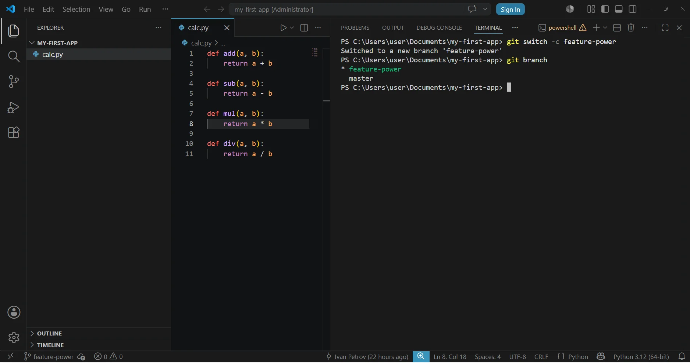
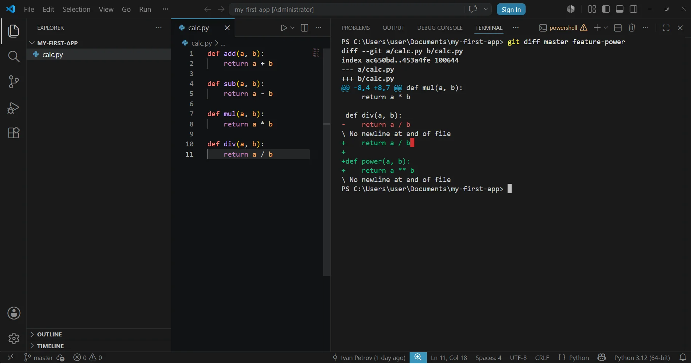
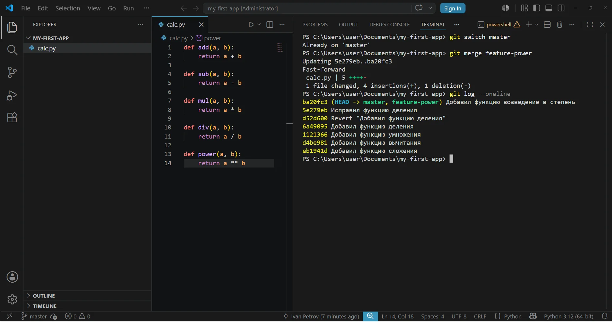
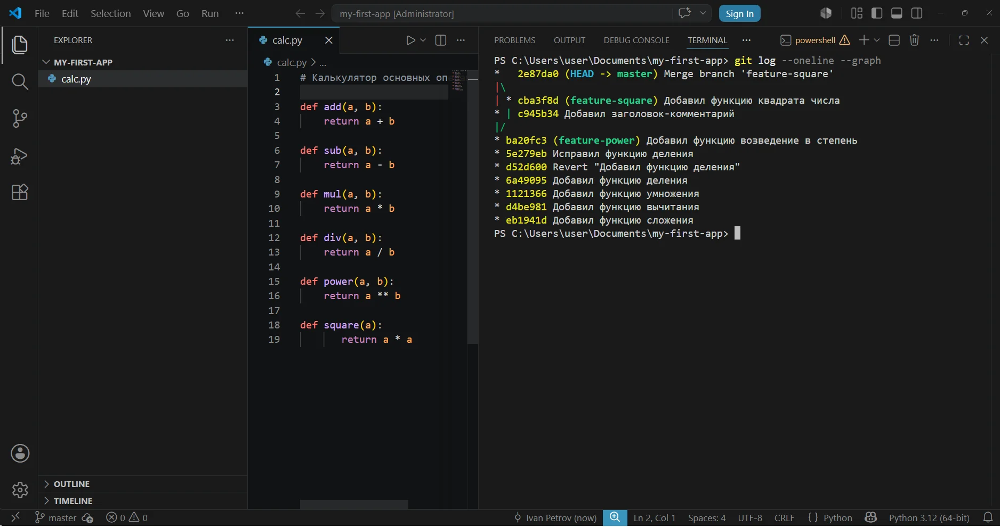
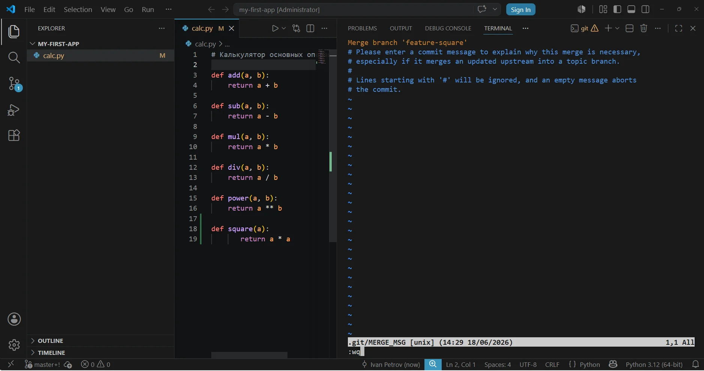

# Урок 4 — Ветки: создание, переключение, слияние

## Общая информация

| Параметр          | Значение                                  |
| ----------------- | ----------------------------------------- |
| Курс              | От Git до Github                           |
| Модуль            | От Git до Github                           |
| Тема урока        | Ветки: создание, переключение, слияние    |
| Возраст учащихся  | 12–14 лет                                 |
| Продолжительность | 120 мин                                   |

---

## Цель урока

!!! slide "Цель урока"
    К концу урока ученики смогут создать в своём Python-проекте новую ветку командой `git switch -c`, выполнить в ней отдельный коммит, не задев основную ветку, переключаться между ветками командой `git switch` и самостоятельно влить готовую ветку обратно в основную командой `git merge`, а затем удалить ненужную ветку.

---

## План урока

| Этап                      | Время   |
| ------------------------- | ------- |
| 1. Организационный момент | 5 мин   |
| 2. Теоретическая часть    | 10 мин  |
| 3. Практическая работа    | 60 мин  |
| 4. Самостоятельная работа | 35 мин  |
| 5. Подведение итогов      | 10 мин  |
| Итого                     | 120 мин |

---

## Ход занятия

### 1. Организационный момент

**Время:** 5 мин

#### Действия преподавателя

- Поприветствовать группу, проверить, что у каждого ученика включён компьютер, установлены Git и VS Code (с урока 1) и на месте папка проекта `my-first-app` с урока 3.
- Кратко напомнить прошлую тему: «На прошлом уроке мы вели историю проекта-калькулятора, смотрели её и научились отменять ошибки».
- Назвать тему и цель урока простыми словами: «Сегодня научимся работать в Git с ветками. Ветка — это отдельная дорожка, на которой можно спокойно пробовать новую функцию, не ломая рабочую версию программы. Допишем калькулятору возведение в степень в отдельной ветке, а когда всё заработает — соединим её с основной».
- Сообщить, что весь урок работаем в одном окне VS Code: код пишем в редакторе, команды Git вводим во встроенном терминале.

---

### 2. Теоретическая часть

**Время:** 10 мин

#### Действия преподавателя

- Дать только короткое введение: что такое ветка и зачем она нужна. Все команды ученики освоят руками в практике по схеме «мини-теория — задание».
- Объяснять на доске или на экране, опираться на примеры из реальной работы программиста.

!!! slide "Ветка — это отдельная дорожка для работы"
    Пока проект небольшой, все коммиты идут одной цепочкой. Но как только хочется попробовать что-то новое и при этом не сломать то, что уже работает, на помощь приходят ветки. Ветка — это отдельная дорожка истории, которая отходит от основной. На ней можно писать код и делать коммиты, а основная версия программы всё это время остаётся целой.

    Пример из жизни: основная ветка — это чистовик, а новая ветка — черновик, где ты пробуешь идею; если идея удачная, переносишь её в чистовик, если нет — просто выбрасываешь черновик.

!!! slide "Сделал в ветке — потом соединил с основной"
    Когда новая функция в ветке готова и проверена, ветку соединяют с основной — это называется слияние (merge). После слияния все коммиты из ветки оказываются в основной версии, и программа получает новую возможность.

    Так работают программисты в команде: каждый делает свою задачу в своей ветке, а готовое сливают в общий проект. Ненужную после слияния ветку удаляют, чтобы не мешалась.

!!! slide "Записи в блокнот"
    - **Ветка (branch)** — отдельная дорожка истории проекта; на ней можно делать коммиты, не затрагивая основную версию.
    - **Основная ветка** — главная дорожка проекта, та, что появилась при `git init`. Называется `main` или `master` — смотря какая у тебя версия Git.
    - **git branch** — показывает список веток; текущая помечена звёздочкой `*`.
    - **git switch -c &lt;имя&gt;** — создаёт новую ветку и сразу переходит на неё.
    - **git switch &lt;имя&gt;** — переходит на уже существующую ветку.
    - **git merge &lt;имя&gt;** — вливает указанную ветку в ту, на которой ты сейчас находишься.
    - **git branch -d &lt;имя&gt;** — удаляет уже влитую ветку (нельзя удалить ветку, на которой стоишь сейчас).

---

### 3. Практическая работа

**Время:** 60 мин

#### Действия преподавателя

- Работаем по принципу «Я показываю — делаем вместе — делаешь сам». Каждую новую команду сначала показать на проекторе и объяснить, что она делает, затем ученики повторяют у себя и проверяют результат.
- Блоки 1–5 проходим вместе шаг в шаг, блок 6 ученики выполняют почти самостоятельно.
- Весь урок работаем в папке `my-first-app` с прошлого урока, в одном окне VS Code: код пишем в редакторе, команды Git вводим во встроенном терминале (меню Terminal → New Terminal). Программу не запускаем — нам важна работа с ветками и история, а не вывод программы.
- Главное правило урока повторять вслух: «Перед тем как переключиться на другую ветку — всегда сохрани и закоммить изменения». Если у ученика есть незакоммиченные правки, Git может не дать переключиться — это нормальная защита.

!!! slide "Блок 1. Зачем ветки и как создать первую"
    **Мини-теория:** сейчас у нас одна дорожка истории — основная ветка. Чтобы спокойно дописать калькулятору возведение в степень и не бояться сломать рабочий код, заведём отдельную ветку. Сначала посмотрим, как называется наша основная ветка, а потом создадим новую.

    **Как называют ветки:** имя ветки придумывают так, чтобы по нему было сразу понятно, что в ней делают. Пишут английскими буквами, без пробелов; слова разделяют дефисом. Часто впереди ставят слово, которое говорит о цели ветки: `feature` («новая возможность») — для новой функции. Поэтому ветку для новой функции «возведение в степень» назовём `feature-power` (`power` — степень).

    1. Откройте VS Code. Выберите в меню File → Open Folder и откройте папку `my-first-app` с прошлого урока — слева появится `calc.py`.
    2. Откройте встроенный терминал: в меню Terminal выберите New Terminal. Внизу появится строка терминала, уже внутри папки проекта.
    3. Напомните себе историю: наберите `git log --oneline` и нажмите Enter — вы увидите коммиты калькулятора с прошлого урока.
    4. Посмотрите, какие есть ветки: наберите `git branch` и нажмите Enter. Ветка будет одна, рядом с ней звёздочка `*` — это значит, что вы сейчас на ней. Запомните её имя: `main` или `master`.
    5. Создайте новую ветку для возведения в степень и сразу перейдите на неё: наберите `git switch -c feature-power` и нажмите Enter. Git ответит, что переключился на новую ветку.
    6. Снова наберите `git branch` — теперь веток две, а звёздочка `*` стоит у `feature-power`.

    

!!! note "Ожидаемый результат"
    Создана ветка `feature-power`, ученик находится на ней.

!!! note "Заметка про имя основной ветки"
    Дальше в заданиях основная ветка называется `master`. Если у вас `git branch` показал `main` — везде вместо `master` пишите `main`. Имя зависит только от версии Git, на работу с ветками это не влияет.

!!! slide "Блок 2. Делаем коммит в ветке"
    **Мини-теория:** теперь мы на ветке `feature-power`. Всё, что мы здесь напишем и закоммитим, останется на этой ветке и не затронет основную. Допишем калькулятору возведение в степень.

    1. Откройте `calc.py` в редакторе. Допишите в конец файла функцию степени и сохраните файл (Ctrl+S):

        ```python
        def power(a, b):
            return a ** b
        ```

    2. В терминале добавьте файл в индекс: наберите `git add calc.py` и нажмите Enter.
    3. Сделайте коммит: наберите `git commit -m "Добавил функцию возведения в степень"` и нажмите Enter.
    4. Проверьте историю ветки: наберите `git log --oneline` — сверху появился ваш новый коммит про степень.

!!! note "Ожидаемый результат"
    В ветке `feature-power` есть новый коммит с функцией возведения в степень.

!!! slide "Блок 3. Переключаемся между ветками"
    **Мини-теория:** самое важное про ветки — когда переключаешься на другую ветку, Git меняет файлы в папке так, как они выглядят на той ветке. Сейчас увидим это своими глазами: на основной ветке степени ещё нет. А ещё Git умеет показать разницу между двумя ветками одной командой — `git diff`, не переключаясь туда-сюда.

    1. Перейдите на основную ветку: наберите `git switch master` и нажмите Enter.
    2. Посмотрите на `calc.py` в редакторе. Функция `power` пропала — на основной ветке её ещё нет. Файл сам обновился, ничего удалять не нужно.
    3. Вернитесь на ветку со степенью: наберите `git switch feature-power` и нажмите Enter.
    4. Снова посмотрите `calc.py` — функция `power` вернулась.
    5. Теперь покажем разницу между ветками одной командой: наберите `git diff master feature-power` и нажмите Enter. Git выведет строки, которыми `feature-power` отличается от `master` — добавленная функция `power` помечена зелёным и знаком `+` в начале. Чтобы выйти из просмотра, нажмите `q`.

    

!!! note "Ожидаемый результат"
    Ученик видит, что при переключении веток содержимое `calc.py` меняется, и что `git diff master feature-power` показывает добавленную в ветке функцию `power`; понимает, что степень пока живёт только в `feature-power`.

!!! warning "Частая ошибка"
    Если Git при `git switch` пишет, что есть несохранённые изменения и переключиться нельзя — значит, вы не закоммитили правки. Сделайте `git add` и `git commit`, потом переключайтесь.

!!! slide "Блок 4. Сливаем ветку в основную: git merge"
    **Мини-теория:** степень готова и проверена — пора перенести её в основную версию. Слияние всегда делают, стоя на той ветке, в которую вливают. Значит, сначала переходим на `master`, а потом вливаем в неё `feature-power`.

    1. Перейдите на основную ветку: наберите `git switch master` и нажмите Enter.
    2. Влейте ветку со степенью: наберите `git merge feature-power` и нажмите Enter.
    3. Посмотрите `calc.py` — теперь функция `power` есть и на основной ветке.
    4. Проверьте историю: наберите `git log --oneline` — коммит про степень теперь в основной ветке.

    

!!! note "Ожидаемый результат"
    Коммит со степенью влит в основную ветку, `calc.py` на `master` содержит все четыре операции.

!!! slide "Блок 5. Две ветки разошлись — настоящее слияние"
    **Мини-теория:** в прошлом блоке основная ветка просто «догнала» нашу — это было простое слияние. Бывает иначе: пока мы что-то делали в новой ветке, основная тоже изменилась. Тогда обе дорожки разошлись, и Git соединяет их особым коммитом слияния. Сделаем так нарочно: добавим в новой ветке квадрат числа, а в основной — отдельную строчку.

    1. Создайте новую ветку и перейдите на неё: наберите `git switch -c feature-square` и нажмите Enter.
    2. Допишите в `calc.py` функцию квадрата и сохраните файл:

        ```python
        def square(a):
            return a * a
        ```

    3. Закоммитьте: `git add calc.py`, затем `git commit -m "Добавил функцию квадрата числа"`.
    4. Вернитесь на основную ветку: наберите `git switch master` и нажмите Enter.
    5. В самом верху `calc.py` допишите строку-комментарий и сохраните файл:

        ```python
        # Калькулятор основных операций
        ```

    6. Закоммитьте это изменение на основной ветке: `git add calc.py`, затем `git commit -m "Добавил заголовок-комментарий"`.
    7. Теперь влейте ветку квадрата и сразу задайте сообщение коммита слияния через `-m`: наберите `git merge feature-square -m "Слияние ветки feature-square"` и нажмите Enter. Git создаст коммит слияния, не открывая никаких редакторов.
    8. Посмотрите историю с картинкой веток: наберите `git log --oneline --graph` и нажмите Enter — слева видно, как две дорожки сошлись в одну.

    

!!! warning "Если запустить merge без -m — откроется vim"
    Если вы напишете `git merge feature-square` без `-m`, Git попытается открыть для сообщения текстовый редактор. В свежем Git это редактор vim прямо в терминале (внизу появится строка `.git/MERGE_MSG`). В vim `Ctrl+S` не работает: чтобы сохранить готовое сообщение и выйти, наберите `:wq` и нажмите Enter. Поэтому проще сразу указывать `-m`, как в команде выше.

    

!!! note "Ожидаемый результат"
    В основной ветке есть и комментарий-заголовок, и функция `square`; в истории виден коммит слияния.

!!! slide "Блок 6. Удаляем ненужные ветки"
    **Мини-теория:** ветки `feature-power` и `feature-square` уже влиты в основную — всё, что в них было, теперь в `master`. Такие ветки больше не нужны, их удаляют, чтобы список был чистым. Удалять можно только влитые ветки, и только не находясь на них.

    1. Убедитесь, что вы на основной ветке: наберите `git branch` и проверьте, что звёздочка `*` стоит у `master`.
    2. Удалите ветку степени: наберите `git branch -d feature-power` и нажмите Enter.
    3. Удалите ветку квадрата: наберите `git branch -d feature-square` и нажмите Enter.
    4. Проверьте: снова наберите `git branch` — осталась только основная ветка.

!!! note "Ожидаемый результат"
    Лишние ветки удалены, в списке только `master`, весь новый код в ней сохранён.

!!! tip "Эксперимент: а можно ли удалить саму основную ветку?"
    Сейчас вы стоите на `master` — попробуем удалить её и посмотрим, что ответит Git. Это безопасно: Git не даст совершить ошибку.

    1. Наберите `git branch -d master` и нажмите Enter.
    2. Прочитайте ответ. Git откажется удалять и напишет примерно так: `error: Cannot delete branch 'master' used by worktree at ...` (в некоторых версиях — `Cannot delete the branch 'master' which you are currently on`). Смысл один: нельзя удалить ветку, на которой ты сейчас находишься, — иначе исчезла бы дорожка, по которой ты стоишь.
    3. Убедитесь, что ничего не пропало: наберите `git branch` — ветка `master` на месте, со звёздочкой `*`.

    Вывод: основную ветку случайно не сотрёшь. Чтобы удалить какую-то ветку, нужно сначала перейти на другую (`git switch <другая ветка>`), и только потом удалять — но `master` нам и не нужно удалять, это главная дорожка проекта.

---

### 4. Самостоятельная работа

**Время:** 35 мин

#### Действия преподавателя

- Раздать задание и попросить пройти весь путь работы с веткой полностью самостоятельно, как в практике, но с новой функцией.
- Наблюдать, в какой момент ученики теряются, не подсказывать сразу — сначала навести вопросом (см. «Способы помощи учащимся»).
- Главное, на что обращать внимание: проверяет ли ученик командой `git branch`, на какой он ветке, и коммитит ли изменения перед переключением.

#### Задание

!!! slide "Самостоятельная работа"
    Добавь калькулятору поиск большего из двух чисел — но через отдельную ветку, по всей цепочке:

    1. Создай и перейди на новую ветку `feature-max`.
    2. Допиши в `calc.py` функцию и сохрани файл:

        ```python
        def maximum(a, b):
            if a > b:
                return a
            return b
        ```

    3. Сделай коммит с понятным сообщением.
    4. Переключись на основную ветку и убедись, что там функции `maximum` пока нет.
    5. Влей ветку `feature-max` в основную и проверь, что функция `maximum` появилась.
    6. Удали влитую ветку `feature-max`.
    7. Покажи преподавателю результат `git branch` (одна ветка) и `git log --oneline`.

#### Критерии оценки

| Результат | Оценка |
| --------- | ------ |
| Прошёл всю цепочку самостоятельно: ветка создана, коммит сделан, слияние выполнено, ветка удалена; в `git branch` осталась одна ветка, в `calc.py` есть `maximum` | Отлично |
| Выполнил всё, но с одной-двумя мелкими ошибками или с одной подсказкой (например, забыл закоммитить перед переключением) | Хорошо |
| Создал ветку и коммит, но слияние или удаление сделал только с помощью преподавателя | Удовлетворительно |
| Не смог создать ветку и сделать коммит даже с помощью | Требует доработки |

---

### 5. Подведение итогов

**Время:** 10 мин

#### Действия преподавателя

- Кратко повторить путь работы с веткой: создать (`git switch -c`) — поработать и закоммитить — переключиться и проверить (`git switch`) — влить в основную (`git merge`) — удалить (`git branch -d`).
- Спросить нескольких учеников, зачем вообще нужны ветки и чем удобно пробовать новое в отдельной ветке. Похвалить за аккуратную работу.
- Сделать связку со следующим уроком: «На следующем уроке мы заведём аккаунт на GitHub и научимся выкладывать свой проект в интернет, чтобы он был доступен с любого компьютера».

#### Вопросы для рефлексии

!!! slide "Подведём итоги"
    - Что нового узнали сегодня?
    - Что было самым сложным?
    - Где это можно применить в жизни?

---

## Домашнее задание

!!! slide "Домашнее задание"
    Повторение. Возьми свою папку `my-first-app` и потренируй полный цикл работы с веткой ещё раз — на новой маленькой задаче:

    1. Создай ветку `feature-hello`.
    2. Допиши в `calc.py` функцию `greeting()`, которая возвращает строку `"Привет! Это мой калькулятор"`.
    3. Сделай коммит, переключись на основную ветку и убедись, что функции там пока нет.
    4. Влей ветку в основную и удали её.

    Письменно ответь одной-двумя строками на вопросы (можно в обычном текстовом файле):

    - Зачем нужна отдельная ветка, если можно писать код сразу в основной?
    - Какой командой узнать, на какой ветке ты сейчас находишься?

---

## Методические заметки преподавателя

### Возможные сложности

- Ученик не отслеживает, на какой он ветке, и пишет код не там, где собирался. Из-за слабого знания ОС многие не привыкли смотреть на подсказки в интерфейсе — не замечают ни звёздочку `*` в `git branch`, ни имя ветки в строке терминала.
- Забывают закоммитить изменения перед `git switch`, Git отказывается переключаться, и ученик пугается красного текста ошибки.
- Путают порядок при слиянии: пытаются влить основную ветку в рабочую, а нужно наоборот — стоять на основной и вливать в неё.
- Пытаются удалить ветку `git branch -d`, находясь на ней самой, и получают отказ.
- В блоке 5 при слиянии без `-m` Git открывает редактор vim прямо в терминале (строка `.git/MERGE_MSG` внизу). Ученик не понимает, что произошло, жмёт `Ctrl+S` (в vim не работает) и зависает в незнакомом редакторе. Поэтому в задании сразу используется `-m`.
- Опечатки в именах веток (`feature-poewr`, `mster` вместо `master`) — Git не находит ветку и выдаёт ошибку.

### Способы помощи учащимся

Подсказки давать по нарастанию, не выдавая ответ сразу:

- «Как проверить, на какой ты сейчас ветке?» → если не вспомнил: «Набери `git branch` и посмотри, у какой ветки звёздочка».
- При отказе переключиться: «Что Git написал в сообщении? У тебя остались несохранённые изменения?» → «Сделай `git add` и `git commit`, потом переключайся».
- При путанице со слиянием: «На какой ветке нужно стоять, чтобы влить в неё другую? Куда ты хочешь перенести код — туда и переходи перед merge».
- Если ученик всё же запустил слияние без `-m` и попал в vim (внизу терминала строка `.git/MERGE_MSG`): «Ничего менять не надо. Набери `:wq` (двоеточие, w, q) и нажми Enter — это сохранит готовое сообщение и закроет редактор». На будущее — показать, что слияние удобнее делать сразу с `-m "текст"`.
- При ошибке «ветка не найдена»: «Сравни имя ветки по буквам с тем, что показывает `git branch` — нет ли опечатки?».

### Дополнительные задания (для тех, кто справился раньше)

- Создай две ветки от основной и в каждой допиши свою функцию в `calc.py` (например, `square` и `cube`), затем влей обе по очереди в основную. Посмотри историю командой `git log --oneline --graph`.
- Узнай, что такое конфликт слияния: измени одну и ту же строку `calc.py` по-разному в двух ветках и попробуй их слить. Прочитай, что напишет Git, и попроси преподавателя объяснить, как такой конфликт решается (это тема будущих уроков по командной работе).

---
