# Урок 5 — GitHub: аккаунт, удалённый репозиторий, push и pull

## Общая информация

| Параметр          | Значение                                          |
| ----------------- | ------------------------------------------------- |
| Курс              | От Git до Github                                   |
| Модуль            | От Git до Github                                   |
| Тема урока        | GitHub: аккаунт, удалённый репозиторий, push и pull |
| Возраст учащихся  | 12–14 лет                                         |
| Продолжительность | 120 мин                                           |

---

## Цель урока

!!! slide "Цель урока"
    К концу урока ученики смогут зарегистрировать аккаунт на GitHub, создать на нём пустой удалённый репозиторий, привязать к нему свой локальный проект `my-first-app` командой `git remote add origin`, отправить всю историю проекта в интернет командой `git push`, а затем забрать обратно изменение, сделанное на сайте GitHub, командой `git pull`.

---

## План урока

| Этап                      | Время   |
| ------------------------- | ------- |
| 1. Организационный момент | 5 мин   |
| 2. Теоретическая часть    | 10 мин  |
| 3. Практическая работа    | 60 мин  |
| 4. Самостоятельная работа | 35 мин  |
| 5. Подведение итогов      | 10 мин  |
| Итого                     | 120 мин |

---

## Ход занятия

### 1. Организационный момент

**Время:** 5 мин

#### Действия преподавателя

- Поприветствовать группу, проверить, что у каждого ученика включён компьютер, установлены Git и VS Code (с урока 1) и на месте папка проекта `my-first-app` с прошлых уроков.
- Отдельно проверить, что у каждого ученика есть доступ к своей электронной почте — она понадобится для регистрации (по требованию модуля e-mail нужно было завести заранее).
- Кратко напомнить прошлую тему: «На прошлом уроке мы работали с ветками: создавали новую дорожку, делали в ней коммит и сливали обратно в основную».
- Назвать тему и цель урока простыми словами: «До сих пор весь наш проект жил только на одном компьютере — в папке `my-first-app`. Если компьютер сломается или мы сядем за другой, проекта рядом не будет. Сегодня заведём аккаунт на GitHub — это бесплатное хранилище для проектов в интернете — и научимся отправлять туда свой код и забирать его обратно».
- Предупредить: часть урока работаем в браузере (сайт GitHub), часть — в VS Code и его терминале; будем переключаться между окном браузера и окном VS Code.

---

### 2. Теоретическая часть

**Время:** 10 мин

#### Действия преподавателя

- Дать только короткое введение: что такое GitHub и чем «удалённый» репозиторий отличается от «локального». Все команды ученики освоят руками в практике по схеме «мини-теория — задание».
- Объяснять на доске или на экране, опираться на понятные примеры. Сами команды разбираем дальше, по ходу практики.

!!! slide "GitHub — это облако для проектов с кодом"
    Локальный репозиторий — это папка `my-first-app` на твоём компьютере: Git хранит там всю историю проекта. Но эта история есть только на одной машине. GitHub — это сайт в интернете, на котором можно бесплатно хранить копию своего репозитория. Такую копию называют удалённым репозиторием — «удалённый» значит «не на твоём компьютере, а на сервере в интернете».

    Проект, выложенный на GitHub, доступен с любого компьютера, не пропадёт, если сломается твой, и его можно показать другим людям по ссылке.

!!! slide "Отправил — push, забрал — pull"
    Локальный репозиторий и удалённый — это две копии одного проекта, и их нужно держать одинаковыми. Когда ты сделал коммиты у себя и хочешь отправить их в интернет — это `push` («толкнуть» наверх, в облако). Когда в удалённом репозитории появились изменения (например, ты или кто-то другой поправил файл прямо на сайте GitHub) и ты хочешь забрать их к себе на компьютер — это `pull` («подтянуть» вниз, к себе).

    Пример из жизни: `push` — это «загрузить файл в облако», `pull` — «скачать обновление из облака».

!!! slide "Записи в блокнот"
    - **GitHub** — сайт в интернете, где можно бесплатно хранить репозитории и показывать проекты другим.
    - **Локальный репозиторий** — копия проекта с историей на твоём компьютере (папка `my-first-app`).
    - **Удалённый репозиторий (remote)** — копия того же проекта на сервере GitHub.
    - **`origin`** — стандартное короткое имя для удалённого репозитория (чтобы не писать каждый раз длинный адрес).
    - **git remote add origin &lt;адрес&gt;** — привязывает локальный репозиторий к удалённому по его адресу.
    - **git push** — отправляет коммиты из локального репозитория в удалённый.
    - **git pull** — забирает изменения из удалённого репозитория в локальный.

---

### 3. Практическая работа

**Время:** 60 мин

#### Действия преподавателя

- Работаем по принципу «Я показываю — делаем вместе — делаешь сам». Каждый новый шаг сначала показать на проекторе, затем ученики повторяют у себя и проверяют результат.
- Все шаги проходим вместе шаг в шаг. Весь урок работаем с папкой `my-first-app` с прошлых уроков. Команды Git вводим во встроенном терминале VS Code (меню Terminal → New Terminal), а сайт GitHub открываем в браузере; будем переключаться между этими двумя окнами.
- Главное правило урока повторять вслух: «Сначала коммит — потом push. Отправить в облако можно только то, что уже закоммичено».
- Самый сложный момент — первый `push` с входом в GitHub через браузер (шаги с авторизацией): на нём задержаться и помочь каждому.

!!! slide "Заводим аккаунт на GitHub"
    **Мини-теория:** чтобы хранить проект в интернете, нужен бесплатный аккаунт на GitHub. Регистрация обычная: почта, имя пользователя и пароль. Имя пользователя (username) будет видно всем и попадёт в адрес твоих проектов, поэтому его стоит выбрать аккуратно.

    1. Открой браузер и перейди на сайт `https://github.com`.
    2. Нажми кнопку **Sign up** (Зарегистрироваться) в правом верхнем углу.
    3. Введи свою электронную почту, придумай пароль и имя пользователя (username). Username пишется английскими буквами и цифрами, без пробелов; например `ivan-petrov-2012`. Запиши свой username — он понадобится дальше.
    4. Подтверди, что ты не робот, и нажми кнопку создания аккаунта.
    5. Открой свою почту: GitHub пришлёт письмо с кодом подтверждения. Введи код на сайте.

    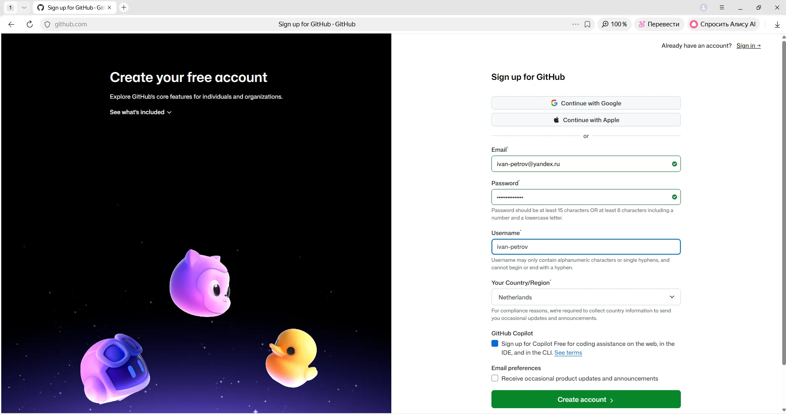

!!! note "Ожидаемый результат"
    У ученика есть подтверждённый аккаунт на GitHub, он вошёл в него и видит главную страницу сайта.

!!! note "Заметка про тариф"
    Если GitHub предлагает платные тарифы (Pro, Team) — выбирай бесплатный вариант (Free). Всё, что нужно на уроке, в бесплатном тарифе есть.

!!! slide "Создаём пустой удалённый репозиторий"
    **Мини-теория:** аккаунт есть — теперь создадим на GitHub пустой репозиторий, в который потом отправим наш калькулятор. Важно: создаём его **пустым**, без файлов. Так наша история с компьютера ляжет в него без помех.

    1. На сайте GitHub нажми зелёную кнопку **New** (или плюс `+` в правом верхнем углу — пункт New repository).
    2. В поле **Repository name** введи имя репозитория: `my-first-app` (так же, как папка проекта).
    3. Оставь репозиторий публичным (**Public**) — так его проще показать.
    4. **Важно:** не ставь галочку «Add a README file» и ничего не добавляй в полях про `.gitignore` и лицензию. Репозиторий должен быть полностью пустым.

        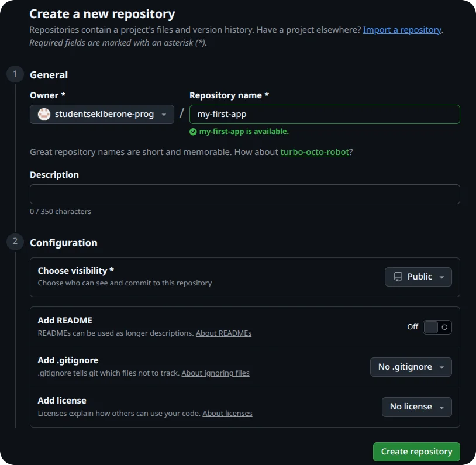

    5. Нажми зелёную кнопку **Create repository**.
    6. Откроется страница с подсказками для пустого репозитория. Найди вверху адрес репозитория, который заканчивается на `.git` (он начинается с `https://github.com/твой-username/my-first-app.git`). Этот адрес скопируй кнопкой-иконкой рядом с ним — он понадобится в следующем шаге.

    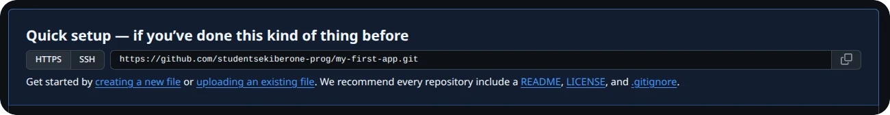

!!! note "Ожидаемый результат"
    На GitHub создан пустой публичный репозиторий `my-first-app`, ученик скопировал его адрес (HTTPS), заканчивающийся на `.git`.

!!! slide "Привязываем локальный проект к удалённому"
    **Мини-теория:** теперь нужно сказать нашему локальному репозиторию, в какой удалённый его отправлять. Для этого добавляют «адрес назначения» под коротким именем `origin`. После этого вместо длинного адреса можно будет писать просто `origin`.

    1. Открой VS Code. Через меню File → Open Folder открой папку `my-first-app` — слева появится `calc.py`.
    2. Открой встроенный терминал: меню Terminal → New Terminal.
    3. Убедись, что всё закоммичено: набери `git status` и нажми Enter. Должно быть написано, что нет изменений для коммита (`nothing to commit, working tree clean`). Если что-то не закоммичено — сделай `git add .` и `git commit -m "Сохраняю перед отправкой на GitHub"`.
    4. Привяжи удалённый репозиторий. Набери `git remote add origin ` (с пробелом в конце) и **вставь** скопированный адрес (в терминале VS Code вставка — это правый клик мышью или Ctrl+V). Должна получиться строка вида:

        ```
        git remote add origin https://github.com/твой-username/my-first-app.git
        ```

        Нажми Enter. Git ничего не ответит — это нормально, значит всё прошло.
    5. Проверь, что адрес привязался: набери `git remote -v` и нажми Enter. Git покажет адрес репозитория с пометками `fetch` и `push`.

    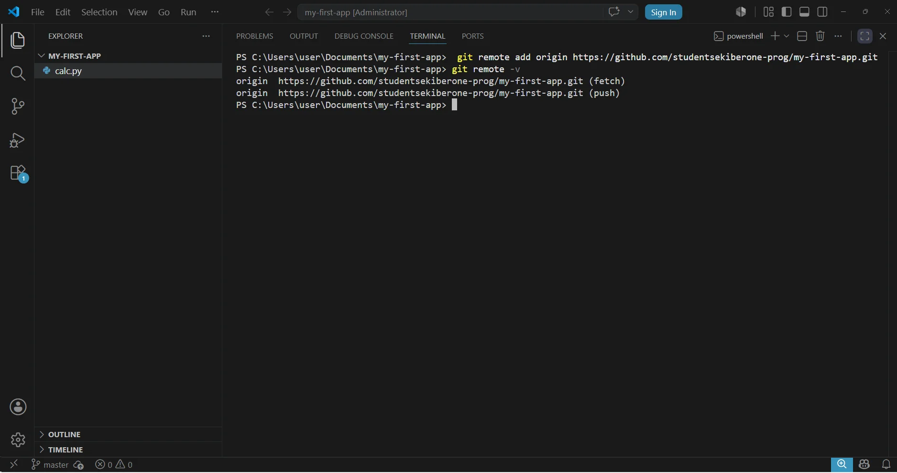

!!! note "Ожидаемый результат"
    Локальный репозиторий привязан к удалённому под именем `origin`; `git remote -v` показывает правильный адрес.

!!! warning "Частая ошибка"
    Если при `git remote add origin` Git пишет `remote origin already exists`, значит адрес уже добавлялся. Тогда не добавляй заново, а замени адрес командой `git remote set-url origin <адрес>`.

!!! slide "Первый push: отправляем проект в интернет"
    **Мини-теория:** всё готово — отправляем нашу историю в облако. Первый раз делаем это с ключиком `-u`: он запоминает связь между нашей веткой и удалённым репозиторием, чтобы дальше можно было писать просто `git push`. При самой первой отправке Git попросит войти в GitHub — откроется окно браузера, где нужно разрешить доступ. Это происходит один раз.

    1. Сначала вспомни имя своей основной ветки: набери `git branch` и нажми Enter. Запомни, что показано — `master` или `main`.
    2. Отправь проект в облако. Если ветка называется `master`, набери:

        ```
        git push -u origin master
        ```

        Если ветка называется `main` — напиши `main` вместо `master`. Нажми Enter.
    3. Откроется окно браузера с входом в GitHub (окно называется примерно «Connect to GitHub» или «Sign in»). Если ты уже вошёл в аккаунт — просто нажми зелёную кнопку **Authorize** (Разрешить). Если попросит войти — введи логин и пароль от GitHub, затем нажми Authorize.

        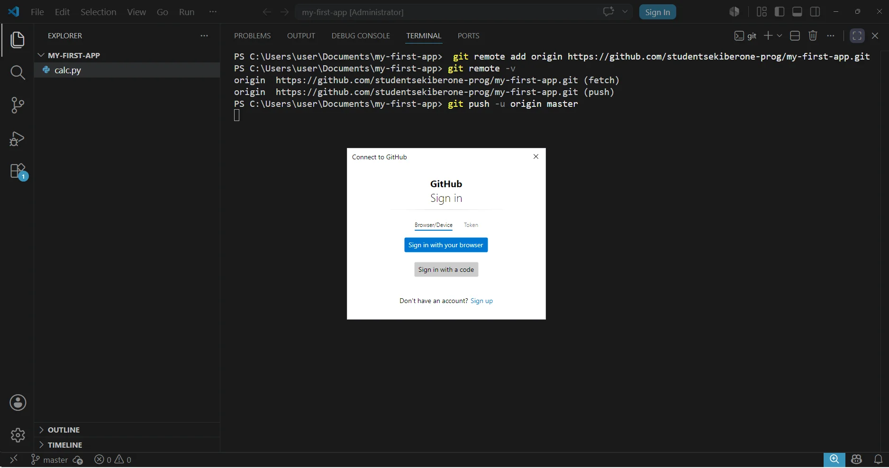

    4. Вернись в окно VS Code. В терминале Git напишет, что объекты отправлены (строки `Writing objects`, в конце — имя ветки). Это значит, что проект ушёл в облако.

        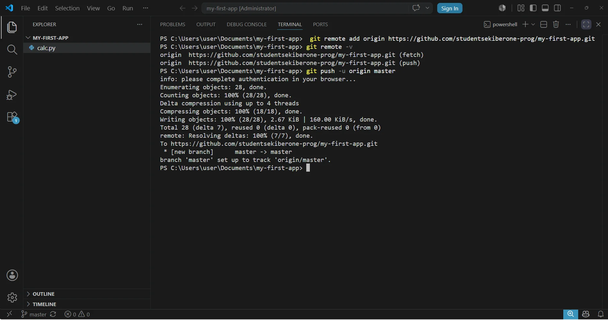

    5. Переключись в браузер, открой страницу своего репозитория на GitHub и обнови её (клавиша F5). Теперь на ней виден файл `calc.py` со всем твоим кодом.

    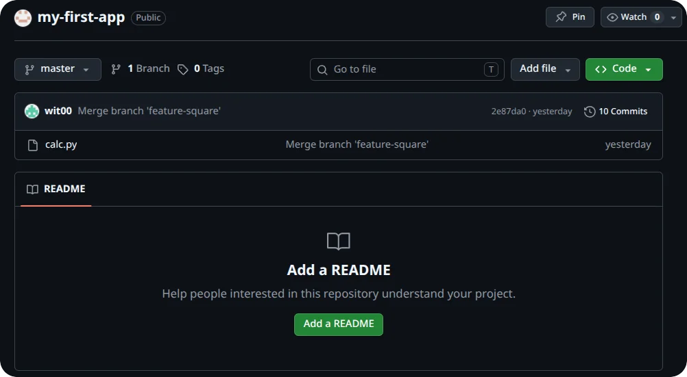

!!! note "Ожидаемый результат"
    История проекта отправлена на GitHub; на странице репозитория появился файл `calc.py`; ученик понимает, что это копия его проекта в интернете.

!!! warning "Окно входа может спрятаться"
    Окно браузера для входа в GitHub открывается отдельно и может спрятаться за другими окнами — если кажется, что push «завис», поищи его на панели задач Windows. Вход запрашивается только при самой первой отправке; дальше Windows запомнит доступ, и push будет проходить молча.

!!! slide "Меняем код и снова отправляем"
    **Мини-теория:** теперь у нас две копии проекта — на компьютере и на GitHub. Любое новое изменение сначала коммитим у себя, а потом отправляем командой `git push` (уже без `-u`, связь мы настроили на прошлом шаге). Проверим это: допишем калькулятору ещё одну функцию и отправим её в облако.

    1. В VS Code открой `calc.py`, допиши в конец файла функцию среднего из двух чисел и сохрани файл (Ctrl+S):

        ```python
        def average(a, b):
            return (a + b) / 2
        ```

    2. Закоммить изменение: набери `git add calc.py`, нажми Enter, затем `git commit -m "Добавил функцию среднего из двух чисел"` и Enter.
    3. Отправь коммит в облако: набери `git push` и нажми Enter (на этот раз без `-u` и без входа в браузер).
    4. Переключись в браузер, обнови страницу репозитория (F5) и открой файл `calc.py` на сайте — там появилась функция `average`.

    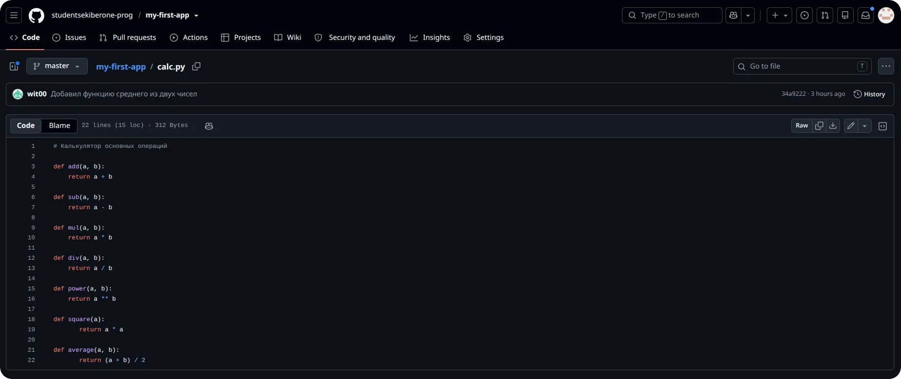

!!! note "Ожидаемый результат"
    Новый коммит отправлен на GitHub; ученик видит обновлённый `calc.py` на сайте и понимает связку «коммит у себя → push → изменение на GitHub».

!!! slide "Меняем файл на GitHub и забираем его командой pull"
    **Мини-теория:** изменения могут появиться не только на компьютере, но и прямо на сайте GitHub. Тогда на компьютере их ещё нет, и нужно их забрать командой `git pull`. Сделаем это нарочно: добавим на GitHub файл с описанием проекта, а потом подтянем его к себе.

    **Зачем нужен README.md.** Когда человек заходит на страницу репозитория, он видит только список файлов с непонятными названиями — что это за проект и зачем он, неясно. `README.md` (по-английски «read me» — «прочти меня») — это файл-визитка проекта: GitHub показывает его прямо под списком файлов на главной странице репозитория. Это первое, что читают, открыв проект. Хороший README коротко отвечает на несколько вопросов: что это за проект, что он умеет, на чём написан и, если нужно, как им пользоваться. Расширение `.md` означает формат Markdown — тот же, в котором можно делать заголовки и списки; но для начала достаточно обычного текста.

    Для нашего калькулятора в README можно написать так:

    ```
    # Мой первый калькулятор

    Учебный проект на Python. Делаю его на курсе про Git и GitHub.

    Что умеет: сложение, вычитание, умножение, деление, возведение в степень,
    квадрат и поиск большего из двух чисел.
    ```

    1. В браузере на странице репозитория нажми кнопку **Add file** → пункт **Create new file**.

        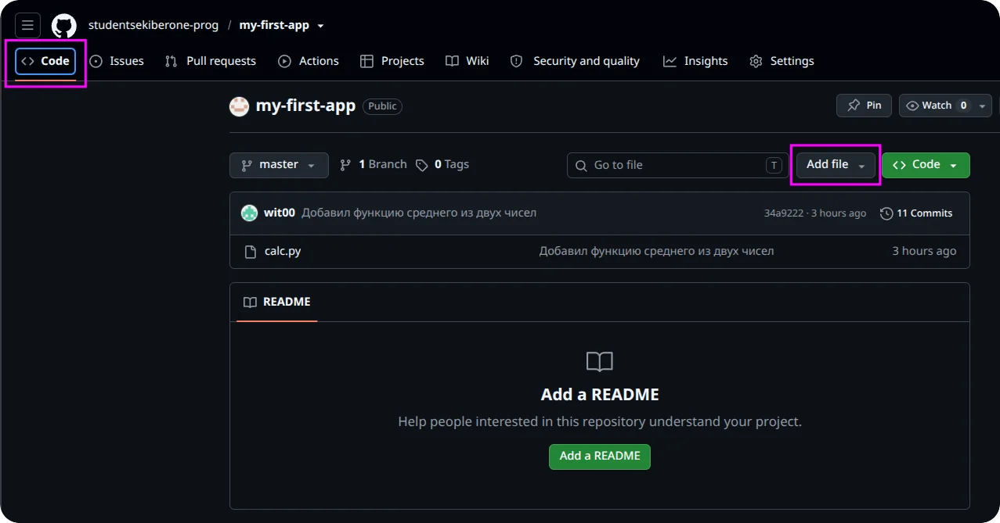

    2. В поле имени файла введи `README.md`.
    3. В большое поле текста впиши описание проекта по образцу из мини-теории выше (или своими словами — что за проект и что он умеет).
    4. Нажми зелёную кнопку **Commit changes**. На GitHub появится новый файл `README.md` — но на компьютере его пока нет.

        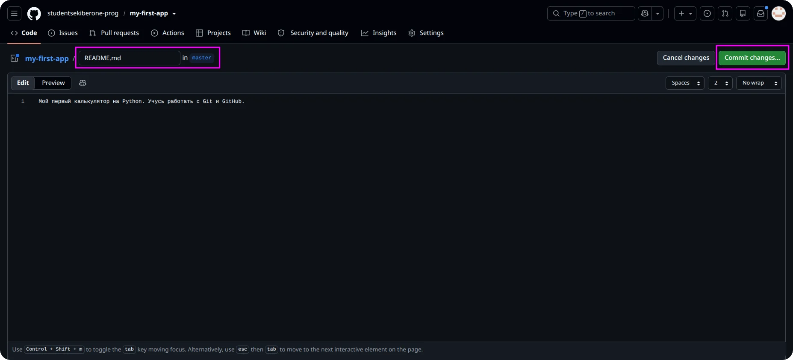

        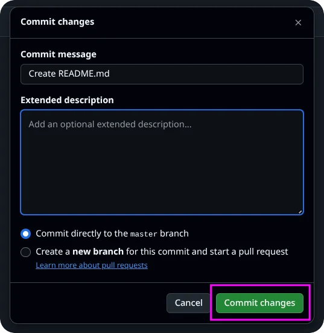

    5. Вернись в VS Code, в терминал. Заберите изменения с GitHub: набери `git pull` и нажми Enter.
    6. Посмотри в левую панель VS Code (список файлов): рядом с `calc.py` появился новый файл `README.md` — он скачался из облака.

    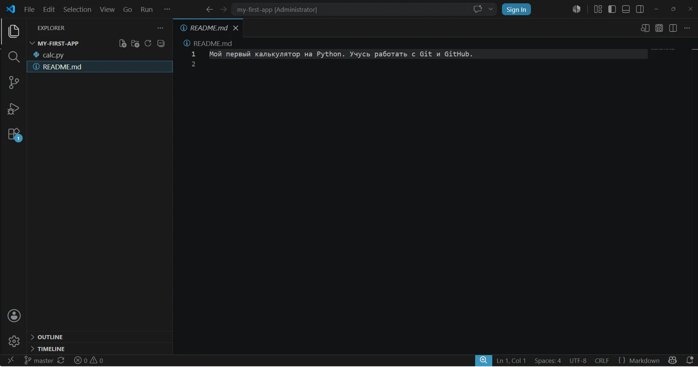

!!! note "Ожидаемый результат"
    Файл `README.md`, созданный на сайте GitHub, забран на компьютер командой `git pull`; ученик понимает, что `pull` приносит к нему изменения из облака.

---

### 4. Самостоятельная работа

**Время:** 35 мин

#### Действия преподавателя

- Раздать задание и попросить пройти полный круг работы с GitHub самостоятельно: изменение у себя — push — изменение на сайте — pull.
- Наблюдать, в какой момент ученики теряются, не подсказывать сразу — сначала навести вопросом (см. «Способы помощи учащимся»).
- Главное, на что обращать внимание: коммитит ли ученик перед push, и не путает ли направления — `push` отправляет наверх, `pull` забирает вниз.

#### Задание

!!! slide "Самостоятельная работа"
    Доведи синхронизацию проекта с GitHub до конца — сам, по всей цепочке:

    1. В `calc.py` допиши функцию остатка от деления и сохрани файл:

        ```python
        def remainder(a, b):
            return a % b
        ```

    2. Сделай коммит с понятным сообщением.
    3. Отправь изменение на GitHub командой `git push`.
    4. Открой репозиторий в браузере, обнови страницу и убедись, что функция `remainder` появилась в `calc.py` на сайте.
    5. Прямо на сайте GitHub открой файл `README.md` (кнопка-карандаш «Edit»), допиши в него строку `В калькуляторе есть сложение, вычитание, умножение, деление и остаток.` и сохрани изменение (Commit changes).
    6. Вернись в VS Code и забери это изменение к себе командой `git pull`.
    7. Покажи преподавателю: обновлённый `calc.py` на сайте GitHub и обновлённый `README.md` у себя в VS Code.

#### Критерии оценки

| Результат | Оценка |
| --------- | ------ |
| Прошёл всю цепочку самостоятельно: закоммитил, отправил `push`, проверил на сайте, изменил `README.md` на GitHub и забрал его `pull`; обе копии совпадают | Отлично |
| Выполнил всё, но с одной-двумя мелкими ошибками или с одной подсказкой (например, забыл закоммитить перед push) | Хорошо |
| Сделал push, но `pull` или изменение на сайте выполнил только с помощью преподавателя | Удовлетворительно |
| Не смог отправить изменение на GitHub даже с помощью | Требует доработки |

---

### 5. Подведение итогов

**Время:** 10 мин

#### Действия преподавателя

- Кратко повторить путь: завести аккаунт — создать пустой удалённый репозиторий — привязать его (`git remote add origin`) — отправить проект (`git push`) — забрать изменения (`git pull`).
- Спросить нескольких учеников, чем удобно хранить проект на GitHub и в какую сторону работают `push` и `pull`. Похвалить за то, что справились с самым сложным моментом — первым входом и отправкой.
- Сделать связку со следующим уроком: «На следующем уроке научимся скачивать к себе чужие проекты с GitHub — это команды clone и fork».

#### Вопросы для рефлексии

!!! slide "Подведём итоги"
    - Что нового узнал сегодня?
    - Что было самым сложным?
    - Где это можно применить в жизни?

---

## Домашнее задание

!!! slide "Домашнее задание"
    Повторение. Зайди на свою страницу репозитория `my-first-app` на GitHub из дома (или с любого компьютера) и убедись, что проект на месте и доступен по ссылке. Затем потренируй полный круг синхронизации:

    1. На компьютере допиши в `calc.py` функцию `subtract_three(a, b, c)`, которая возвращает `a - b - c`.
    2. Сделай коммит и отправь его командой `git push`.
    3. Проверь на сайте GitHub, что функция появилась.

    Письменно ответь одной-двумя строками на вопросы (можно в обычном текстовом файле):

    - Чем удалённый репозиторий отличается от локального?
    - Какой командой отправляют изменения на GitHub, а какой — забирают их к себе?

---

## Методические заметки преподавателя

### Возможные сложности

- Регистрация и подтверждение почты затягиваются: письмо с кодом приходит не сразу или попадает в «Спам». Заложить на это время, заранее напомнить про папку «Спам».
- Самый трудный момент урока — первый `push` с входом через браузер. Окно входа GitHub открывается отдельно и часто прячется за окном VS Code; ученику кажется, что команда «зависла». Из-за слабого знания ОС многие не догадываются поискать окно на панели задач Windows.
- Ученики копируют не тот адрес репозитория (берут адрес страницы из строки браузера вместо HTTPS-адреса, заканчивающегося на `.git`). Тогда `git remote add` принимает неверный адрес, и push не проходит.
- Создают репозиторий на GitHub с галочкой «Add a README file». Тогда удалённый репозиторий не пустой, и первый `push` отклоняется с ошибкой про `non-fast-forward`. Поэтому при создании репозитория явно требуется делать его пустым.
- Путают направление: пытаются `pull` вместо `push` или наоборот. Помогает короткая формула: «push — толкаю наверх, в облако; pull — тяну вниз, к себе».
- Забывают закоммитить перед `push` и удивляются, что на сайте нет последних правок (push отправляет только коммиты).
- Опечатки в username или в адресе репозитория — Git не находит удалённый репозиторий и выдаёт ошибку.

### Способы помощи учащимся

Подсказки давать по нарастанию, не выдавая ответ сразу:

- При «зависшем» первом push: «Git ничего не ждёт от тебя в терминале — он открыл окно входа в браузере. Посмотри на панель задач Windows, нет ли там нового окна GitHub».
- При неверном адресе: «Адрес репозитория должен заканчиваться на `.git`. Сравни то, что ты вставил, с адресом на странице репозитория — это адрес из подсказки, а не из строки браузера». Если адрес уже добавлен неверно — показать `git remote set-url origin <правильный адрес>`.
- При ошибке `non-fast-forward` на первом push: «Проверь, не создал ли ты репозиторий с готовым README — он должен был быть пустым. Если README уже есть на сайте, сначала сделай `git pull`, а потом `push`».
- При путанице push/pull: «В какую сторону ты хочешь передать изменения — к себе на компьютер или на сайт? push — наверх, в облако; pull — вниз, к себе».
- Если на сайте нет последних правок: «А ты закоммитил это изменение перед push? push отправляет только то, что уже в коммите. Проверь `git status`».
- При ошибке «repository not found»: «Сравни username и имя репозитория в адресе по буквам с тем, что на сайте, — нет ли опечатки?».

### Дополнительные задания (для тех, кто справился раньше)

- Открой свой репозиторий на GitHub и изучи вкладку **Commits** (история коммитов): найди там все коммиты, которые ты делал на прошлых уроках, и сравни сообщения с тем, что показывает `git log --oneline` на компьютере.
- На сайте GitHub нажми на любой коммит и посмотри, как GitHub показывает разницу (зелёные строки добавлены, красные удалены) — это то же самое, что делает `git diff`, только в браузере.
- Узнай, что такое профиль GitHub: зайди в настройки профиля (Settings) и добавь себе короткое описание и аватар. Объясни соседу, почему ссылку на свой репозиторий удобно показывать другим.

---
