# Урок 6 — Клонирование и работа с чужими проектами: clone, fork

## Общая информация

| Параметр          | Значение                                              |
| ----------------- | ----------------------------------------------------- |
| Курс              | От Git до Github                                       |
| Модуль            | От Git до Github                                       |
| Тема урока        | Клонирование и работа с чужими проектами: clone, fork |
| Возраст учащихся  | 12–14 лет                                             |
| Продолжительность | 120 мин                                               |

---

## Цель урока

!!! slide "Цель урока"
    К концу урока ученики смогут склонировать репозиторий с GitHub к себе на компьютер командой `git clone`, сделать форк чужого репозитория на свой аккаунт GitHub, склонировать этот форк, внести в него изменение и отправить его обратно в свой форк командой `git push`.

---

## План урока

| Этап                      | Время   |
| ------------------------- | ------- |
| 1. Организационный момент | 5 мин   |
| 2. Теоретическая часть    | 10 мин  |
| 3. Практическая работа    | 60 мин  |
| 4. Самостоятельная работа | 35 мин  |
| 5. Подведение итогов      | 10 мин  |
| Итого                     | 120 мин |

---

## Ход занятия

### 1. Организационный момент

**Время:** 5 мин

#### Действия преподавателя

- Поприветствовать группу, проверить, что у каждого ученика включён компьютер, установлены Git и VS Code (с урока 1), есть вход в аккаунт на GitHub (с урока 5) и на GitHub лежит репозиторий `my-first-app`.
- Кратко напомнить прошлую тему: «На прошлом уроке мы выложили свой проект на GitHub и научились отправлять изменения командой `push` и забирать их командой `pull`».
- Назвать тему и цель урока простыми словами: «До сих пор мы работали только со своим проектом. Но на GitHub лежат миллионы чужих проектов, и почти любой из них можно скачать к себе и изучить. Сегодня научимся двум вещам: командой `clone` скачивать готовый проект с GitHub на компьютер, а кнопкой `Fork` делать себе личную копию чужого проекта, чтобы спокойно с ним работать».
- Предупредить, что во второй половине урока ученики будут работать с настоящим открытым проектом из интернета.
- Заранее записать на доске два адреса (они понадобятся в практике и самостоятельной работе): `https://github.com/firstcontributions/first-contributions` и `https://github.com/octocat/Hello-World`. Это реальные публичные репозитории, специально открытые для тренировки: первый создан, чтобы новички учились делать форк и предлагать изменения, второй — демонстрационный репозиторий самого GitHub.

---

### 2. Теоретическая часть

**Время:** 10 мин

#### Действия преподавателя

- Объяснить на доске или на экране две идеи: что делает `clone` и зачем нужен `fork` и чем они отличаются. Опираться на понятные примеры. Подробности разберём по ходу практики.

!!! slide "git clone — скачать готовый проект целиком"
    `clone` (по-английски «клон» — точная копия) скачивает репозиторий с GitHub к тебе на компьютер целиком: и все файлы, и всю историю коммитов. Это не просто загрузка файлов — вместе с ними приезжает вся история проекта, как будто ты вёл его сам с самого начала.

    Так делают, когда садятся за новый компьютер и хотят продолжить свой проект, или когда нашли чужой интересный проект и хотят его изучить и запустить у себя.

!!! slide "Форк (fork) — личная копия чужого проекта"
    Чужой репозиторий менять напрямую нельзя: у тебя нет на это прав. Чтобы спокойно работать с чужим проектом, сначала делают форк — кнопкой на GitHub создают полную копию чужого репозитория на своём аккаунте.

    Эта копия уже целиком твоя: в ней можно всё менять, ломать и чинить, и оригинал от этого не пострадает.

!!! slide "Записи в блокнот"
    - **`git clone <адрес>`** — скачивает репозиторий с GitHub на компьютер целиком, со всей историей; сразу настраивает `origin` на этот адрес.
    - **Форк (fork)** — копия чужого репозитория на аккаунте в GitHub.
    - **Оригинал** — исходный чужой репозиторий, с которого сделан форк; форк на него не влияет.
    - **Локальная копия** — папка с проектом на твоём компьютере, которая появляется после `clone`.
    - **`origin`** — у склонированного проекта это адрес, откуда его скачали (Git настраивает его сам при `clone`).

---

### 3. Практическая работа

**Время:** 60 мин

#### Действия преподавателя

- Работаем по принципу «Я показываю — делаем вместе — делаешь сам». Каждый новый шаг сначала показать на проекторе, затем ученики повторяют у себя и проверяют результат. Все три части проходим вместе шаг в шаг.
- Сложнее всего ученикам даётся ориентация в папках: где сейчас открыт терминал и куда именно скачается проект. Поэтому весь урок все клоны складываем в одну заранее созданную папку и каждый раз вслух проговариваем, в какой папке мы находимся.
- Команды Git вводим во встроенном терминале VS Code (меню Terminal → New Terminal), а сайт GitHub открываем в браузере; будем переключаться между этими двумя окнами.

!!! slide "Скачиваем свой проект командой clone"
    **Мини-теория:** проверим, как работает `clone`, на своём же проекте. Представим, что мы сели за новый, чистый компьютер, на котором нашего проекта ещё нет, и хотим скачать его с GitHub. Сначала подготовим отдельную папку, куда будем складывать все скачанные проекты, чтобы не путать их с рабочей папкой `my-first-app`.

    1. Создайте папку для скачанных проектов там же, где лежат ваши проекты (например, «Документы» или папку, которую укажет тьютор; не на Рабочем столе). Откройте Проводник (Win+E), перейдите в эту папку, щёлкните правой кнопкой мыши по пустому месту, выберите **Создать — Папку** и назовите её `git-clones` (английскими буквами, без пробелов).
    2. Откройте VS Code. В меню выберите **File → Open Folder** и откройте только что созданную папку `git-clones`. Папка пока пустая.
    3. Откройте встроенный терминал: меню **Terminal → New Terminal**. Терминал откроется внутри папки `git-clones`.
    4. Переключитесь в браузер, откройте страницу своего репозитория `my-first-app` на GitHub. Нажмите зелёную кнопку **Code** и в выпавшем окошке на вкладке **HTTPS** скопируйте адрес, заканчивающийся на `.git`, кнопкой-иконкой рядом с ним.

        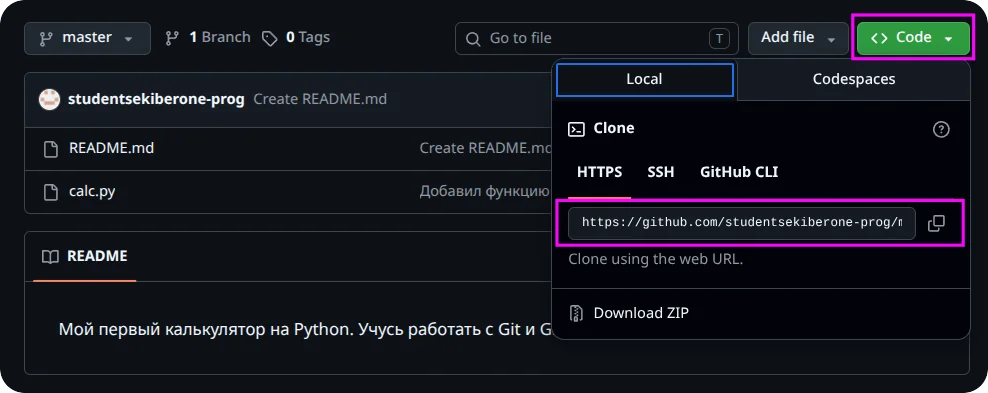

    5. Вернитесь в VS Code, в терминал. Наберите `git clone ` (с пробелом в конце) и **вставьте** скопированный адрес (в терминале VS Code вставка — правый клик мышью или Ctrl+V). Должна получиться строка вида:

        ```
        git clone https://github.com/ваш-username/my-first-app.git
        ```

        Нажмите Enter. Git напишет `Cloning into 'my-first-app'...` и скачает проект. Внутри `git-clones` появится новая папка `my-first-app`.
    6. Зайдите в скачанную папку прямо в терминале: наберите `cd my-first-app` и нажмите Enter. В начале строки терминала появится `my-first-app` — значит, вы внутри проекта. Слева в Проводнике VS Code раскройте папку `my-first-app` — в ней лежат `calc.py` и `README.md`, это копия вашего проекта.
    7. Не выходя из этой папки, наберите `git log --oneline` и нажмите Enter. Видно, что скачалась не только последняя версия, а вся история коммитов с прошлых уроков.

    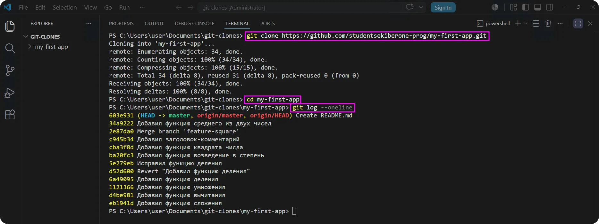

!!! note "Ожидаемый результат"
    Ученик скачал свой репозиторий с GitHub в папку `git-clones/my-first-app`; в нём есть все файлы и вся история коммитов; ученик понимает, что `clone` приносит проект целиком.

!!! note "Заметка про публичный репозиторий"
    Репозиторий с урока 5 публичный (Public), поэтому скачивается без пароля. Если Git просит вход — значит, скопирован адрес приватного репозитория или адрес с опечаткой; сверьте адрес со страницей на GitHub.

!!! slide "Делаем форк настоящего открытого проекта"
    **Мини-теория:** теперь поработаем с настоящим чужим проектом из интернета. На GitHub есть репозиторий `first-contributions` — его специально открыли, чтобы новички со всего мира тренировались делать форк и предлагать свои изменения. Менять чужой репозиторий напрямую нельзя, поэтому сначала сделаем его копию на своём аккаунте — форк. После этого в списке репозиториев на твоём GitHub появится `first-contributions`, и это будет уже твоя личная копия.

    1. В браузере откройте страницу проекта по адресу с доски: `https://github.com/firstcontributions/first-contributions`.
    2. В правом верхнем углу страницы нажмите кнопку **Fork** (не путать со звёздочкой **Star** рядом).
    3. Откроется страница создания форка. Ничего не меняйте, нажмите кнопку **Create fork**.

        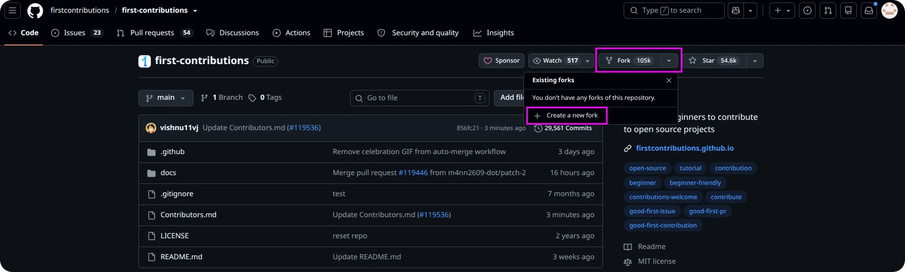

    4. Через пару секунд откроется страница уже вашего форка. Проверьте: вверху написано ваше имя пользователя — `ваш-username / first-contributions`, а чуть ниже мелким шрифтом — `forked from firstcontributions/first-contributions` («сделано из оригинального репозитория»).

    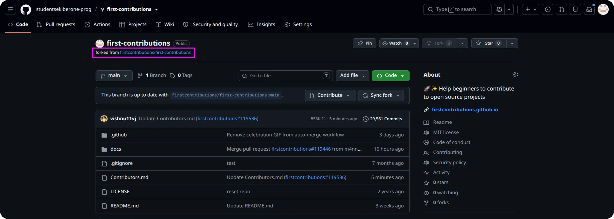

!!! note "Ожидаемый результат"
    На аккаунте ученика появилась копия проекта `first-contributions`; ученик видит надпись `forked from` и понимает, что это его личная копия чужого проекта.

!!! slide "Скачиваем форк, меняем и отправляем обратно"
    **Мини-теория:** форк пока живёт только на GitHub. Чтобы поработать с ним руками, скачаем его на компьютер тем же `clone`, что и свой проект (только адрес теперь берём со страницы своего форка). Внесём в проект небольшой вклад: добавим в него файл со своим именем — так в этом учебном репозитории принято «отмечаться».

    1. На странице своего форка нажмите зелёную кнопку **Code** и скопируйте HTTPS-адрес (заканчивается на `.git`) — так же, как раньше со своим проектом.

        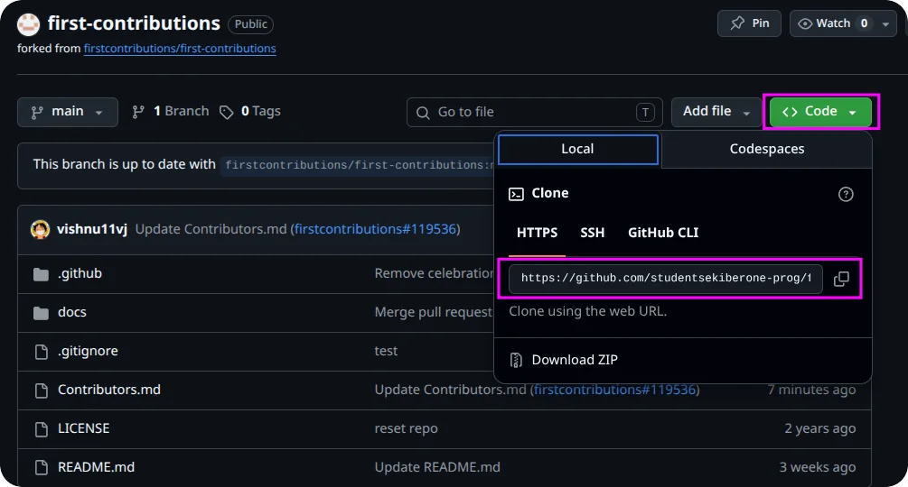

    2. Вернитесь в терминал VS Code. Сейчас он внутри папки `my-first-app` со своим проектом — поднимитесь обратно в `git-clones`: наберите `cd ..` и нажмите Enter. В начале строки терминала снова станет `git-clones`.

        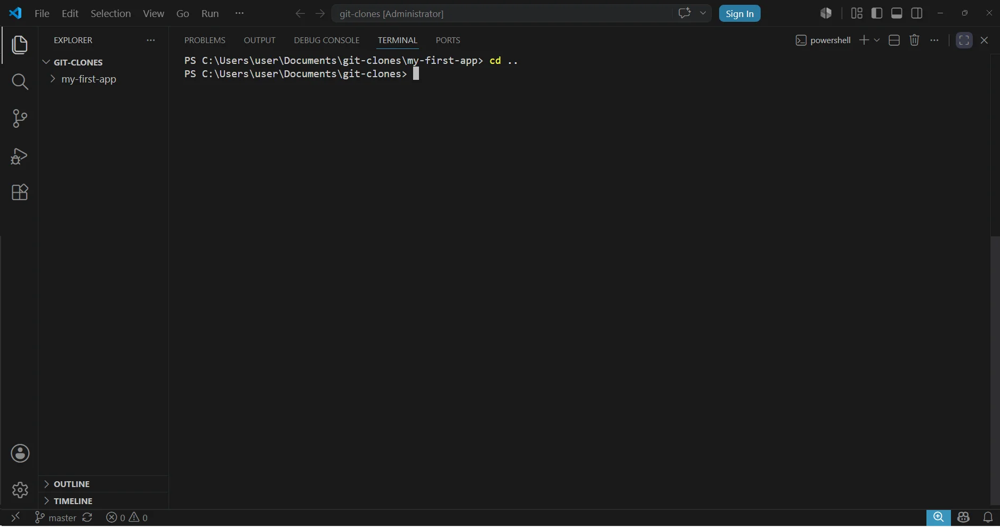

    3. Наберите `git clone `, вставьте адрес своего форка и нажмите Enter:

        ```
        git clone https://github.com/ваш-username/first-contributions.git
        ```

        Git скачает форк в папку `first-contributions` внутри `git-clones`.

        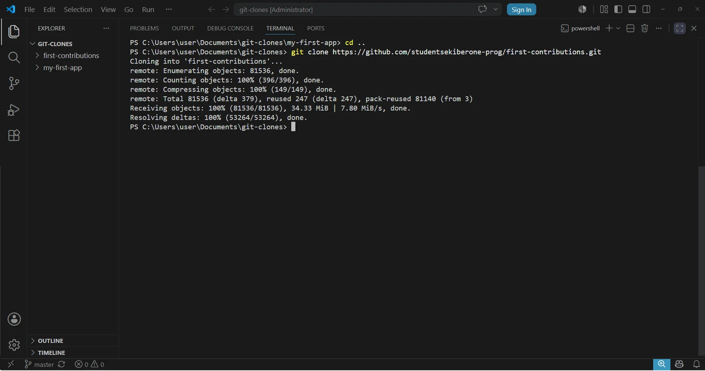

    4. Зайдите в скачанную папку: наберите `cd first-contributions` и нажмите Enter. В начале строки терминала появится `first-contributions`.

        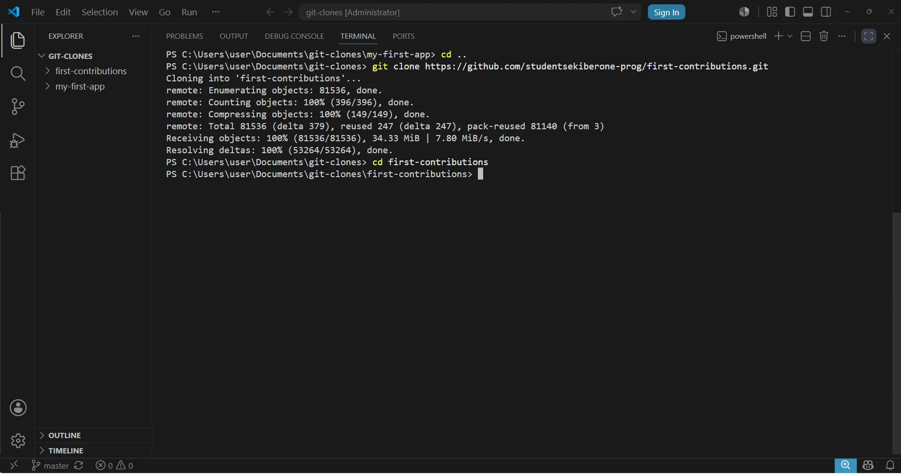

    5. Создайте новый файл со своим именем. Слева в Проводнике VS Code наведите курсор на папку `first-contributions` и нажмите появившуюся кнопку **New File**, задайте имя вида `ivan-petrov.md` (английскими буквами, ваше имя, без пробелов) и впишите внутрь одну строку о себе, например: `Привет! Меня зовут Иван, я учусь работать с Git и GitHub.` Сохраните файл (Ctrl+S).

        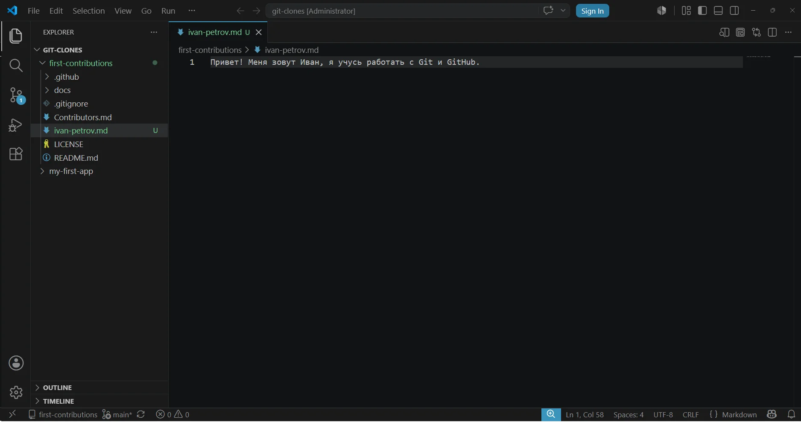

    6. Вернитесь в терминал (он уже внутри `first-contributions`) и закоммитьте новый файл: наберите `git add .`, Enter, затем `git commit -m "Добавил файл со своим именем"`, Enter.
    7. Отправьте изменение в свой форк: наберите `git push`, нажмите Enter. (Адрес `origin` уже настроен — его прописал `clone`.)

        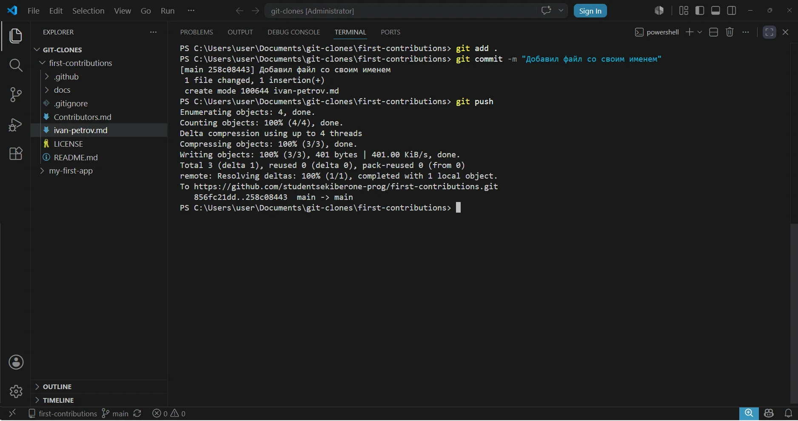

    8. Переключитесь в браузер, обновите страницу своего форка (F5) — в списке файлов появился ваш файл `ivan-petrov.md`.

    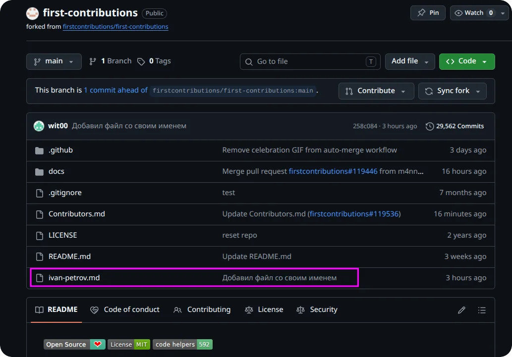

!!! note "Ожидаемый результат"
    Ученик скачал свой форк в папку `first-contributions`, добавил в него файл со своим именем, закоммитил и отправил изменение в свой форк; файл виден на GitHub в форке, а оригинальный репозиторий `firstcontributions/first-contributions` не изменился.

!!! warning "Менялся форк, а не оригинал"
    Важно проговорить вслух: ты менял свою копию (форк), а не оригинал. Откройте рядом оригинальный репозиторий `firstcontributions/first-contributions` — вашего файла там нет. Так и работает форк: правишь у себя, оригинал не трогаешь. (На уроке 7 научимся предлагать такой файл автору оригинала через Pull Request.)

---

### 4. Самостоятельная работа

**Время:** 35 мин

#### Действия преподавателя

- Сначала дать ученикам пройти короткий квиз для самопроверки (5 минут) — он закрепляет теорию урока перед практикой. Разобрать на классе те вопросы, где ошиблись многие.
- Затем раздать основное задание и попросить пройти весь путь работы с чужим проектом самостоятельно: форк — clone форка — изменение — коммит — push. На этот раз источник другой — второй учебный репозиторий с доски (`octocat/Hello-World`).
- Наблюдать, в какой момент ученики теряются, не подсказывать сразу — сначала навести вопросом (см. «Способы помощи учащимся»).
- Главное, на что обращать внимание: берут ли ученики адрес своего форка (а не оригинала), коммитят ли перед push и понимают ли, что меняют свою копию, а не оригинал.

#### Квиз для самопроверки

!!! note "Что сделать тьютору"
    Перед основным заданием откройте этот квиз на компьютере каждого ученика. Это короткая проверка теории урока: что делает `clone`, зачем нужен форк, чем они отличаются, что происходит с оригиналом при `push` в форк и откуда брать адрес для `clone` форка. Ученик отвечает на все вопросы, при ошибке под вопросом появляется правильный ответ, а справа выставляется итоговая оценка за квиз.

<div class="interactive-embed" markdown>
<iframe src="../../interactives/quiz-6.html" title="Квиз 6: клонирование и работа с чужими проектами" loading="lazy"></iframe>
[Открыть квиз на весь экран ↗](../interactives/quiz-6.html){ target="_blank" }
</div>

#### Задание

!!! slide "Самостоятельная работа"
    Поработай с ещё одним настоящим открытым проектом по всей цепочке — сам:

    1. Открой в браузере второй адрес с доски — демонстрационный репозиторий GitHub `https://github.com/octocat/Hello-World` — и сделай его форк на свой аккаунт (кнопка **Fork → Create fork**).
    2. В терминале вернись в папку `git-clones` командой `cd ..`, затем склонируй свой новый форк:

        ```
        git clone <адрес-твоего-форка>
        ```

        Git создаст внутри `git-clones` папку `Hello-World`. Зайди в неё: `cd Hello-World`.
    3. Создай в папке `Hello-World` новый файл с именем вида `ivan-petrov.txt` (твоё имя, английскими буквами): слева в Проводнике VS Code наведи курсор на папку `Hello-World` и нажми **New File**. Впиши в файл пару строк о себе: как тебя зовут и чему ты сегодня научился. Сохрани файл.
    4. Сделай коммит с понятным сообщением (терминал уже внутри `Hello-World`).
    5. Отправь изменение в свой форк командой `git push`.
    6. Открой свой форк в браузере, обнови страницу и убедись, что твой файл появился в списке файлов.
    7. Покажи преподавателю: страницу своего форка с надписью `forked from` и свой новый файл на ней.

#### Критерии оценки

| Результат | Оценка |
| --------- | ------ |
| Прошёл всю цепочку самостоятельно: сделал форк, склонировал его, добавил свой файл, закоммитил и отправил `push`; файл виден в форке на GitHub | Отлично |
| Выполнил всё, но с одной-двумя мелкими ошибками или с одной подсказкой (например, забыл закоммитить перед push) | Хорошо |
| Сделал форк и clone, но изменение закоммитил или отправил `push` только с помощью преподавателя | Удовлетворительно |
| Не смог самостоятельно сделать форк и скачать его даже с помощью | Требует доработки |

---

### 5. Подведение итогов

**Время:** 10 мин

#### Действия преподавателя

- Кратко повторить путь: `clone` — скачать готовый проект с GitHub целиком; `Fork` — сделать копию чужого проекта на своём аккаунте; затем clone форка — изменение — push в свой форк.
- Спросить нескольких учеников: чем `clone` отличается от форка, и изменится ли чужой оригинал, если запушить в свой форк (нет). Похвалить за то, что научились работать с чужими проектами, не ломая их.
- Сделать связку со следующим уроком: «На следующем уроке научимся предлагать свои изменения автору оригинального проекта — это Pull Request, и обсуждать задачи через Issues».

#### Вопросы для рефлексии

!!! slide "Подведём итоги"
    - Что нового узнали сегодня?
    - Что было самым сложным?
    - Где это можно применить в жизни?

---

## Домашнее задание

!!! slide "Домашнее задание"
    Повторение. Дома (или с любого компьютера) потренируй `clone` ещё раз, как будто садишься за новый компьютер:

    1. Создай новую пустую папку, открой её в VS Code и в терминале склонируй свой репозиторий `my-first-app` с GitHub командой `git clone <адрес>`.
    2. Открой скачанную папку и набери `git log --oneline` — убедись, что приехала вся история коммитов.

    Письменно ответь одной-двумя строками на вопросы (можно в обычном текстовом файле):

    - Чем `clone` отличается от форка?
    - Если ты сделал форк чужого проекта и отправил в свой форк изменение командой `push` — изменится ли при этом оригинальный (чужой) репозиторий? Почему?

---

## Методические заметки преподавателя

### Возможные сложности

- Ориентация в папках — главная трудность урока. Из-за слабого знания файловой системы ученики не понимают, в какой папке сейчас открыт терминал и куда скачается проект. Поэтому все клоны складываем в одну папку `git-clones`, заходим внутрь командой `cd`, а перед новым клоном возвращаемся в `git-clones` командой `cd ..`. Каждый раз проговаривать вслух, что показано в начале строки терминала — это и есть текущая папка.
- Забывают `cd ..` перед вторым клонированием и скачивают форк внутрь предыдущего проекта (получается папка в папке). Приучать смотреть на начало строки терминала: перед `git clone` там должно стоять `git-clones`, а не имя другого проекта.
- Клонируют не свой форк, а оригинал: на странице форка кнопка **Code** даёт правильный адрес (с их username), но ученик по привычке открывает оригинальный репозиторий и берёт адрес оттуда. Тогда push потом не пройдёт (нет прав на оригинал). Напоминать: адрес для clone берём со страницы своего форка, где вверху стоит своё имя.
- Нажимают не ту кнопку: вместо **Fork** жмут **Star** (звёздочку) или **Watch**. Показать кнопку **Fork** явно на проекторе.
- Думают, что push в форк меняет оригинал. Это частое и важное заблуждение — обязательно развеять, открыв рядом оригинальный репозиторий и показав, что в нём изменения нет.
- Пытаются менять файлы прямо в оригинальном репозитории на GitHub, не сделав форк, и не понимают, почему нет кнопки редактирования или почему изменения не сохраняются. Напоминать: сначала форк, потом работа со своей копией.
- Имя нового файла с расширением: в Windows расширения по умолчанию скрыты, и ученик может случайно создать `ivan.md.txt`. Файл создаём прямо в VS Code (там расширение видно), а не через Проводник.
- При `push` в форк Git может снова запросить вход в GitHub через браузер (как на уроке 5) — окно входа прячется за окном VS Code; напомнить искать его на панели задач Windows.

### Способы помощи учащимся

Подсказки давать по нарастанию, не выдавая ответ сразу:

- При путанице с папками: «Посмотри вверху окна VS Code или в начале строки терминала — какая папка сейчас открыта? Проект скачается именно в неё».
- При ошибке доступа на push (`permission denied` / `403`): «Проверь, чей репозиторий ты склонировал. Адрес для `clone` нужно брать со страницы своего форка — вверху должно стоять твоё имя пользователя, а не firstcontributions или octocat».
- При неверном адресе для clone: «Адрес для `clone` берётся из зелёной кнопки **Code** и заканчивается на `.git`. Сравни то, что ты вставил, с тем, что под кнопкой Code на странице своего форка».
- При вопросе «где кнопка Fork»: «Это справа вверху на странице репозитория, рядом со звёздочкой. Не Star, а Fork».
- При страхе сломать чужой проект: «Ты работаешь со своим форком — со своей копией. Открой страницу оригинала и посмотри: там твоих изменений нет и не будет».
- При «зависшем» push: «Git открыл окно входа в GitHub в браузере. Посмотри на панель задач Windows, нет ли там нового окна».

### Дополнительные задания (для тех, кто справился раньше)

- Открой страницу своего форка и найди надпись `forked from` — перейди по ней на оригинал и сравни: в оригинале нет файла, который ты добавил в свой форк.
- Найди на GitHub любой настоящий открытый проект (например, по слову `python calculator` в поиске GitHub), сделай его форк к себе и склонируй на компьютер. Посмотри `git log --oneline` — сколько в нём коммитов и от скольких авторов.
- Узнай, что показывает счётчик `Forks` на странице репозитория, и объясни соседу, почему у популярных проектов тысячи форков.

---
