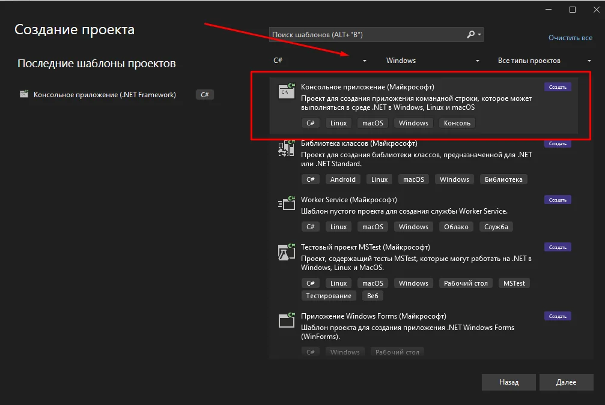
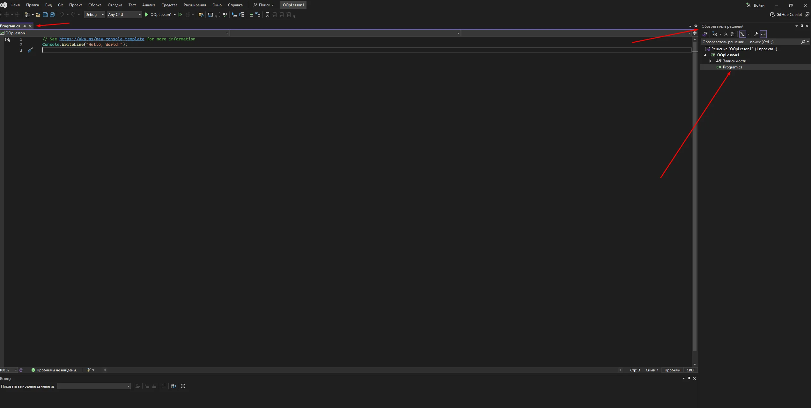
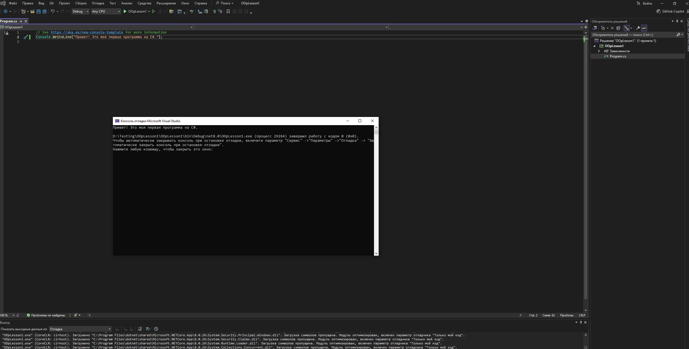
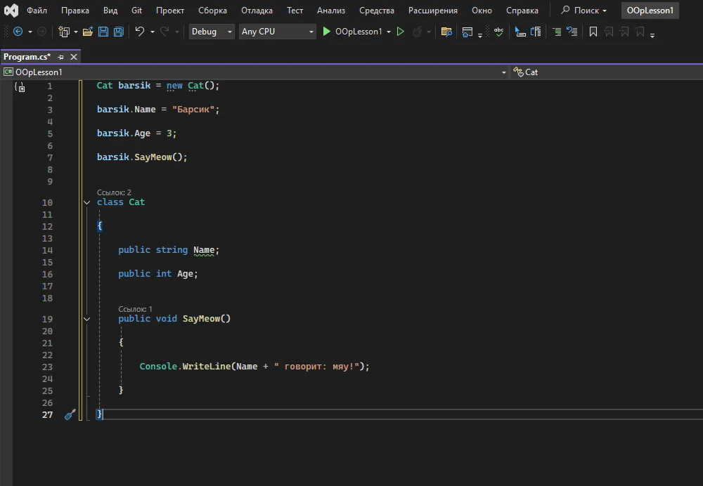
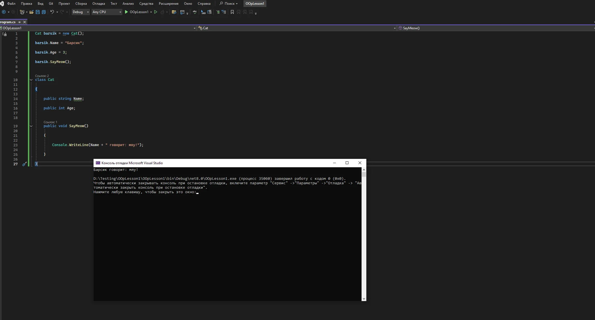

# Урок 1 - Visual Studio, первый проект и первый класс на C\#

## Общая информация

| Параметр          | Значение                                         |
| ----------------- | ------------------------------------------------ |
| Курс              | Программирование на C#                           |
| Модуль            | Введение в ООП                                   |
| Тема урока        | Visual Studio, первый проект и первый класс на C# |
| Возраст учащихся  | 12-15 лет                                        |
| Продолжительность | 120 мин                                          |

---

## Цель урока

!!! slide "Цель урока"
    К концу урока ученики смогут создать первый консольный проект C# в Visual Studio, запустить программу, объяснить своими словами, что такое класс, объект и оператор `new`, а также написать простой класс с полями и методом.

---

## План урока

| Этап                      | Время   |
| ------------------------- | ------- |
| 1. Организационный момент | 5 мин   |
| 2. Теоретическая часть    | 25 мин  |
| 3. Практическая работа    | 50 мин  |
| 4. Самостоятельная работа | 30 мин  |
| 5. Подведение итогов      | 10 мин  |
| Итого                     | 120 мин |

---

## Ход занятия

### 1. Организационный момент

**Время:** 5 мин

#### Действия преподавателя

- Поздороваться с группой и проверить присутствующих.
- Убедиться, что компьютеры включены, у учеников открывается Windows 10/11 и установлен Visual Studio 2022.
- Если Visual Studio ещё не установлена, кратко объяснить, что на этом уроке потребуется готовая среда разработки.
- Назвать тему: сегодня ученики создают первый проект C# и первый класс на языке программирования.
- Сформулировать ожидаемый результат: к концу урока у каждого будет проект `OopLesson1`, который запускается и выводит результат в консоль.

---

### 2. Теоретическая часть

**Время:** 25 мин

#### Действия преподавателя

- Объяснять понятия на простых примерах: программа как набор инструкций, класс как описание будущего объекта, объект как конкретный экземпляр.
- Связывать абстрактные термины с тем, что ученики сразу увидят в Visual Studio: проект, файл `Program.cs`, код, запуск, консоль.
- Не перегружать терминами. На первом уроке важнее, чтобы ученики почувствовали связку "написал код - запустил - увидел результат".

!!! slide "Visual Studio и проект"
    **Visual Studio** - это среда разработки: программа, в которой удобно писать код, запускать его и видеть ошибки.

    **Проект** - это папка с файлами будущей программы. Сегодня мы создадим проект типа `Console App`, потому что консольная программа проще всего показывает результат работы кода.

    Представьте, что проект - это рабочая папка мастера: в ней лежат чертежи, инструменты и заготовки. Visual Studio помогает не потеряться внутри этой папки.

!!! slide "Что такое ООП"
    **ООП** - объектно-ориентированное программирование. Это подход, в котором программа строится вокруг объектов.

    В обычной жизни мы тоже думаем объектами: ученик, автомобиль, кот, персонаж в игре. У каждого объекта есть свойства и действия.

    В программировании класс описывает, каким будет объект, а объект появляется в памяти программы во время запуска.

!!! slide "Класс и объект"
    **Класс** - это описание или шаблон будущего объекта.

    **Объект** - это конкретная вещь, созданная по этому шаблону.

    Например, класс `Cat` описывает, что у кота есть имя, возраст и действие `SayMeow()`. А объект `barsik` - это конкретный кот, у которого имя "Барсик" и возраст 3 года.

!!! slide "Оператор new"
    `new` создаёт новый объект на основе класса.

    Если класс - это чертёж, то строка `new Cat()` похожа на команду: "создай конкретного кота по этому чертежу".

    На первом уроке не нужно глубоко разбирать память .NET. Достаточно запомнить простую схему: **класс описывает**, **`new` создаёт**, **переменная хранит ссылку на объект**.

!!! slide "Записи в тетрадь"
    - Visual Studio - среда разработки для написания и запуска программ.
    - Проект - папка с файлами программы.
    - `Program.cs` - файл, в котором мы пишем C#-код.
    - Класс - описание будущего объекта.
    - Объект - конкретная вещь, созданная по классу.
    - `new` - оператор, который создаёт новый объект.

---

### 3. Практическая работа

**Время:** 50 мин

#### Действия преподавателя

- Работать в режиме "показываю - делаем вместе - проверяем результат".
- Каждый шаг сначала показать на проекторе, затем дать ученикам повторить его на своих компьютерах.
- После каждого крупного шага остановиться и убедиться, что у всех открыт тот же экран.
- Если ученик отстал, не переходить сразу к готовому ответу: сначала попросить сверить название окна, вкладку и место, куда он вводит код.

!!! slide "Шаг 1. Создаём проект"
    1. Нажмите кнопку Windows.
    2. Найдите и откройте `Visual Studio 2022`.
    3. На стартовом экране выберите `Create a new project` или `Создать проект`.
    4. В поиске шаблонов найдите `Console App`.
    5. Выберите шаблон `Console App` для языка C#.
    6. Нажмите `Next` или `Далее`.
    7. Введите имя проекта: `OopLesson1`.
    8. Проверьте папку проекта и нажмите `Create` или `Создать`.
    9. Откройте файл `Program.cs`, если он не открылся автоматически.

    

    

!!! slide "Шаг 2. Запускаем первую программу"
    В файле `Program.cs` оставьте или введите простой вывод в консоль:

    ```csharp
    Console.WriteLine("Привет! Это моя первая программа на C#.");
    ```

    Запустите проект кнопкой запуска в Visual Studio. Убедитесь, что в консоли появился текст.

    

!!! note "Ожидаемый результат"
    Ученик видит, что код в `Program.cs` действительно запускается, а строка внутри `Console.WriteLine(...)` появляется в консоли.

!!! slide "Шаг 3. Добавляем класс Cat"
    Замените код в `Program.cs` на пример с объектом `barsik`.

    ```csharp
    Cat barsik = new Cat();
    barsik.Name = "Барсик";
    barsik.Age = 3;
    barsik.SayMeow();

    class Cat
    {
        public string Name;
        public int Age;

        public void SayMeow()
        {
            Console.WriteLine(Name + " говорит: мяу!");
        }
    }
    ```

    Запустите программу и проверьте, что в консоли появилась фраза:

    ```text
    Барсик говорит: мяу!
    ```

    

    

!!! slide "Шаг 4. Мини-эксперимент"
    Измените строку создания и настройки объекта:

    ```csharp
    barsik.Name = "Мурка";
    barsik.Age = 5;
    ```

    Запустите программу ещё раз.

    Ответьте на вопросы:

    - Что изменилось в консоли?
    - Какая часть кода отвечает за имя объекта?
    - Почему метод `SayMeow()` выводит уже новое имя?

!!! warning "Частые ошибки"
    - Пропущена точка с запятой `;`.
    - Название `Cat` написано по-разному в разных местах.
    - Метод `SayMeow()` вызван до создания объекта.
    - Фигурные скобки класса или метода закрыты не там, где нужно.

---

### 4. Самостоятельная работа

**Время:** 30 мин

#### Действия преподавателя

- Вывести задание на экран и дать ученикам выбрать один из вариантов.
- Первые 5 минут не вмешиваться активно: дать попробовать самостоятельно.
- Затем обходить класс, задавать наводящие вопросы и помогать тем, кто застрял на синтаксисе.
- Если ученик быстро справился, предложить дополнительное поле или второй объект.

#### Задание

!!! slide "Самостоятельная работа"
    Создай новый класс по аналогии с `Cat`. Выбери один вариант:

    1. `Dog` - поля `Name`, `Age`, метод `Bark()`, который выводит сообщение от имени собаки.
    2. `Hero` - поля `Name`, `Level`, метод `ShowInfo()`, который выводит имя и уровень героя.
    3. `Item` - поля `Name`, `Price`, метод `ShowInfo()`, который выводит название и цену предмета.
    4. `Car` - поля `Model`, `Speed`, метод `ShowInfo()`, который выводит модель и скорость автомобиля.

    Требования:

    - создать класс;
    - добавить поля;
    - добавить метод, который печатает текст в консоль;
    - создать объект через `new`;
    - заполнить поля объекта;
    - вызвать метод и проверить результат.

#### Критерии оценки

| Критерий | Оценка |
| -------- | ------ |
| Ученик самостоятельно создал класс, объект, поля, метод, использовал `new`, запустил программу и объяснил результат | Отлично |
| Основная часть выполнена, но была одна подсказка или небольшая ошибка в синтаксисе | Хорошо |
| Задание выполнено частично, ученик понимает идею класса и объекта, но нуждается в помощи с кодом | Удовлетворительно |
| Код не запускается или ученик не может объяснить, где класс, объект и `new` | Требует доработки |

---

### 5. Подведение итогов

**Время:** 10 мин

#### Обсуждение результатов

!!! slide "Подведём итоги"
    Сегодня мы:

    - создали первый проект C# в Visual Studio;
    - открыли и изменили файл `Program.cs`;
    - запустили консольную программу;
    - узнали, что класс описывает объект;
    - создали объект через `new`;
    - написали первый простой класс с полями и методом.

#### Проверка усвоения материала

- Попросить 2-3 учеников показать свой класс и объяснить, что он делает.
- Устно повторить ключевые вопросы:
  - Для чего нужна Visual Studio?
  - Что такое проект?
  - Что такое класс?
  - Что такое объект?
  - Что делает `new Cat()`?
  - Где в проекте находится основной код программы?
- Связать урок с будущими занятиями: дальше ученики будут делать классы более осмысленными и постепенно перейдут к игровым и прикладным объектам.

---

## Домашнее задание

!!! slide "Домашнее задание"
    Выполни задание на повторение:

    1. Напиши 3 предложения о том, зачем программисту нужны классы.
    2. Придумай объект из жизни или игры и перечисли 4 свойства, которые у него могут быть. Например: имя, здоровье, скорость, цвет.
    3. Придумай 2 действия для этого объекта. Например: двигаться, атаковать, мяукать, показывать информацию.
    4. Если дома есть Visual Studio, создай проект `OopLesson1Home`, добавь свой класс и проверь, что программа запускается.

---

## Методические заметки преподавателя

### Возможные сложности

- Ученик не может найти Visual Studio или открыть окно создания проекта.
- В списке шаблонов выбран не `Console App` для C#.
- Файл `Program.cs` не виден в окне Visual Studio.
- Ошибка в синтаксисе: пропущена точка с запятой, кавычка или фигурная скобка.
- Ученик путает класс и объект: `Cat` воспринимает как конкретного кота, а `barsik` - как описание.
- На самостоятельной работе ученик копирует `Cat`, но забывает поменять названия метода и полей.

### Способы помощи учащимся

- Если проект не создан, попросить ученика вслух назвать текущий экран Visual Studio и сверить его с экраном преподавателя.
- Если не виден `Program.cs`, открыть `View` -> `Solution Explorer` и дважды щёлкнуть файл проекта.
- Если код не запускается, сначала посмотреть на красные подчёркивания и строку ошибки, затем проверить скобки и точки с запятой.
- Если ученик путает класс и объект, вернуться к аналогии: `class Cat` - это описание, `barsik` - конкретный кот.
- Если самостоятельное задание слишком сложное, предложить самый близкий вариант к примеру: `Dog` с методом `Bark()`.

### Дополнительные задания (для тех, кто справился раньше)

- Добавить в класс ещё одно поле: `Color`, `Level` или `Speed`.
- Создать два объекта одного класса и вывести информацию о каждом.
- Добавить второй метод: например, `Run()`, `Attack()` или `ShowAge()`.
- Объяснить соседу, где в его коде класс, где объект и где используется `new`.

---
