
# Урок 1 — Сколько стоит внимание в интернете и как объяснить цену услуги

## Общая информация

| Параметр | Значение |
| --- | --- |
| Курс | Финансовая грамотность через IT |
| Модуль | Свой цифровой бренд: услуга, сайт и цена |
| Тема урока | Сколько стоит внимание в интернете и как объяснить цену услуги |
| Возраст учащихся | 10-12 лет |
| Продолжительность | 120 мин |

---

## Цель урока

!!! slide "Цель урока"
    К концу урока ученики смогут на примерах объяснить, за что платят деньги в интернете, определить ценность выбранной цифровой услуги и создать первый черновик сайта-витрины с блоками услуги, пользы и цены.

---

## План урока

| Этап | Время |
| --- | --- |
| 1. Организационный момент | 5 мин |
| 2. Теоретическая часть | 10 мин |
| 3. Практическая работа | 65 мин |
| 4. Самостоятельная работа | 30 мин |
| 5. Подведение итогов | 10 мин |
| Итого | 120 мин |

---

## Ход занятия

### 1. Организационный момент

**Время:** 5 мин

#### Действия преподавателя

- Приветствует учеников и проверяет готовность компьютеров, браузера и доступа к Canva.
- Просит открыть Проводник и создать папку проекта на Рабочем столе: `Финансовый бренд`.
- Объясняет цель урока простыми словами и напоминает: реальные продажи и публикации делаются только с разрешения родителей.

---

### 2. Теоретическая часть

**Время:** 10 мин

#### Действия преподавателя

Коротко задает проблему урока и показывает, какой практический результат должен получиться. Подробные понятия объясняются дальше в практической части через мини-блоки "мини-теория -> задание".

!!! slide "Деньги в интернете"
    В интернете деньги часто платят не за саму картинку или страницу, а за внимание аудитории, решение задачи, время специалиста, удобство и готовый результат.

    Сайт нужен не ради красоты, а чтобы объяснить клиенту услугу и цену.

!!! slide "Цена внимания"
    В интернете дорого стоит не только работа дизайнера, но и место, где эту работу увидят люди.

    Баннер на крупной площадке может стоить десятки тысяч рублей за короткое размещение, а маленькая услуга фрилансера стоит меньше, потому что продает конкретную работу для одного клиента.

!!! note "Примеры цен для обсуждения"
    Цифры ниже используются как учебные ориентиры, чтобы детям было проще почувствовать масштаб денег в интернете. Перед проведением урока преподаватель может заменить их на актуальные скриншоты и цены.

| Ситуация | За что платят | Примерная сумма | Как объяснить детям |
| --- | --- | --- | --- |
| Баннер в крупном интернет-сервисе | Внимание большой аудитории и место на экране | 20 000-100 000 рублей за час как учебный ориентир для обсуждения | Чем больше людей увидят баннер, тем дороже место. Перед реальным уроком преподаватель обновляет пример по актуальным скриншотам. |
| Рекламный пост у небольшого блогера | Доступ к аудитории блогера и доверие подписчиков | 3 000-15 000 рублей за пост | Цена зависит от аудитории, темы, вовлеченности и формата рекламы. |
| Платное продвижение поста или объявления | Показы, клики или переходы на страницу | 500-5 000 рублей для маленького учебного бюджета | Даже небольшая реклама должна окупаться: если потратили 1 000 рублей, нужно понять, сколько заявок она принесет. |

!!! slide "Термины"
    | Термин | Что записать | Зачем нужен |
    | --- | --- | --- |
    | Бриф | Короткий список вопросов перед выполнением заказа. | Помогает понять, что хочет клиент. |
    | Прайс | Список услуг и цен. | Помогает объяснить стоимость вариантов услуги. |
    | Рыночная цена | Ориентир по похожим услугам в интернете. | Помогает не ставить цену наугад. |

#### Термины для записи

| Термин | Что записать | Зачем нужен на уроке |
| --- | --- | --- |
| Бриф | Короткий список вопросов перед выполнением заказа. | Помогает понять, что хочет клиент и какой результат он ожидает. |
| Прайс | Список услуг и цен. | Помогает объяснить, сколько стоит каждый вариант услуги. |
| Рыночная цена | Ориентир по похожим услугам в интернете. | Помогает не ставить цену наугад, а сравнивать с похожими предложениями. |

---

### 3. Практическая работа

**Время:** 65 мин

#### Действия преподавателя

Учитель показывает три ситуации с деньгами в интернете и задает главный вопрос: что здесь продается на самом деле? После обсуждения делает короткий переход: теперь ученики попробуют создать страницу услуги, где клиенту понятно, что предлагается, почему это стоит денег и как оставить заявку.

!!! slide "Что продается?"
    Преподаватель показывает ситуацию, а ученики отвечают не названием предмета, а настоящей ценностью, за которую платят деньги.

#### Интерактив: что здесь продается?

-   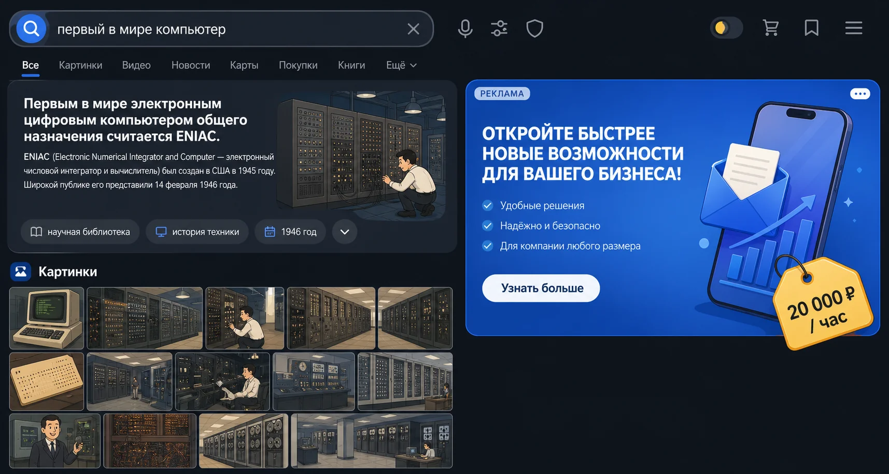

    **Ситуация 1. Баннер в браузере или на крупном сайте**

    Здесь продается не просто картинка, а внимание пользователей и место на экране.

-   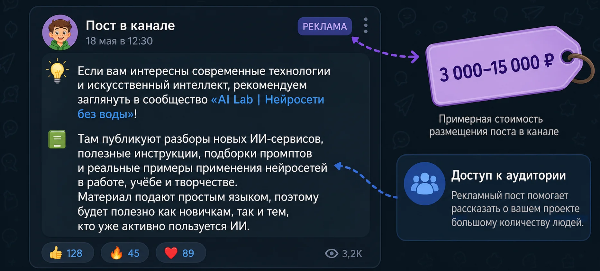

    **Ситуация 2. Рекламный пост у блогера**

    Здесь продается доступ к аудитории блогера и доверие подписчиков.

-   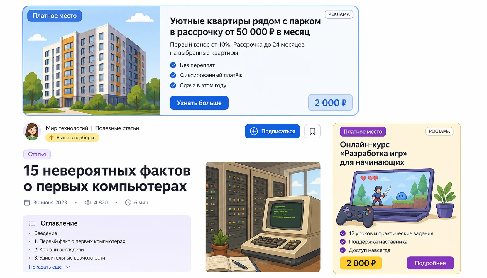

    **Ситуация 3. Платное место в каталоге или подборке**

    Здесь продается более заметное место среди конкурентов, а не сам товар.

??? note "Вопросы и короткие ответы"
    | Ситуация | Вопрос | Короткий ответ |
    | --- | --- | --- |
    | Баннер | Кто платит за это место? | Компания или человек, которому нужно показать рекламу людям. |
    | Баннер | Почему баннер может стоить десятки тысяч рублей за короткое время? | Его видит большая аудитория, поэтому продается не картинка, а внимание людей. |
    | Баннер | Что влияет на цену? | Размер баннера, место, время показа и количество зрителей. |
    | Баннер | Что должен получить рекламодатель? | Переходы, заявки, продажи или узнаваемость, которые стоят дороже потраченных денег. |
    | Пост у блогера | Почему пост у одного блогера стоит дороже, чем у другого? | У блогера может быть больше активной аудитории, выше доверие и лучше совпадение с темой рекламы. |
    | Пост у блогера | Как понять, окупилась ли реклама? | Сравнить затраты с результатом: заявками, продажами или прибылью. |
    | Каталог | Почему продавец может платить за место выше остальных? | Верхнее место видят быстрее, поэтому шанс получить заказ выше. |
    | Каталог | Если место стоило 2 000 рублей, сколько заказов нужно получить? | Зависит от прибыли с одного заказа. Если прибыль 500 рублей, нужно минимум 4 заказа. |

#### Задание

!!! slide "Сайт услуги"
    В интернете цена почти всегда связана с вниманием, пользой или экономией времени.

    На практике ученики создают черновик сайта услуги: не публикуют его, а учатся объяснять предложение, цену и путь к заявке.

Обязательная структура будущего сайта:

| Блок сайта | Что должно быть внутри | Финансовый смысл |
| --- | --- | --- |
| Первый экран | Название услуги, короткое обещание пользы, пример цены `от ... рублей` | Клиент сразу понимает предложение. |
| Что входит | Результат, объем, срок, правки | Цена связывается с составом работы. |
| Почему это стоит денег | Время, стиль, правки, готовый результат | Объясняется ценность, а не только красота. |
| Цена | Базовый, стандартный и срочный вариант | Видно, чем отличаются тарифы. |
| Оставить заявку | Место для будущей ссылки на форму | Появляется путь к заказу. |

#### Подготовка проекта

1. Нажмите правой кнопкой мыши на Рабочем столе.
2. Выберите **Создать**, затем **Папку**.
3. Назовите папку `Стикер бренд`.
4. Откройте браузер.
5. Перейдите на сайт Canva: <https://www.canva.com/>.
6. Пройдите регистрацию с подтверждением. Временная почта не подойдет.

!!! note "Canva"
    Canva - это онлайн-платформа для дизайна. В ней можно делать презентации, баннеры, посты, плакаты и простые сайты без программирования.

    В этом уроке Canva нужна не для красивой картинки, а для черновика сайта услуги, где клиент видит предложение и цену.

#### Создание сайта в Canva

1. В поисковой строке Canva введите `сайт`. Если результатов мало, попробуйте запросы `website`, `лендинг`, `сайт услуги`.
2. Откройте раздел с шаблонами сайтов. Ученикам важно выбрать именно сайт или website, а не обычную презентацию: сайт собирается вертикальными блоками.
3. Выберите простой бесплатный шаблон сайта. Не выбирайте шаблоны со значком короны, потому что это платные элементы Canva Pro.

4. Переименуйте проект: `Сайт услуги - имя`.
5. Покажите ученикам, что сайт состоит из блоков: первый экран, описание, преимущества, цена, заявка.

!!! slide "Первый экран"
    На первом экране оставьте только главное:

    - название услуги;
    - короткое описание пользы;
    - пример цены.

Добавьте название услуги через инструмент **Текст**. В левой панели Canva нажмите **Текст**, выберите **Добавить заголовок** или **Заголовок**. Примеры: `Стикер-пак на заказ`, `Баннер для канала`, `Оформление презентации`, `Карточка товара`.

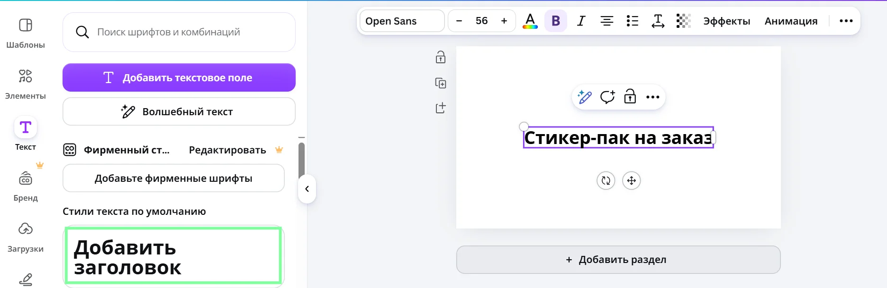

Добавьте короткое описание пользы услуги. Для этого снова откройте **Текст** и выберите **Подзаголовок** или **Добавить подзаголовок**. Подзаголовок должен быть меньше названия и объяснять, кому нужна услуга. Пример: `Цифровая услуга для канала, чата или школьного проекта`.

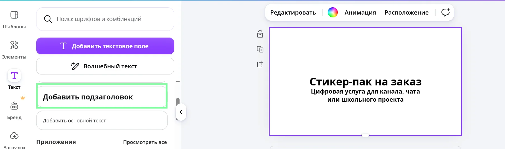

Добавьте строку цены. Сначала можно написать ее обычным текстом: `от 500 рублей`. Затем на этапе дизайна ученики оформят цену как отдельную плашку или кнопку, чтобы она была заметна на первом экране.

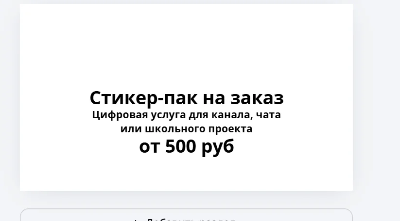

#### Этап дизайна сайта в Canva

!!! slide "Дизайн и доверие"
    Дизайн нужен не ради украшения, а чтобы клиент быстрее понял услугу, поверил в аккуратность исполнителя и увидел, за что платит.

    Если на сайте трудно читать текст, непонятна цена или все элементы стоят хаотично, клиент может уйти, даже если услуга хорошая.

Задание: оформите первый экран сайта по правилу трех акцентов.

| Акцент | Как оформить | Что проверяем |
| --- | --- | --- |
| Название услуги | Самый крупный текст | Понятно, что продается. |
| Польза для клиента | Подзаголовок меньше названия | Понятно, кому и зачем нужна услуга. |
| Цена или кнопка | Заметная плашка или кнопка | Цена видна без поиска. |

Выберите 2 основных цвета и 1 цвет для акцента. Для примера используйте простую схему: темно-синий фон, белый текст и желтая плашка цены. Проверьте шрифты: название услуги сделайте самым крупным, описание меньше, цену или кнопку выделите жирным.

Добавьте визуальный элемент через левую панель **Элементы**. В поиске можно ввести `стикеры`, `чат`, `наклейки`, `планшет`, `иллюстрация`. Откройте раздел **Графика** и выбирайте элементы без значка короны: они бесплатные.

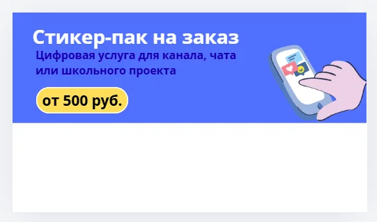

Создайте фон первого экрана через **Элементы -> Фигуры**. Добавьте квадрат или прямоугольник, растяните фигуру на верхнюю часть страницы и задайте ей темно-синий цвет. Если фигура закрыла текст, нажмите на нее правой кнопкой мыши и выберите **На задний план** или **Положение -> Назад**.

Цену оформите так же через фигуру: добавьте прямоугольник со скругленными углами, задайте ему желтый цвет и поместите поверх него текст `от 500 рублей`.

Увеличьте высоту страницы, потому что ниже нужно разместить блоки "Что входит", "Почему это стоит денег" и "Пакеты". Для этого нажмите на страницу Canva, найдите нижнюю границу рабочей области и потяните ее вниз.

Нажмите **Предварительный просмотр** и проверьте: читается ли название, видна ли цена, понятно ли, что продается, нет ли слишком мелкого текста.

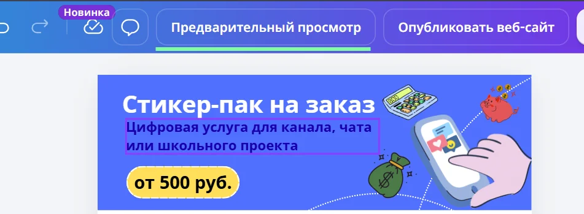

!!! warning
    Если текст не помещается, не уменьшайте его до нечитаемого размера. Лучше сократите формулировку или перенесите часть информации в следующий блок.

#### Блоки сайта

| Блок | Что сделать | Пример текста |
| --- | --- | --- |
| Что входит | Заполнить 2 пункта | `5 стикеров в одном стиле`, `1 правка после показа результата` |
| Почему это стоит денег | Заполнить 2 причины | `время на работу`, `подбор стиля под клиента` |
| Пакеты | Заполнить 2 строки | `Мини - 500 рублей`, `Стандарт - 1 000 рублей` |
| Оставить заявку | Добавить место для будущей формы | `На следующих уроках здесь будет кнопка на форму заявки` |

Создайте блок "Что входит" и заполните только 2 пункта, чтобы ученики поняли принцип. Затем создайте блок "Почему это стоит денег" и заполните 2 причины. Это важный финансовый блок: он объясняет не красоту дизайна, а цену услуги.

Создайте блок "Пакеты" или "Примерный прайс". Заполните 2 строки: `Мини - 500 рублей` и `Стандарт - 1 000 рублей`. Рядом с ценой кратко напишите, что входит в пакет.

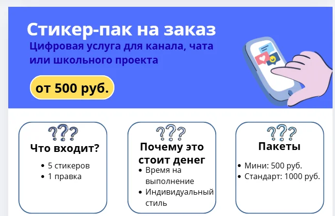

Создайте блок "Оставить заявку" или "Как заказать". На следующих уроках здесь будет кнопка на форму заявки.

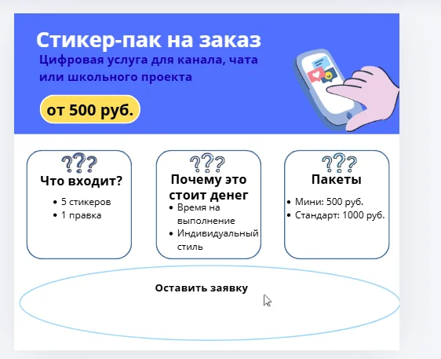

!!! tip "Проверка перед сохранением"
    Проверьте сайт по чек-листу: есть название услуги, кому она нужна, что входит, почему это стоит денег, примерная цена, будущая заявка.

Финансовый вопрос к ученикам после дизайна: стало ли теперь понятнее, почему услуга может стоить 500, 1 000 или 2 000 рублей? Что именно на сайте объясняет эту цену?

Сохраните изменения в Canva. Обычно Canva сохраняет проект автоматически, но преподаватель показывает и ручной вариант: нажмите **Файл** в верхней панели и выберите **Сохранить изменения**, если такой пункт отображается. Публиковать сайт в интернете на этом уроке не нужно.

Ожидаемый результат: черновик сайта услуги в Canva Websites, где уже видны ценность услуги, стартовая цена, состав заказа, будущий путь к заявке и базовый дизайн первого экрана.

---

### 4. Самостоятельная работа

**Время:** 30 мин

#### Действия преподавателя

Учитель объясняет: основу сайта сделали вместе, теперь ученики закрепляют действия самостоятельно. Учитель помогает точечно, если ученик потерял инструмент, выбрал платный элемент, сделал нечитаемый текст или поставил цену без объяснения состава услуги.

#### Задание

!!! slide "Самостоятельная работа"
    Самостоятельно дополните страницу сайта. Работайте в том же Canva-проекте, который начали на уроке.

    Не создавайте новый сайт, чтобы не потерять структуру.

Что нужно сделать:

1. В блок "Что входит" добавьте еще 1-2 пункта: срок выполнения, количество файлов, формат результата, количество правок.
2. В блок "Почему это стоит денег" добавьте еще 1-2 причины: время исполнителя, умение работать в одном стиле, подбор референсов, исправления после обратной связи.
3. В блок "Пакеты" сделайте еще один тариф: Мини, Стандарт, Плюс или Срочный.
4. Добавьте дизайн к этим блокам: карточки, простые фигуры, иконки или стикеры из **Элементы -> Графика**. Используйте только бесплатные элементы без коронки.
5. Проверьте финансовую логику: чем дороже пакет, тем больше в нем результата, скорости или правок.
6. Проверьте внешний вид: текст читается, карточки стоят ровно, цвета не спорят друг с другом, цена заметна.

#### Примерный результат

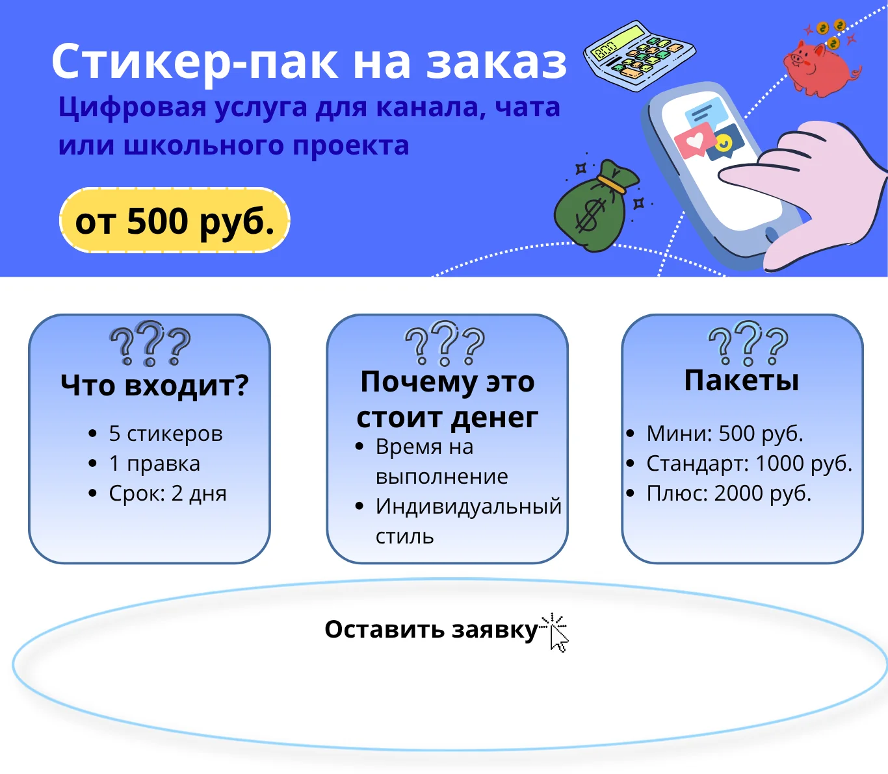

На странице должны быть видны: первый экран с названием и ценой, блок "Что входит", блок "Почему это стоит денег", блок "Пакеты" и будущая заявка через форму.

Главная проверка самостоятельной работы: клиент должен понять, за что он платит и чем отличаются варианты цены.

#### Критерии оценки

| Результат | Оценка |
| --- | --- |
| Сайт создан, есть услуга, понятный первый экран, блоки "Что входит", "Почему это стоит денег", "Пакеты", объяснение ценности, стартовая цена и аккуратный базовый дизайн | Отлично |
| Сайт создан, есть услуга, блоки и цена, но дизайн или объяснение ценности требуют небольшой доработки | Хорошо |
| Сайт начат, но клиенту трудно понять, что входит в услугу или за что он платит | Удовлетворительно |
| Сайт не создан или на нем нет связи между услугой, ценностью и ценой | Требует доработки |

---

### 5. Подведение итогов

**Время:** 10 мин

#### Обсуждение результатов

!!! slide "Подведем итоги"
    - Что дороже: сама картинка баннера или внимание людей, которые ее увидят?
    - Почему сайт услуги должен объяснять не только красоту, но и цену?
    - Что клиент покупает в услуге: файл, время, стиль, правки или решение задачи?
    - Какая часть вашего сайта лучше всего объясняет, за что клиент платит?

#### Проверка усвоения материала

- Ответы на вопросы преподавателя.
- Демонстрация результата урока преподавателю или соседу по паре.
- Проверка, что в работе есть связь между услугой, ценностью и ценой.

---

## Домашнее задание

!!! slide "Домашнее задание"
    Доработайте сайт или подготовьте текст для доработки.

    Нужно добавить два блока: "Для кого это подходит" и "Что входит в разные типы пакетов".

В блоке "Для кого это подходит" напишите 3-4 варианта клиентов или ситуаций, где услуга может пригодиться.

В блоке про пакеты опишите 3 варианта: Мини, Стандарт и Плюс. Укажите примерную цену и что входит в каждый пакет.

Если дома есть доступ к Canva, внесите эти блоки прямо в сайт. Если доступа к Canva нет, оформите задание письменно: в тетради, Word или заметках телефона. На следующем уроке этот текст можно будет перенести в проект.

---

## Методические заметки преподавателя

### Возможные сложности

- Ученики могут воспринимать сайт как декоративную страницу и забывать финансовый смысл.
- Ученик может выбрать платный элемент с коронкой.
- Ученик может не найти раздел **Текст** или **Элементы**.
- Ученик может не понять, как растянуть страницу вниз.
- Текст на сайте может получиться слишком мелким.
- Ученик может забыть сохранить изменения или поставить цену без объяснения состава услуги.

### Способы помощи учащимся

- Если ученик не понимает финансовую часть, используйте цепочку: клиент хочет результат -> исполнитель тратит время и ресурсы -> сайт объясняет ценность -> цена должна соответствовать составу услуги.
- Если ученик не справляется с дизайном, дайте минимальный шаблон: темный верхний фон, крупный заголовок, желтая цена, три белые карточки ниже.
- Если дома нет доступа к Canva, домашнее задание можно выполнить письменно: оно готовит текст и цены для следующего урока.

### Дополнительные задания (для тех, кто справился раньше)

- Добавить на сайт мини-блок "Почему не бесплатно": 3 причины, почему даже простая цифровая услуга имеет цену.

---
