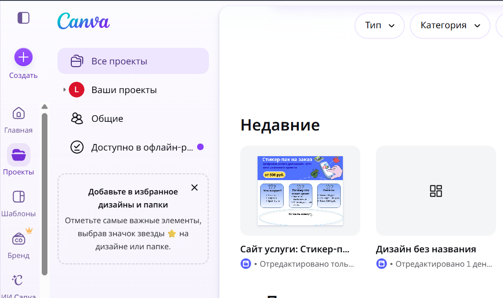
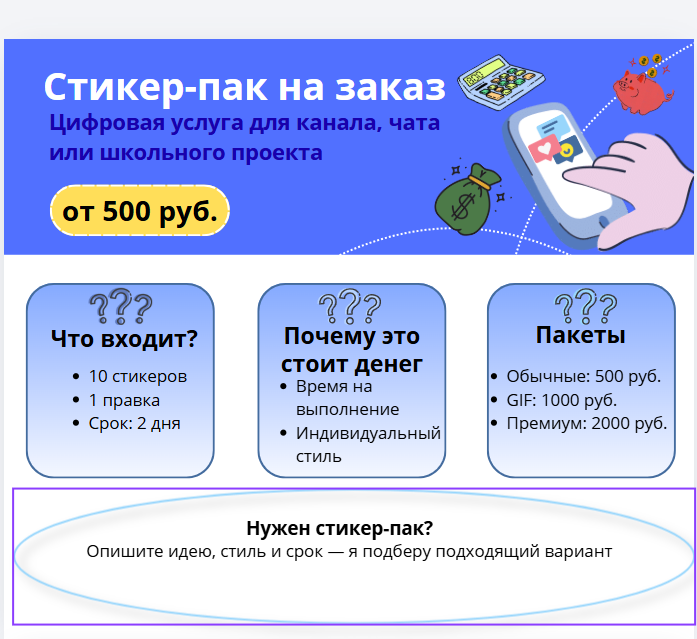
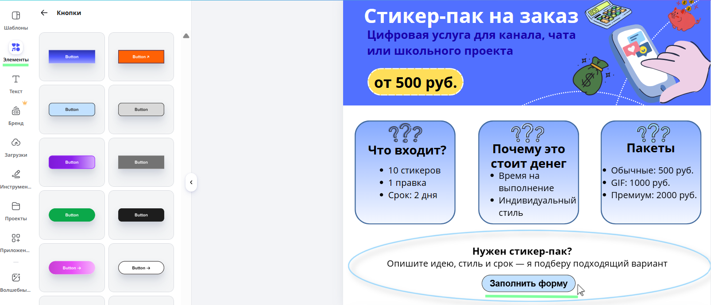
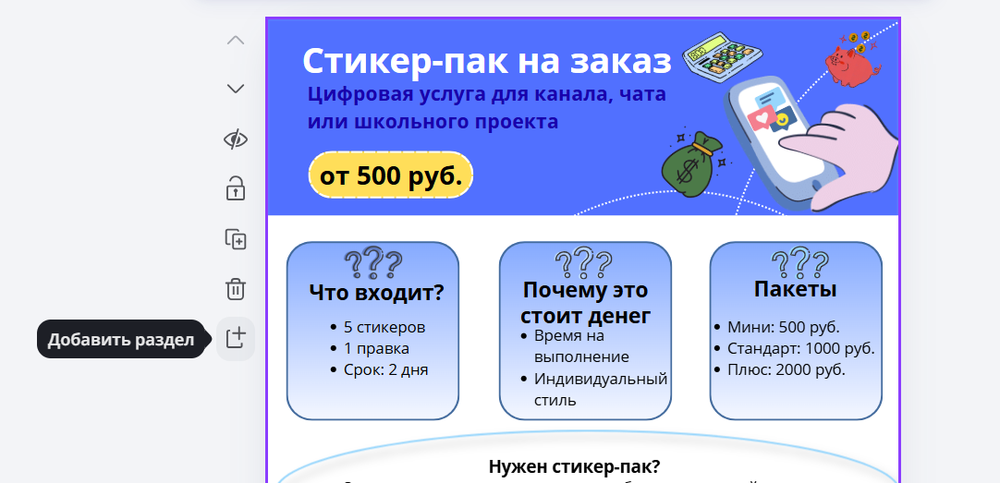
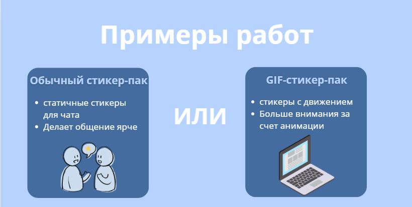
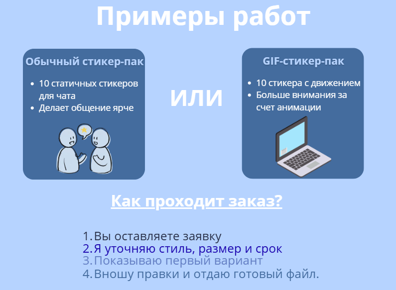
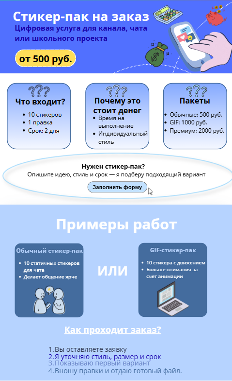
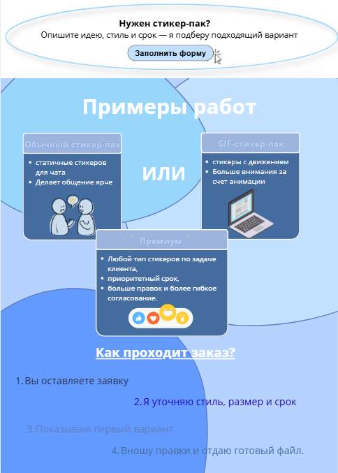

# Урок 2 — Портфолио и сайт услуги в Canva Websites

## Общая информация

| Параметр | Значение |
| --- | --- |
| Курс | Финансовая грамотность через IT |
| Модуль | Свой цифровой бренд: услуга, сайт и цена |
| Номер урока | 2 из 4 |
| Тема урока | Портфолио и сайт услуги в Canva Websites |
| Возраст учащихся | 10-12 лет |
| Продолжительность | 120 минут |
| Формат | Объяснение через практику за компьютером, режим теории Б |
| Платформы | Canva Websites, при необходимости Google Документы или тетрадь для черновиков текста |

---

## Цель урока

!!! slide "Цель урока"
    Сформировать у учеников понимание, что цена цифровой услуги зависит не только от картинки или файла, а от понятной ценности: качества примеров, состава услуги, срока выполнения, правок и доверия клиента.

    На практике ученики дорабатывают сайт своей услуги в Canva Websites так, чтобы клиент мог увидеть примеры, выбрать пакет и понять, за что он платит.

---

## План урока

| Этап | Время | Что делают ученики |
| --- | --- | --- |
| 1. Организационный старт | 5 минут | Открывают проект сайта из урока 1, проверяют доступ к Canva. |
| 2. Финансовая разминка | 15 минут | Разбирают, почему похожие цифровые услуги могут стоить по-разному. Смотрят примерные цены рынка. |
| 3. Практическая работа в Canva | 65 минут | Добавляют портфолио, проверяют пакеты услуги, уточняют условия заказа и блок доверия. |
| 4. Самостоятельная работа | 25 минут | Дорабатывают страницу по чек-листу и проверяют ее глазами клиента. |
| 5. Итог и домашнее задание | 10 минут | Фиксируют, что влияет на цену, и готовят вопросы для формы заказа. |

---

## Ход занятия

### 1. Организационный старт

**Время:** 5 минут

#### Действия преподавателя

Короткое вводное слово преподавателя:

> На прошлом занятии мы начали сайт услуги: сделали первый экран, коротко описали услугу, показали примерную цену и добавили карточку "Оставить заявку". Сегодня сайт должен стать более убедительным. Клиенту мало увидеть красивую первую страницу: он хочет понять, что исполнитель уже умеет делать, какие есть варианты заказа, сколько это стоит и почему этой услуге можно доверять.

На прошлом уроке дети остановились на карточке "Оставить заявку", поэтому начните практику с нее: доведите карточку до понятного состояния, а затем добавьте портфолио, проверку пакетов и порядок работы. Карточка заявки нужна не для красоты: она показывает клиенту следующий шаг и готовит сайт к форме заказа на уроке 3.

!!! note "Важно"
    Первый экран и карточки с прошлого урока считаются черновой витриной услуги. Их не нужно полностью переделывать.

    На этом уроке дети сохраняют готовый дизайн и уточняют смысл ниже: через примеры работ, различие обычного и GIF-варианта, понятные пакеты и путь к заявке.

---

### 2. Финансовая разминка: почему сайт влияет на цену

**Время:** 15 минут

Формат: короткое обсуждение с записью двух терминов. Не превращайте этап в лекцию: каждый тезис сразу связывается с будущим блоком сайта.

!!! slide "Вопрос классу"
    Представьте две одинаковые услуги: "сделаю баннер за 500 рублей".

    У первого исполнителя есть только фраза и кнопка "заказать".

    У второго есть примеры работ, понятные пакеты, сроки, количество правок и объяснение, как проходит заказ.

    У кого клиент с большей вероятностью купит? Почему?

#### Пояснение преподавателя

В интернете клиент не всегда знает исполнителя лично. Поэтому сайт работает как финансовое объяснение: он показывает не только красоту, но и состав услуги. Чем понятнее результат, сроки и условия, тем легче объяснить цену.

!!! note "Примерные цены для разговора"
    Это не обещание заработка, а учебные ориентиры: реальные цены зависят от качества, опыта, срочности, количества правок и площадки.

| Цифровая услуга | Примерный диапазон | Почему цена может отличаться |
| --- | --- | --- |
| Аватарка или простая картинка для профиля | 300-1 000 ₽ | Стиль, детализация, срочность, количество вариантов. |
| Баннер или шапка для канала/сообщества | 500-2 500 ₽ | Размеры под площадку, подбор шрифтов, несколько версий. |
| Карточка товара для маркетплейса | 400-1 500 ₽ за 1 карточку | Нужно показать товар понятно, добавить текст, выгоды и аккуратную композицию. |
| Мини-презентация 5-7 слайдов | 800-3 000 ₽ | Нужна структура, оформление, единый стиль, иногда подбор изображений. |
| Простой сайт-визитка на конструкторе | 1 500-7 000 ₽ | Чем больше блоков, текста и аккуратной настройки, тем выше цена. |

!!! slide "Термины"
    | Термин | Что записать |
    | --- | --- |
    | Портфолио | Примеры работ, по которым клиент понимает уровень исполнителя. |
    | Пакет услуги | Заранее описанный вариант заказа: что входит, сколько стоит, сколько времени занимает. |

#### Короткие вопросы для закрепления

- Почему "просто картинка" и "картинка с учетом задачи клиента" могут стоить по-разному?
- Что должно быть на сайте, чтобы клиент понял цену без долгих объяснений?
- Почему честное описание условий лучше, чем обещание "сделаю идеально всем"?

---

### 3. Практическая работа в Canva

**Время:** 65 минут

Практический результат этого этапа: ученики не пересобирают первый экран с нуля, а дорабатывают уже созданный сайт. Карточки первого урока остаются краткой витриной, а ниже добавляются конкретные примеры работ, различие обычного и GIF-стикер-пака, проверка пакетов и блок заявки.

!!! slide "Практический результат"
    К концу практики на сайте должны появиться:

    - понятная карточка "Оставить заявку";
    - блок "Примеры работ";
    - проверенные пакеты услуги;
    - блок "Как проходит заказ";
    - объяснение, почему услуга стоит своих денег.

#### Шаг 1. Открыть сайт и перейти к редактированию

1. Откройте Canva: <https://www.canva.com/>.
2. Нажмите **Проекты** или откройте **Недавние дизайны**.
3. Выберите сайт, созданный на уроке 1.
4. Проверьте, что на первой странице уже есть название услуги, короткое объяснение и примерная цена или пакеты.

!!! tip "Если проекта нет"
    Если ученик пропустил урок 1 или не нашел свой проект, выдайте резервный Canva-макет: <https://canva.link/eh9oiajheptsake>.

    Ученик открывает ссылку, нажимает **Файл -> Сделать копию**, переименовывает копию в `Сайт услуги - имя` и продолжает работу в своем проекте.

#### Шаг 2. Доработать карточку "Оставить заявку"

Объяснение для учеников: карточка "Оставить заявку" — это место, где интерес клиента превращается в действие. Если на сайте есть только красивые блоки, но непонятно, как заказать, клиент может просто закрыть страницу. Поэтому карточка заявки должна коротко объяснять, что человек получит после нажатия и что будет дальше.

!!! slide "Заявка"
    Заявка — это первый шаг к продаже.

    Выручка появляется не от просмотра сайта, а от заказа. Поэтому кнопка и текст рядом с ней должны быть понятными, спокойными и честными.

1. Прокрутите сайт до карточки **Оставить заявку**, которую начали на прошлом уроке.
2. Замените текст карточки на более точный.
3. Заголовок: `Нужен стикер-пак?`
4. Подзаголовок: `Опишите идею, стиль и срок — я подберу подходящий вариант`.

Так карточка объясняет не просто "оставить заявку", а зачем пользователю это делать.

Добавьте внутри карточки отдельную кнопку **Заполнить форму**. В Canva откройте **Элементы**, в поиске введите `кнопка` или добавьте простую скругленную фигуру, затем напишите на ней текст. На уроке 3 к этой кнопке будет добавлена ссылка на форму заявки.

#### Шаг 3. Добавить блок "Портфолио"

Объяснение для учеников: портфолио — это доказательство качества. Даже если работа учебная, можно показать 2-3 демонстрационных примера: макет баннера, пример карточки, пример аватарки, пример слайда.

!!! warning "Важно"
    Важно честно подписать примеры: `учебный пример`, `пример оформления`, `демонстрационный макет`.

1. Прокрутите сайт ниже первого экрана.
2. Добавьте новый блок или секцию.
3. В Canva нажмите на пустое место ниже текущего блока и выберите **Добавить раздел**.
4. Если такой кнопки не видно, увеличьте свободное место внизу страницы или используйте кнопку добавления новой секции.

Напишите заголовок: `Примеры работ` или `Что я могу оформить`.

Разместите 2-3 карточки-примера. Создайте простые демонстрационные макеты прямо в Canva: прямоугольник, заголовок, 1-2 элемента, аккуратные цвета.

Под каждой карточкой напишите короткую подпись: что это, для кого, какую задачу решает.

#### Шаг 4. Уточнить пакеты услуги без переделки первого экрана

Эта часть не должна занимать много времени: на первом уроке дети уже сделали краткую карточку с пакетами. На втором уроке они только проверяют, что пакеты не спорят с блоком "Примеры работ", и при необходимости уточняют 1-2 слова в тексте.

Объяснение для учеников: первый экран работает как короткая витрина, а подробности можно раскрывать ниже.

| Пакет | Пример цены | Что входит |
| --- | --- | --- |
| Обычные стикеры | 500 ₽ | 5 статичных стикеров, 1 правка, срок 2 дня. |
| GIF-стикеры | 1 000 ₽ | 3 стикера с простым движением, 2 правки, срок 3-4 дня. |
| Премиум | 2 000 ₽ | Любой тип стикеров по задаче клиента, приоритетный срок, больше правок и более гибкое согласование. |

#### Действия учеников

- Прочитать карточку **Пакеты** на первом экране.
- Сверить ее с примерами работ.
- Убрать противоречия.
- Оставить цены и условия так, чтобы клиент понял, за что он платит.

!!! note "Финансовая логика"
    Обычные стикеры дешевле, потому что это статичные картинки.

    GIF-стикеры дороже, потому что нужно продумать движение и сделать несколько кадров.

    Премиум дороже не из-за отдельного типа стикеров, а из-за приоритета, большего количества правок и более гибкого заказа.

#### Шаг 5. Добавить блок доверия "Как проходит заказ"

Объяснение для учеников: доверие не обязательно строится на отзывах. Если отзывов нет, их нельзя придумывать. Вместо этого можно честно показать порядок работы: что клиент должен прислать, когда он увидит первый вариант, сколько правок входит в цену.

1. Добавьте ниже пакетов блок **Как проходит заказ**.
2. Запишите 4 шага работы простыми словами.
3. Добавьте честное уточнение: `Проект учебный, примеры демонстрационные` или `Работа выполняется по заранее согласованному заданию`.
4. Проверьте, что блок отвечает на вопрос клиента: "Что будет после того, как я оставлю заявку?"

Пример структуры блока:

1. Вы оставляете заявку.
2. Я уточняю стиль, размер и срок.
3. Показываю первый вариант.
4. Вношу правки и отдаю готовый файл.

#### Шаг 6. Проверить страницу глазами клиента

Попросите учеников нажать **Предпросмотр** или посмотреть страницу целиком в редакторе. Проверка занимает 3 минуты.

- Понятно ли за 30 секунд, какую услугу предлагает сайт?
- Есть ли примеры работ?
- Есть ли минимум 3 пакета с разной ценностью?
- Понятно ли, как оставить заявку?
- Нет ли платных элементов Canva с короной, которые потом помешают скачать или опубликовать макет?

---

### 4. Самостоятельная работа

**Время:** 25 минут

Задача самостоятельной работы — не просто "украсить сайт", а сделать его финансово понятным. Каждый ученик дорабатывает свой сайт по чек-листу. Преподаватель ходит по классу и задает уточняющие вопросы, а не забирает управление мышкой у ученика.

#### Задание

!!! slide "Самостоятельная работа"
    Доработайте страницу по чек-листу и проверьте ее глазами клиента.

#### Чек-лист для ученика

- Проверь карточку **Оставить заявку**: есть заголовок, пояснение, кнопка и понятный следующий шаг.
- Добавь третий пример работы или демонстрационного макета.
- Подпиши каждый пример: что это и какую задачу клиента он решает.
- Укажи в пакетах не только цену, но и состав: обычный или GIF-формат, количество стикеров, количество правок, срок и чем премиум отличается от остальных вариантов.
- Добавь блок **Как проходит заказ** из 4 шагов.
- Дополни сайт дизайном.

#### Мини-проверка в парах

Один ученик смотрит сайт соседа и отвечает на три вопроса.

1. Что именно продается?
2. За что клиент платит больше в дорогом пакете?
3. Понятно ли, куда нажать, чтобы оставить заявку, и что произойдет после этого?

#### Критерии оценки

| Критерий | Минимальный результат |
| --- | --- |
| Портфолио | Есть 2-3 примера с подписями. |
| Пакеты | Есть 3 тарифа, у каждого указаны цена, состав, срок и правки. |
| Финансовая логика | Дорогой пакет отличается реальной ценностью, а не только ценой. |
| Доверие | Есть понятный порядок заказа без выдуманных отзывов. |
| Готовность к уроку 3 | Понятно, какие вопросы нужно будет задать клиенту в форме заказа. |
| Карточка заявки | Есть понятная кнопка, короткое объяснение следующего шага и временная пометка про форму урока 3. |

---

### 5. Итог и домашнее задание

**Время:** 10 минут

#### Итоговое обсуждение

!!! slide "Подведем итоги"
    - Какой блок сайта сильнее всего помогает объяснить цену?
    - Почему портфолио может повышать доверие клиента?
    - Чем пакет "Премиум" должен отличаться от обычных или GIF-стикеров?
    - Зачем на сайте нужна карточка "Оставить заявку", если форма появится только на следующем уроке?
    - Какие вопросы нужно задать клиенту до начала работы, чтобы не переделывать заказ бесконечно?

#### Краткие ответы, к которым нужно подвести учеников

- Цену объясняют примеры, состав услуги, сроки, правки и понятный порядок заказа.
- Портфолио показывает, что исполнитель понимает задачу и может сделать похожий результат.
- Дорогой пакет должен давать больше пользы: больше вариантов, быстрее срок, больше правок или подготовку под разные размеры.
- Карточка заявки заранее показывает клиенту, что заказ можно оформить, и готовит место для будущей формы.
- Форма заказа нужна, чтобы заранее узнать задачу клиента, стиль, срок, размер и желаемый результат.

---

## Домашнее задание

!!! slide "Домашнее задание"
    Подготовьте вопросы для будущей формы заказа и короткую фразу для кнопки на сайте.

Домашнее задание должно быть выполнимым даже без доступа к аккаунту Canva. Ученику достаточно тетради, заметок в телефоне, Word или Google Документов.

1. Придумать 5 вопросов для будущей формы заказа. Вопросы должны помогать понять задачу клиента. Например: "Для какой площадки нужен макет?", "Какой стиль нравится?", "Какие цвета нельзя использовать?", "Когда нужен результат?", "Что обязательно должно быть на картинке?"
2. Придумать 2 вопроса, которые помогут выбрать пакет: "Нужен один макет или несколько?", "Нужны ли дополнительные правки?"
3. Написать одну короткую фразу для кнопки или призыва к действию на сайте. Например: "Оставить заявку", "Рассчитать заказ", "Выбрать пакет".
4. По желанию: найти 2-3 сайта или страницы услуг в интернете и выписать, что там хорошо объясняет цену. Скриншоты делать необязательно.

---

## Методические заметки преподавателя

### Возможные сложности

- Ученики могут начать украшать сайт и забыть про смысл. Возвращайте их вопросом: "Что здесь помогает клиенту понять цену?"
- Если у ребенка уже готов красивый первый экран, не заставляйте его переделывать карточки ради новой логики. Лучше объясните: первый экран — короткое предложение, второй раздел — доказательства и уточнения. Это экономит время урока и сохраняет мотивацию.
- Часть учеников будет хотеть поставить очень высокую цену. Просите объяснить, какая конкретная польза входит в эту цену: варианты, срок, правки, размеры, сложность.
- Некоторые ученики могут придумать отзывы. Отдельно проговорите: если отзывов нет, их не пишем. Вместо отзывов используем порядок работы и честные условия.
- В Canva ученики могут выбрать платные элементы. Напомните про значок короны и предложите заменить элементы на бесплатные.

### Способы помощи учащимся

#### Резервный Canva-макет для урока 2

Ссылка на резервный макет урока 2: <https://canva.link/0ajuf9xodzohsmj>

Открывать ссылку нужно как редактируемый Canva-шаблон: ученик делает свою копию и дальше меняет текст, цены, карточки и примеры под свою работу.

Этот вариант нужен, если ученик пропустил урок 2, потерял доступ к своей работе или сильно отстал от практической части. Важно: это должен быть редактируемый Canva-макет, а не PNG-картинка.

#### Действия преподавателя

1. Откройте подготовленный Canva-макет урока 2.
2. Проверьте, что в нем есть первый экран, карточка заявки, блок "Примеры работ", уточненные пакеты и блок "Как проходит заказ".
3. Отправьте ученику ссылку на шаблон и сразу попросите сделать свою копию, чтобы он не редактировал общий файл преподавателя.

#### Действия ученика

1. Открыть ссылку от преподавателя.
2. Если Canva предлагает использовать дизайн как шаблон, выбрать этот вариант. Если открывается обычный проект, нажать **Файл -> Сделать копию**.
3. Переименовать копию: `Сайт услуги - имя`.
4. Работать только в своей копии: менять текст, цены, карточки, примеры работ и дизайн под свою идею.

!!! warning "Важно для преподавателя"
    Не используйте PNG/PDF как основу для пропустившего ученика: такой файл нельзя нормально редактировать как сайт. PNG/PDF подходит только как пример внешнего вида.

### Дополнительные задания (для тех, кто справился раньше)

- Добавить небольшой блок FAQ: "Можно ли внести правки?", "В каком формате будет результат?", "Что нужно прислать для начала?"
- Добавить честную пометку "Учебный проект" или "Демонстрационные примеры", если сайт используется только для обучения.
- Сделать мини-баннер внутри сайта: "Пакет Стандарт — лучший выбор, если нужен аккуратный результат и 2 правки".

### Материалы к следующему уроку

На уроке 3 ученики будут создавать форму заказа и таблицу расчетов. Поэтому к концу урока 2 у каждого должны быть понятны: услуга, проверенные пакеты, цены, сроки, количество правок и вопросы, которые нужно задать клиенту перед началом работы.

#### Сохранение проекта

Canva сохраняет работу автоматически, поэтому не тратьте на это много времени. В конце урока достаточно проверить в верхней панели, что изменения сохранены, и что проект нормально называется.

Единое название проекта: `Сайт услуги - имя`.

Чтобы ученик нашел работу на следующем занятии: открыть <https://www.canva.com/> -> **Проекты** или **Недавние дизайны** -> выбрать свой проект.

Папку на Рабочем столе создавать не обязательно. Она нужна только если преподаватель просит сохранить контрольный PNG/PDF или текстовые заметки. Основная работа хранится в Canva.

---
